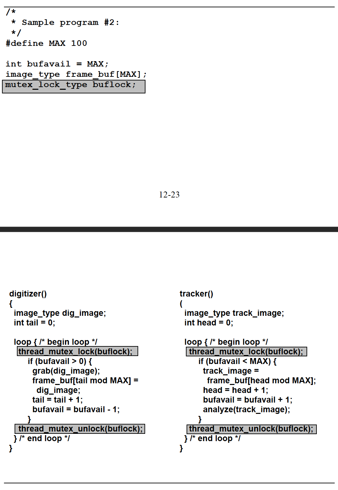

**Ch12: Multithreaded Programming and Processors**

- do multiple things at once

# Why Multithreading?
- `thread` - represents active unit of processing
- allows program to express concurrent activities easily
- allows computing I/O activities as well since it doesn't need CPU

- many programs must have multiple processes run, so doing them all at once increases efficiency
# Programming Support for Threads
- need key abstraction operations for threads
    - create
    - terminate
    - communicate
    - synchronize
## Thread Creation/Termination
- entry point of a thread is any user-defined procedure
    - **top level procedure** - any procedure that is visible where procedure is used for thread creation
    - `thread_create (top-level procedure, args);`
        - thread creation call
        - creates another thread that is a child of the thread that made the call
        - parent-child relationship
- starting point for threaded program is typical sequential procedure
- address space is the same for children threads as well as parent thread
- process vs thread
    - process
        - has more state information (because thread shares address space with a process)
    - thread
        - threads have no memory protection from each other within the address space
- termination   
    - automatically terminates when it exits top-level procedure 
    - or explicit call: `thread_terminate (tid);`
        - `tid` = thread id
## Communication Among Threads
- threads need to share data
- data structures are shared between threads as well if they are in the top-level procedure
    - example: global vars
## Data Race and Non-Termination
- **data race** - multiple threads attempt to access same shared variable at same time and another thread trying to write to shared variable
    - doesn't always mean there is an error
- example:

    - what is printed depends on which thread finishes first
- since everything executes asynchronously, program order (order in which instructions appear in code)is not deterministic anymore
- since order is not guaranteed, can have lots of machine instructions between threads interleaved
    - instructions of the same thread execute in program order

- programmer must understand the non-deterministic nature of multithreaded programs
## Synchronization Among Threads
- **producer and consumer threads**
    - producer must not modify shared buffer while consumer is reading it
        - called **mutual exclusion**
- **mutual exclusion lock**
    - like declaring variables
    - once thread acquires lock, no other thread can get that lock until the thread releases it
    - declaration
        - `mutex_lock_type mylock;`
    - acquire/release lock
        - `thread_mutex_lock (mylock);`
        - `thread_mutex_unlock(mylock);`
    - if thread is currently using lock but other thread needs it, it is **blocked**
    - can also check to see if lock is in use
        - `{success, failure} <- thread_mutex_trylock (mylock);`
    - what do other threads do if it is trying to access a lock that is in use?
        - either execute something else, or wait
    - **critical section**
        - region in program where execution of threads is ordered
    - example:
    ```c
    mutex_lock_type lock;
    int counter; /* shared counter */
    int increment_counter() {
        thread_mutex_lock(lock);
        counter = counter + 1;
        thread_mutex_unlock(lock);
        return 0;
    }
    ```
    - can be used by all threads, but only 1 thread at a time can increment counter
- Rendezvous
    - parent should wait for child 
    - example: parent spawns child to read file, and parent needs file contents so it waits
    - `thread_join (peer_thread_id);`
        - function blocks the caller until the named thread terminates - only works on 1 main and 1 child thread
    - basically all threads that participate in the rendezvous resume execution once they all reach the rendezvous point
    - when parent thread terminates, watch out for children processes also terminating
        - might want to wait until all children processes are done before terminating
## Internal Representation of Data Types Provided By Thread Library
- `thread type` and `mutex_lock_type` types are opaque types (user has no direct access to internal representation)
- `mutex_lock_type`
    - internal representation contains current user of the lock
    - queue of requestors for the lock
## Simple Programming Examples
- basic code w/ no synchronization
    - sample program 1:
    
    - `frame_buf` and `bufavail` are modified by both threads
        - `fram_buf` is a circular queue with head & tail
    - 2 threads are independent except in shaded areas, where they use the shared variables
- need for atomicity for a group of instructions 
    - problem is that both threads can be writing/reading from same var at the same time
    - correct execution is that first thread executes, then 2nd thread, or vice versa - **atomic**
    - need to make sure access to shared data structures is mutex
- code refinement with coarse grain critical sections
    - sample program 2:
    - uses mutex lock, so ensures atomicity, but has performance issues, as entire other thread cannot loop if lock is in use
    
- Code refinement with fine grain critical sections
    - no need to lock entire loop - only access to shared data structure
    - sample program 3:
    
## Deadlocks/Livelocks
- upon analysis of program 3, can see that deadlock can occur when buffer is full - digitizer continuously checks while statement, but tracker cannot remove image from buffer since digitizer has lock
- **livelock** - special case of deadlock where thread is actively checking for an event that will never occur
- solution: remove locks around while statements

## Condition Variables
- ideally, we want system to recognize that thread is waiting on a condition to be satisfied, so until the condition is satisfied, it should release control of lock - this is where condition vars come in
- declaration: `cond_var_type buf_not_empty;`
- wait and signal:
    - `thread_cond_wait(buf_not_empty, buflock);`
        - waiting descedules the thread that makes the call
        - implicitly performs an unlock
    - `thread_cond_signal(buf_not_empty);`
        - signals any thread that may be waiting on condition var
        - indicates that any thread waiting can resume execution
        - performs an implicit lock, and schedules waiting thread
    - multiple threads can wait on a signal, typically handled in FCFS manner
    - must ensure that signal doesn't come prematurely
### Internal Representation of Condition Variable Data Type
- `cond_var_type`
    - contains queue of threads waiting for signal
    - for each thread, its associated mutex lock
## Complete solution to example

- maintains an invariant that calling thread always holds the lock for the conditional wait
### Discussion of Solution
- concurrency
    - when checking the buffer, in either outcome, the lock is always released
    - when updating the variable, only lock when need to update it
    - no lack of concurrency
- no deadlocks
## Rechecking the Predicate
- example only works for 1 digitizer and tracker
- more general approach

- when T1 is about to release the resource and setes the state to `NOT_BUSY`
    - T2 is conditionally waiting and T3 is waiting to acquire the lock
- after T1 releases the mutex
    - lock is given to T3, which the first thread in the mutex waiting queue
        - since state is not busy, uses the resource
    - T2 resumes from the conditional wait since the mutex is now available, releases the mutex, then uses the resource as well
        - this violates the mutex principle, as T2 and T3 are both attempting to consume the resource at once
        - T1 enables condition that allows T2 to execute, but T3 negates it
            -  need to recheck the condition when we resume to avoid error
- change the if to a while
# Summary of Thread Function Calls and Threaded Programming Concepts
- `thread_create (top-level procedure, args);`
    - creates a new thread that starts execution in top-level procedure with the supplied args as parameters for the formal parameters specified in the procedure prototype
- `thread_terminate (tid);`
    - terminates thread with given `tid`
- `thread_mutex_lock (mylock);`
    - when thread returns it has `mylock`, if lock is being used, then calling thread is blocked
- `thread_mutex_trylock (mylock);`
    - thread that calls is never blocked; simply returns success/failure if lock is in use by another thread
- `thread_mutex_unlock(mylock);`
    - releases `mylock` in use by the thread, errors otherwise
- `thread_join (peer_thread_tid);`
    - calling thread blocks until `peer_thread_id` terminates
- `thread_cond_wait(buf_not_empty, buflock);`
    - calling thread blocks on the condition variable `buf_not_empty`, and implicitly releases `buflock`; lock must be currently held by calling thread
- `thread_cond_signal(buf_not_empty);`
    - any thread that is waiting on `buf_not_empty` variable is woken up and is ready for execution, and either executes or is added to the queue for the lock

# Points To Remember When Programming With Threads
- design data structures in a way to enhance concurrency
- minimize granularity of data structures that need to be locked as well as the duration they need to be locked
- avoid busy waiting 
- understand invariant is true and is preserved in critical sections
- make sure critical sections are simply and concise as possible to debug if there are dead/livelocks
# Threads as A Software Structuring Abstraction
- models
    - dispatcher model - dispatcher thread dispatches requests as they come to a pool of worker threads
        - request queue smooths out traffic
    - team model - all threads directly access ready queue
    - pipelined model - each stage handles specific task

# POSIX pThreads Library Calls Summary
- all unix system follow pthread library standard


# OS Support for Threads
- memory for OS is divided to kernel and user space
- virtual memory/paging allows every process to have its own address space
- for single threaded program, PCB contains defines a single process of the single thread on CPU
    - if process makes system call, entire program is blocked until it finishes
- for multithreaded process, PCB has all threads of a given process, and all share the same address space
- TCB (thread control block) - contains all info on state of thread
    - stack pointer, PC val, general purpose reg contents
- since all threads share the same heap, global data, and code, only have distinct stacks for each thread
    - **cactus stack**

## User Level Threads
- OS maintains ready queue of scheduleable processes, and threads library maintains list of threads that are ready to run in each process with info about them in respective TCBs
- threads at a user level cannot execute concurrently
    - operate as co-routines instead; when one thread is blocked, thread scheduler picks some other thread to run instead
    - can switch threads quickly at user level
- when one of the threads in a process makes a blocking call, OS must block entire process since it does not know info about the other threads that are ready to run or not
    - solutions:
        - wrap all OS calls with an envelope so all calls go through thread library, and when a blocking call is made, it is caught and held until all threads cannot run
        - upcall where OS can warn thread scheduler that blocking call is incoming, and thus scheduler can defer it to later time or switch threads
## Kernel Level Threads