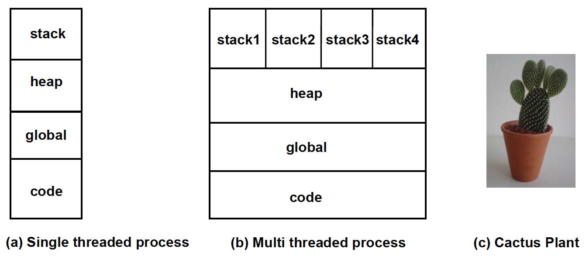
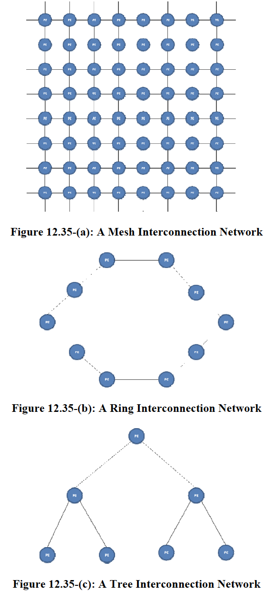

**Ch12: Multithreaded Programming and Processors**

- do multiple things at once


- [Why Multithreading?](#why-multithreading)
- [Programming Support for Threads](#programming-support-for-threads)
    - [Thread Creation/Termination](#thread-creationtermination)
    - [Communication Among Threads](#communication-among-threads)
    - [Data Race and Non-Termination](#data-race-and-non-termination)
    - [Synchronization Among Threads](#synchronization-among-threads)
    - [Internal Representation of Data Types Provided By Thread Library](#internal-representation-of-data-types-provided-by-thread-library)
    - [Simple Programming Examples](#simple-programming-examples)
    - [Deadlocks/Livelocks](#deadlockslivelocks)
    - [Condition Variables](#condition-variables)
        - [Internal Representation of Condition Variable Data Type](#internal-representation-of-condition-variable-data-type)
    - [Complete solution to example](#complete-solution-to-example)
        - [Discussion of Solution](#discussion-of-solution)
    - [Rechecking the Predicate](#rechecking-the-predicate)
- [Summary of Thread Function Calls and Threaded Programming Concepts](#summary-of-thread-function-calls-and-threaded-programming-concepts)
- [Points To Remember When Programming With Threads](#points-to-remember-when-programming-with-threads)
- [Threads as A Software Structuring Abstraction](#threads-as-a-software-structuring-abstraction)
- [POSIX pThreads Library Calls Summary](#posix-pthreads-library-calls-summary)
- [OS Support for Threads](#os-support-for-threads)
    - [User Level Threads](#user-level-threads)
    - [Kernel Level Threads](#kernel-level-threads)
    - [Solaris Threads: Example of Kernel Level Threads](#solaris-threads-example-of-kernel-level-threads)
    - [Threads and Libraries](#threads-and-libraries)
- [Hardware Support for Multithreading in a Uniprocessor](#hardware-support-for-multithreading-in-a-uniprocessor)
    - [Thread Creation, Termination, Communication](#thread-creation-termination-communication)
    - [Synchronization](#synchronization)
    - [Atomic Test-and-Set Instruction](#atomic-test-and-set-instruction)
    - [Lock Algorithm With Test-and-Set Instruction](#lock-algorithm-with-test-and-set-instruction)
- [Multiprocessors](#multiprocessors)
    - [Page Tables](#page-tables)
    - [Memory Hierarchy](#memory-hierarchy)
    - [Ensuring Atomicity](#ensuring-atomicity)
- [Advanced Topics](#advanced-topics)
    - [OS Topics](#os-topics)
        - [Deadlocks](#deadlocks)
        - [Advanced Synchronization Algorithms](#advanced-synchronization-algorithms)
        - [Scheduling in Multiprocessor](#scheduling-in-multiprocessor)
        - [Classic Problems of Concurrency](#classic-problems-of-concurrency)
    - [Architecture Topics](#architecture-topics)
        - [Hardware Multithreading](#hardware-multithreading)
        - [Interconnection Networks](#interconnection-networks)
        - [Taxonomy of Parallel Architectures](#taxonomy-of-parallel-architectures)
        - [Message-passing Vs. Shared Address Space Multiprocessors](#message-passing-vs-shared-address-space-multiprocessors)
        - [Memory Consistency Model and Cache Coherence](#memory-consistency-model-and-cache-coherence)
# Why Multithreading?
- `thread` - represents active unit of processing
- allows program to express concurrent activities easily
- allows computing I/O activities as well since it doesn't need CPU

- many programs must have multiple processes run, so doing them all at once increases efficiency
# Programming Support for Threads
- need key abstraction operations for threads
    - create
    - terminate
    - communicate
    - synchronize
## Thread Creation/Termination
- entry point of a thread is any user-defined procedure
    - **top level procedure** - any procedure that is visible where procedure is used for thread creation
    - `thread_create (top-level procedure, args);`
        - thread creation call
        - creates another thread that is a child of the thread that made the call
        - parent-child relationship
- starting point for threaded program is typical sequential procedure
- address space is the same for children threads as well as parent thread
- process vs thread
    - process
        - has more state information (because thread shares address space with a process)
    - thread
        - threads have no memory protection from each other within the address space
- termination   
    - automatically terminates when it exits top-level procedure 
    - or explicit call: `thread_terminate (tid);`
        - `tid` = thread id
## Communication Among Threads
- threads need to share data
- data structures are shared between threads as well if they are in the top-level procedure
    - example: global vars
## Data Race and Non-Termination
- **data race** - multiple threads attempt to access same shared variable at same time and another thread trying to write to shared variable
    - doesn't always mean there is an error
- example:

    - what is printed depends on which thread finishes first
- since everything executes asynchronously, program order (order in which instructions appear in code)is not deterministic anymore
- since order is not guaranteed, can have lots of machine instructions between threads interleaved
    - instructions of the same thread execute in program order

- programmer must understand the non-deterministic nature of multithreaded programs
## Synchronization Among Threads
- **producer and consumer threads**
    - producer must not modify shared buffer while consumer is reading it
        - called **mutual exclusion**
- **mutual exclusion lock**
    - like declaring variables
    - once thread acquires lock, no other thread can get that lock until the thread releases it
    - declaration
        - `mutex_lock_type mylock;`
    - acquire/release lock
        - `thread_mutex_lock (mylock);`
        - `thread_mutex_unlock(mylock);`
    - if thread is currently using lock but other thread needs it, it is **blocked**
    - can also check to see if lock is in use
        - `{success, failure} <- thread_mutex_trylock (mylock);`
    - what do other threads do if it is trying to access a lock that is in use?
        - either execute something else, or wait
    - **critical section**
        - region in program where execution of threads is ordered
    - example:
    ```c
    mutex_lock_type lock;
    int counter; /* shared counter */
    int increment_counter() {
        thread_mutex_lock(lock);
        counter = counter + 1;
        thread_mutex_unlock(lock);
        return 0;
    }
    ```
    - can be used by all threads, but only 1 thread at a time can increment counter
- Rendezvous
    - parent should wait for child 
    - example: parent spawns child to read file, and parent needs file contents so it waits
    - `thread_join (peer_thread_id);`
        - function blocks the caller until the named thread terminates - only works on 1 main and 1 child thread
    - basically all threads that participate in the rendezvous resume execution once they all reach the rendezvous point
    - when parent thread terminates, watch out for children processes also terminating
        - might want to wait until all children processes are done before terminating
## Internal Representation of Data Types Provided By Thread Library
- `thread type` and `mutex_lock_type` types are opaque types (user has no direct access to internal representation)
- `mutex_lock_type`
    - internal representation contains current user of the lock
    - queue of requestors for the lock
## Simple Programming Examples
- basic code w/ no synchronization
    - sample program 1:
    
    - `frame_buf` and `bufavail` are modified by both threads
        - `fram_buf` is a circular queue with head & tail
    - 2 threads are independent except in shaded areas, where they use the shared variables
- need for atomicity for a group of instructions 
    - problem is that both threads can be writing/reading from same var at the same time
    - correct execution is that first thread executes, then 2nd thread, or vice versa - **atomic**
    - need to make sure access to shared data structures is mutex
- code refinement with coarse grain critical sections
    - sample program 2:
    - uses mutex lock, so ensures atomicity, but has performance issues, as entire other thread cannot loop if lock is in use
    
- Code refinement with fine grain critical sections
    - no need to lock entire loop - only access to shared data structure
    - sample program 3:
    
## Deadlocks/Livelocks
- upon analysis of program 3, can see that deadlock can occur when buffer is full - digitizer continuously checks while statement, but tracker cannot remove image from buffer since digitizer has lock
- **livelock** - special case of deadlock where thread is actively checking for an event that will never occur
- solution: remove locks around while statements

## Condition Variables
- ideally, we want system to recognize that thread is waiting on a condition to be satisfied, so until the condition is satisfied, it should release control of lock - this is where condition vars come in
- declaration: `cond_var_type buf_not_empty;`
- wait and signal:
    - `thread_cond_wait(buf_not_empty, buflock);`
        - waiting descedules the thread that makes the call
        - implicitly performs an unlock
    - `thread_cond_signal(buf_not_empty);`
        - signals any thread that may be waiting on condition var
        - indicates that any thread waiting can resume execution
        - performs an implicit lock, and schedules waiting thread
    - multiple threads can wait on a signal, typically handled in FCFS manner
    - must ensure that signal doesn't come prematurely
### Internal Representation of Condition Variable Data Type
- `cond_var_type`
    - contains queue of threads waiting for signal
    - for each thread, its associated mutex lock
## Complete solution to example

- maintains an invariant that calling thread always holds the lock for the conditional wait
### Discussion of Solution
- concurrency
    - when checking the buffer, in either outcome, the lock is always released
    - when updating the variable, only lock when need to update it
    - no lack of concurrency
- no deadlocks
## Rechecking the Predicate
- example only works for 1 digitizer and tracker
- more general approach

- when T1 is about to release the resource and setes the state to `NOT_BUSY`
    - T2 is conditionally waiting and T3 is waiting to acquire the lock
- after T1 releases the mutex
    - lock is given to T3, which the first thread in the mutex waiting queue
        - since state is not busy, uses the resource
    - T2 resumes from the conditional wait since the mutex is now available, releases the mutex, then uses the resource as well
        - this violates the mutex principle, as T2 and T3 are both attempting to consume the resource at once
        - T1 enables condition that allows T2 to execute, but T3 negates it
            -  need to recheck the condition when we resume to avoid error
- change the if to a while
# Summary of Thread Function Calls and Threaded Programming Concepts
- `thread_create (top-level procedure, args);`
    - creates a new thread that starts execution in top-level procedure with the supplied args as parameters for the formal parameters specified in the procedure prototype
- `thread_terminate (tid);`
    - terminates thread with given `tid`
- `thread_mutex_lock (mylock);`
    - when thread returns it has `mylock`, if lock is being used, then calling thread is blocked
- `thread_mutex_trylock (mylock);`
    - thread that calls is never blocked; simply returns success/failure if lock is in use by another thread
- `thread_mutex_unlock(mylock);`
    - releases `mylock` in use by the thread, errors otherwise
- `thread_join (peer_thread_tid);`
    - calling thread blocks until `peer_thread_id` terminates
- `thread_cond_wait(buf_not_empty, buflock);`
    - calling thread blocks on the condition variable `buf_not_empty`, and implicitly releases `buflock`; lock must be currently held by calling thread
- `thread_cond_signal(buf_not_empty);`
    - any thread that is waiting on `buf_not_empty` variable is woken up and is ready for execution, and either executes or is added to the queue for the lock

# Points To Remember When Programming With Threads
- design data structures in a way to enhance concurrency
- minimize granularity of data structures that need to be locked as well as the duration they need to be locked
- avoid busy waiting 
- understand invariant is true and is preserved in critical sections
- make sure critical sections are simply and concise as possible to debug if there are dead/livelocks
# Threads as A Software Structuring Abstraction
- models
    - dispatcher model - dispatcher thread dispatches requests as they come to a pool of worker threads
        - request queue smooths out traffic
    - team model - all threads directly access ready queue
    - pipelined model - each stage handles specific task

# POSIX pThreads Library Calls Summary
- all unix system follow pthread library standard


# OS Support for Threads
- memory for OS is divided to kernel and user space
- virtual memory/paging allows every process to have its own address space
- for single threaded program, PCB contains defines a single process of the single thread on CPU
    - if process makes system call, entire program is blocked until it finishes
- for multithreaded process, PCB has all threads of a given process, and all share the same address space
- TCB (thread control block) - contains all info on state of thread
    - stack pointer, PC val, general purpose reg contents
- since all threads share the same heap, global data, and code, only have distinct stacks for each thread
    - **cactus stack**

## User Level Threads
- OS maintains ready queue of scheduleable processes, and threads library maintains list of threads that are ready to run in each process with info about them in respective TCBs
- threads at a user level cannot execute concurrently
    - operate as co-routines instead; when one thread is blocked, thread scheduler picks some other thread to run instead
    - can switch threads quickly at user level
- when one of the threads in a process makes a blocking call, OS must block entire process since it does not know info about the other threads that are ready to run or not
    - solutions:
        - wrap all OS calls with an envelope so all calls go through thread library, and when a blocking call is made, it is caught and held until all threads cannot run
        - upcall where OS can warn thread scheduler that blocking call is incoming, and thus scheduler can defer it to later time or switch threads
## Kernel Level Threads
- all threads live in single address space, therefore OS should ensure all threads share same page table
- each thread needs own stack, but share other parts of memory footprint
- should support thread level synchronization
- OS may implement 2 level scheduler
    - process level scheduler manages PCBs
        - allocates time quanta for each process, and performs preemptive scheduling
    - thread level scheduler manages TCBs
        - within time quanta, thread scheduler schedules threads in in round-robin/co-routine fashion

- allows overlap of I/O and processing
- however, unit of scheduling is still a process rather than a thread
## Solaris Threads: Example of Kernel Level Threads

- explanation of diagram:
    - for example, t1 and t2 of p1 are co-routines (both share that thread), while t3 runs concurrently to t1/t2.
- 3 kinds of threads
    - Kernel - unit of scheduling
        - implemented in OS
    - LWP - lighweight process
        - representation of a process within kernel
        - 1 to 1 association from kernel thread to lwp
            - however, kernel thread doesn't have to have a lwp; OS uses these threads to carry out functions independent of user-level processes
    - user - user level threads
        - implemented at user level with some form of library
- threads created by OS result in creation of user-level threads
    - specifies if thread created should be attached to existing lwp or new lwp
- ready queue of scheduler is set of kernel threads ready to run
    - if kernel is bound to lwp, then it is executing user thread/process
    - if kernel thread blocks, then lwp and user thread blocks as well
- How expensive a thread switch is depends on what kernel threads are mapped to what lwp
    - cheapest is when both user level threads map to same lwp
    - next cheapest is switching from different lwps with same process
    - most expensive is switching lwps from 2 different processes
## Threads and Libraries
- libraries typically have thread-safe wrappers to ensure atomicity for concurrent calls
    - example: since all threads share heap, dynamic memory alloc library needs wrappers
    - implicitly acquires lock 
# Hardware Support for Multithreading in a Uniprocessor
- 3 things to consider
    - thread creation/termination
    - communication among threads
    - synchronization
## Thread Creation, Termination, Communication
- on a thread context switch within same process, no change to TLB 
- thus, creation/termination do not need special hardware support
## Synchronization
- mutex lock implementation:
    - if lock is in use (ie mutex variable == 1), then block thread
    - else, set the mutex variable to 1
- mutex unlock:
    - set mutex variable to 0
- both need to be atomic instructions
    - unlock is simply store operation
    - how do we implement atomic lock operation?
## Atomic Test-and-Set Instruction
- test-and-set memory location - new instruction
    - read current value of memory location into proc register
    - set memory location to a 1
- point of atomicity is that no other thread can execute instruction while these are executing
- **binary semaphore**
    - signals a thread that it is safe to proceed into critical section
- **counting semaphore**
    - signals that `n` resources to competing threads are available
    - at most `n` threads can consume resource
## Lock Algorithm With Test-and-Set Instruction
```c
#define SUCCESS 0
#define FAILURE 1
int lock(int L) {
    int X;
    while ( (X = test-and-set (L)) == FAILURE ) {
        /* current value of L is 1
        * implying that the lock is
        * currently in use
        */
        block the thread;
        /* the threads library puts the
        * the thread in a queue; when
        * lock is released it allows
        * this thread to check the
        * availability of the lock again
        */
    }
    /* falling out of the while loop implies that
    * the lock attempt was successful
    */
    return(SUCCESS);
}
int unlock(int L) {
    L = 0;
    return(SUCCESS);
}
```
# Multiprocessors
- symmetric processor (SMP) - multiple processors that share all the system resources

- threads of program may be running on different processors
    - software/hardware must work to share data structures used by the threads
- must ensure
    - threads share the same page table
    - threads of same process have identical views of memory hierarchy even thought they are on different CPUs
    - threads are guaranteed atomicity for synchronous operations when executing concurrently
## Page Tables
- ensure that page table in memory is same for all threads of same process
- problems beyond scope of the course
## Memory Hierarchy
- each CPU has own cache and TLB
- hardware is responsible for maintaining consistent view of shared memory in each cache
    - multiprocessor cache coherence
- example: t1, t2, t3 threads running on processors p1, p2, p3
    - suppose all 3 have location X in cache
    - t1 writes to cache
        - options
            - either invalidate copies of X in other caches using invalidation line hardware
                - **write-invalidate protocol**
            - update copies of X in the other caches - simply a memory write
                - **write-update protocol**
- **snoopy caches** - bus-based cache coherence protocols
    - must have shared bus

## Ensuring Atomicity
- lock and unlock algorithms discussed earlier work with multiprocessors as well
# Advanced Topics
## OS Topics
### Deadlocks
- deadlocks occur b/c there are finite resources on computer
    - example: if nonpreemptive scheduler has process that infinite loops, there is deadlock
        - `**resource deadlock**
            - all processes are waiting on a resource
            - mutual exclusion and lack of preemption lead to this
- squash (who tf plays squash)/tennis analogy
    - 1 court, 1 pair of rackets
    - 1 group claims the court first, while other group grabs rackets first
    - **circular wait**/**hold and wait**
- 4 conditions that must all hold for process to be deadlocked
    - mutual exclusion
    - no preemption
    - hold and wait: process is allowed to hold resource while waiting for other resources
    - circular wait: cyclic dependency among process waiting for resources (a is waiting for b, and b is waiting for a)
- 3 stragies to prevent deadlocks
    - avoidance - most conservative
        - will not allocate resources that might result in deadlock
        - not a good choice
    - prevention
        - simply break any of the conditions that can cause a deadlock
            - breaking no preemption: preempt :)
            - how to break mutex condition: pretend that there are many instances of the shared resource, and create a buffer of requests
            - breaking hold and wait: specify all resources need to be obtain simultaneously before process starts
            - break circular wait: order resources and make sure requests are made in order 
                - tennis analogy: makes sure that you grab rackets before claiming court
    - detection
### Advanced Synchronization Algorithms
- programming mutex locks is error-prone
- concurrent programming needs
    - need thread to be able to execute critical sections of program in a mutex manner
    - thread to wait until some condition is satisfied
    - thread notifies peer thread waiting for condition to become true
- **monitor ADT** - like Java object
    - only can have 1 active thread inside monitor at 1 time
    - monitor has condition variables to wait and signal
    - simplifies methods so they don't need to provide overhead for concurrency
### Scheduling in Multiprocessor
- simply have a shared run queue on each scheduler of each processor
    - downsides: if thread is switched to different processor, new processor's cache most likely will not have memory location that the original processor has in their cache

- **cache affinity**: scheduling queue for each processor
- **lock-based time quantum extemsion** lengthen timeslice for thread holding a lock
- **space sharing**: dedicate a set of processors for a certain application over its lifetime
    - since application is dedicated to these set of processors, no context switching problems
    - scheduler allocates different sized partitions
    - if thread is blocked, cycles are wasted
- **gang scheduling**
    - related threads in application are scheduled as a group
    - overall process
        - time in divided into timeslices
        - all CPUs are scheduled at beginning of timeslice
        - scheduler allocates processors to threads using gang manner for given application
        - different gangs can use same set of processors
        - multiple gangs can be scheduled at the same time
        - once scheduled the association between the thread and processor it runs on remains until the timeslice is up
### Classic Problems of Concurrency
- producer-consumer problem
    - many applications can be modeled with producers putting things in a shared buffer, and consumers removing from the buffer
- readers-writers problem
    - example: buying tickets to movies
    - when you access website, can see choices for seats; however, by the time you actually go to check out, the seat could have been taken because many users concurrently could be writing to the database that you just read from
    - writers need exclusive access to database, where readers do not
    - solution: if writer needs access, wait until all current readers have exited, and if writer exists, prevent incoming readers from accessing until writer is done
- dining philosopher's problem
    - philosophers alternate between thinking and eating - however, only 5 forks and 5 philosophers, and need 2 forks to eat
    - solution: hungry state - philosopher tries to pick up both forks
        - if not successful, keep trying until they are available - when both neighbors are not eating, and do not change state while he is trying to pick up forks
## Architecture Topics
### Hardware Multithreading
- problems with instruction level parallelism - cache misses cause pipeline stalls
- use thread level parallelism
- analogy - filling out forms at a bank
    - if person needs to fill out form to complete transaction, that person will move to the side and fill out the form while the bank teller takes the next customer
    - processor is teller - threads are the customers
        - upon a thread stall, processor picks instruction from other thread to run
- how it is implemented
    - processor architecture specifies how many concurrent threads it can handle in software (logical processors)
        - represents level of duplication of hardware resources needed
    - each logical processor has own PC, reg file
    - OS binds thread to logical processor
    - physical processor has mappings for each logical processor through duplicate PC, reg files, etc
    - when an instruction corresponding with a logical processor runs through the pipeline, processor knows what specific hardware that has to be accessed
- improves throughput, even for single-threaded applications
- combine ILP with TLP
### Interconnection Networks
- how elements within computer are connected
    - shared bus
- large scale parallel machines have many processing elements
    - use a mesh (connected to North, South, East, West neighbors) or tree/ring


### Taxonomy of Parallel Architectures
- single instruction single data - classic uniprocessor
- single instruction multiple data - used for fine-grained computationally intensive tasks
- multiple instruction single data 
- multiple instruction multiple data - most common today

### Message-passing Vs. Shared Address Space Multiprocessors
- MIMD has 2 major categories: message-passing and shared address space
- message passing
    - each processor has private memory, and communicate over shared interconnection network
    - no shared memory
    - also called distributed memory multiprocessors
- shared address space
    - given memory address refers to same location regardless of processor is accessing it
    - cache coherence problem
        - implement in either hardware or software
    - cache coherent implementation without shared bus (since interconnection network cannot use bus)
        - use directory-based scheme with a directory with entries associated with each piece of shared memory
### Memory Consistency Model and Cache Coherence
- cache coherence: once entry in cache is updated in 1 processor, must propogate change accordingly in other processors who have the same copy
- memory consistency model - contract between programmer and memory system to define the programmer's view
    - declares "when" the cache coherence is met 
- sequential consistency - reads/writes are atomic with respect to system
    - thus, when we say that processor1 has written to memory at time = x, then the value should be visible to all processors afterward
    - each read/write is atomic