**Ch13: Fundamentals of Networking and Network Protocols**
- how do computers communicate with one another?
- [Preliminaries](#preliminaries)
- [Basic Terms](#basic-terms)
- [Networking Software](#networking-software)
- [Protocol Stack](#protocol-stack)
  - [OSI Model](#osi-model)
  - [Practical Issues with Layering](#practical-issues-with-layering)
- [Application Layer](#application-layer)
- [Transport Layer](#transport-layer)
  - [Stop and Wait Protocols](#stop-and-wait-protocols)
  - [Pipelined Protocols](#pipelined-protocols)
  - [Reliable Pipelined Protocol](#reliable-pipelined-protocol)
    - [Network Congestion](#network-congestion)
    - [Sliding Window](#sliding-window)
  - [Dealing With Transmission Errors](#dealing-with-transmission-errors)
  - [Transport Protocols on Internet](#transport-protocols-on-internet)
- [Network Layer](#network-layer)
  - [Routing Algorithms](#routing-algorithms)
  - [Internet Addressing](#internet-addressing)
  - [Network Service Model](#network-service-model)
    - [Circuit Switching](#circuit-switching)
    - [Packet Switching](#packet-switching)
    - [Message Switching](#message-switching)
    - [Service Model with Packet Switched Networks](#service-model-with-packet-switched-networks)
  - [Network Routing vs. Forwarding](#network-routing-vs-forwarding)
  - [Network Layer Summary](#network-layer-summary)
- [Link Layer and Local Area Networks](#link-layer-and-local-area-networks)
  - [Ethernet](#ethernet)
  - [CSMA/CD](#csmacd)
  - [IEEE 802.3](#ieee-8023)
  - [Wireless LAN and IEEE 802.11](#wireless-lan-and-ieee-80211)
  - [Token Ring](#token-ring)
  - [Other Link Layer Protocols](#other-link-layer-protocols)
- [Networking Hardware](#networking-hardware)
- [Relationship between Layer of Protocol Stack](#relationship-between-layer-of-protocol-stack)
- [Data Structures For Packet Transmission](#data-structures-for-packet-transmission)
  - [TCP/IP Header](#tcpip-header)
- [Message Transmission Time](#message-transmission-time)
- [Summary of Protocol Layer Functionalities](#summary-of-protocol-layer-functionalities)
- [Networking Software and the OS](#networking-software-and-the-os)
  - [Socket Library](#socket-library)
  - [Implementation of Protocol Stack in the OS](#implementation-of-protocol-stack-in-the-os)
  - [Network Device Driver](#network-device-driver)
- [Network Programming Using Unix Sockets](#network-programming-using-unix-sockets)
# Preliminaries
- goal is to focus on networking from perspective of hardware and OS points of view
- **socket** library provides API for developing network apps
  - implementing this API is first step
- **protocol stack** - abstraction that addresses networking issues
- **network device driver** - interacts with network interace card to connect to network

# Basic Terms
- **host** - computer that hooks onto network
- **NIC(network interface card**- peripheral controller
- "the network" is simply a composite of several networks
- what is the internet?
  - analogy: sending letter to grandma in india
    - write letter and put into mailbox, mailperson picks up letter
    - letter is sent to regional post office, which are sorted and sent to their respective regional post office destinations, which is finally sent to grandma in India
  - writing an email to mom in California
    - computer plugs into modem, and the modem connects to an ISP (internet service provider), which is a local cable company
      - since this is the access point to the internet, it is an access network
    - access network is like mailwoman - doesn't know how to get email to Cali, but knows how to send it to the regional ISPs
    - regional ISP knows how to talk to other regional ISPs across country/world
    - Mom's access point would be the final destination of email
- ISP systems are not directly connected to one another 
  - **routers** - sit in core on network and route messages accordingly
    - how does it know where to send?
      - like zipcode for mailing, networks use IP address
  - internet is network of networks
- **packets** - unit of data that is routed from origin to destination
  - traverses seres of queues at routers' input from source to destination
  - if heavy network traffic, then paacket can experience queueing delays, and if router is full, packet can be dropped, leading to **packet loss**
- **edge of network** - laptops, computers, servers
- **core of network** - machines that route from source to destination
- **LAN(local area network)** - connecting computer to school/office network
# Networking Software
- in OS, this is the protocol stack
- **network protocol** - language that defines syntax and semantics of messages for computer to interact w/ each other
- there is a maximum packet size limit for different technologies, as well as maximum transmission rate
  - if data is too big, it needs to be split into several packets
  - also, no guarantee that packets will arrive in same order they are sent (out of order delivery)
  - queueing delays also another problem
  - packet loss
  - bit errors in data 
1. Arbitrary message size and physical limitations of network packets
2. Out of order delivery of packets
3. Packet loss in the network
4. Bit errors in transmission
5. Queuing delays en route to the destination
- protocol stack addresses these problems
# Protocol Stack
- protocol layering - abstracts and separates certain concerns to different layers of stack
  - outgoing messages are pushed down stack
  - incoming messages are popped up

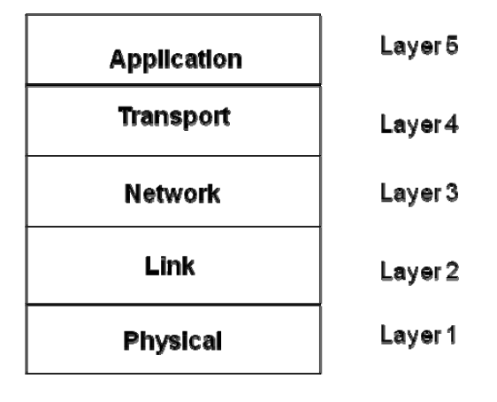
- **application layer**
  - supports network-based applications
  - examples: HTTP, SMTP, FTP
- **Transport layer**
  - responsible for taking application layer message nad moving it between ends of communication
    - breaking message into packets
  - TCP/UDP are dominant transport protocols
    - TCP (Transmission Control Protocol)- reliable, and in-order delivery of data using a byte stream
      - connection oriented - establishes connection between 2 endpoints, and tears it down once the connection is closed
    - UDP(user datagram protocol) - like sending call through US mail
      - messages that have strict boundaries (no relationship at protocol level between successive messages)
      - no connection is established/no teardown before/after sending message, and messages can arrive out of order
- **Network Layer**
  - responsibility to route the packets from transport layer
  - when sending packet, network layer finds a way to get packet to destination address
  - when receiving packet, passes packet up to transport layer
  - use IP to format information in the packet 
- **Link layer**
  - sending mail analogy - airplane, mailcar, are examples of different vehicles used to transport mail
  - Link layer is similar - provides protocol on how to move packet between nodes on internet
  - network layer gives link layer IP packet
  - link layer delivers fragments of IP to then next node, where the data is passed up to the network layer and repeated until it reaches the destination
  - many different link layer protocols
- **Physical layer**
  - physically moves the bits from one node to next
- example message sending with protocol stacks
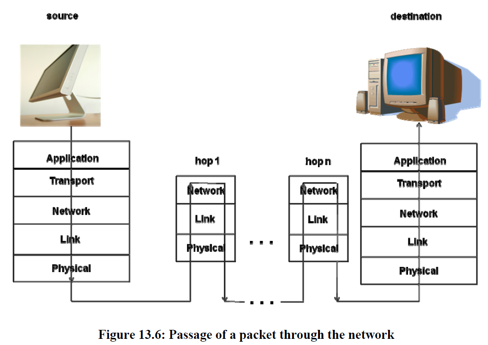
- layering abstraction has many benefits
  - separation of responsibilities
  - makes it easy to add/change modules in a layer without changing other layers

## OSI Model

- adds presentation and session layers
  - session - manager of a specific communication session between 2 endpts
  - presentation - formats text input and does character conversion
## Practical Issues with Layering
- real implementations do not stick with OSI model
- TCP/IP protocol is already standard for transport/network layers, thus many existing protocols combine many layers of the OSI model
# Application Layer
- network app has 2 parts
  - client - sits on end devices like laptops and phones
  - server - part that provides the functionality of a network service (search engine)
  - examples of network apps: WWW, email
- different app layer protocols for different types of apps
  - HTTP - web clients and servers
  - SMTP - email
- protocols can transcend hardware architecture, and are independent of the platform
  - example: HTTP, SMTP
- OS can also provide own network services
  - example: UNIX has socket library for building network apps
# Transport Layer
- assume transport has API:
  - `send (destination-address, data)`
  - `receive (source-address, data)`
- functionality of transport layer
  - support arbitrary data size at app level
  - support in-order delivery of data
  - shield app from loss of data
  - shield app from bit errors in transmission
- 2 views of data:
  - byte stream
    - TCP
  - message
    - UDP
- must separate data into packets to comply with network, as well as assemble the packets to deliver in order
  - called **scatter/gather**
- need a **sequence number** to determine order of message
  - each packet gets a sequence number, so solves the out of order and arbitrary message size problem
- source needs confirmation that destination received packets, and that none are lost
  - positive acknowledgement
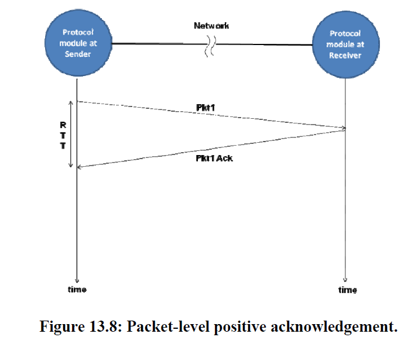
- **round trip time** - time taken for small message to be sent from sender to receiver then back to sender
  - estimates delay experienced to send and receive acknowledgement, set timeout values accordingly
## Stop and Wait Protocols
- simple approach
  - sender sends packet and wait for positive ACK
  - once packet is received, recipient generates and sends an ACK for the packet
    - contains info for the sender to show that the packet is acknowledged (Seq #)
  - sender wait for period of time called **timeout**. If within this period it doesn't get an ACK, then it retransmits the packet
- need sequence numbers still because ACK packets can be lost as well, so may need to resend
  - seq # lets sender know if incoming ACK is current or duplicate ACK
- since at a given time there is only 1 packet in transit, we don't need an infinitely increasing # to be our sequence number
  - simply have an alternating bit from 0 to 1 (alternating bit protocol)
- timeout value must bee greater than round trip time
## Pipelined Protocols
- stop-and-wait is very slow
  - lots of **dead time** (no activity on network)
- if network is reliable, we can pipeline packets without waiting for ACKs
- bandwith - amount of time it takes host to place packet on wire
- propogation time - end-to-end delay for packet to reach destination
- need for ACKs depends on if protocol requires reliable transport
## Reliable Pipelined Protocol
- another approach is to pipeline sending of packets with receiving ACKs
  - source sends set of packets (window) before expecting ACK
  - destination acknowledges each packet individually
  - sender doesn't have to wait for ACKs before sending again
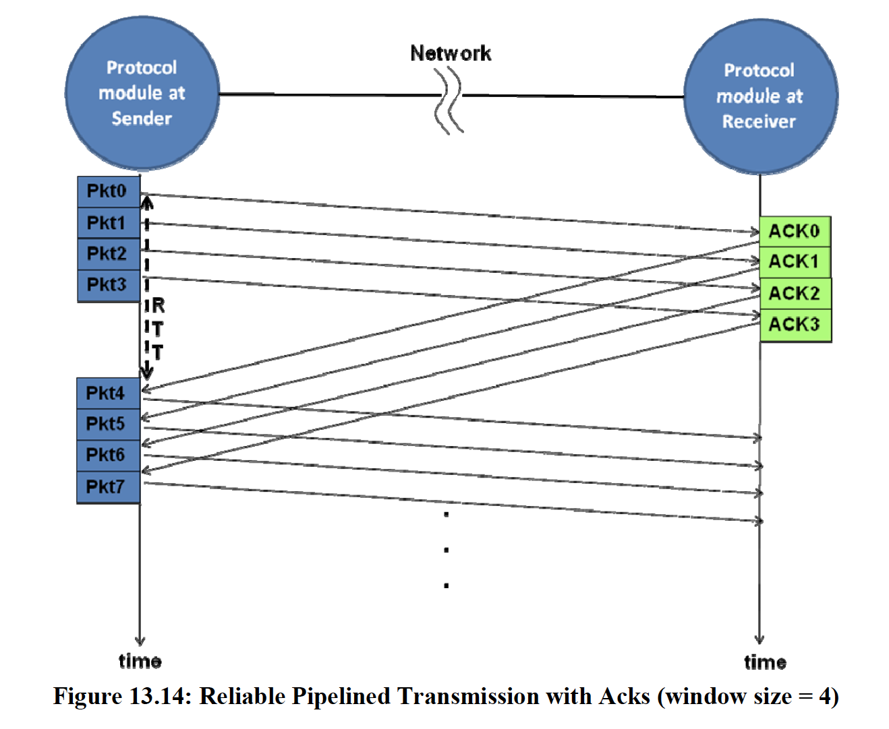
- size of window changes based on network congestion

### Network Congestion
- analogy: highway in rush hour
  - several feeder streets that are putting traffic on highway, and highways can also merge
    - streets are putting more cars on the highway than can be sustained
- ex) four 1 gbps network flows going into one 10 gbps network flow
  - but if there are 20 flows, there will be congestion
- congestion causes buildup of packet queues at routers
  - queueing delays and once queues become full, packet loss occurs
- ways of dealing with congestion
  - self-regulate amount of data it hands to network layer depending on congestion
    - problem: no guaranteed upper bound for delay
### Sliding Window
- mechanism for self-regulation in a transport protocol that incorporates congestion control
  - window size restricts sender's rate; prevents buildup at router queues
- for a given window size, we can define an active window of sequence numbers corresponding to set of packets that source can send without waiting for ACKs
- how width of packet is decided
  - ratio of packet size to bandwith, and how many packets we can fit within 1 round trip time
- window size can be chosen to be smaller than upper bound due to congestion
  - represents max number of packets that can be outstanding
- as ACKs for packets are received, window moves to the right by 1 packet
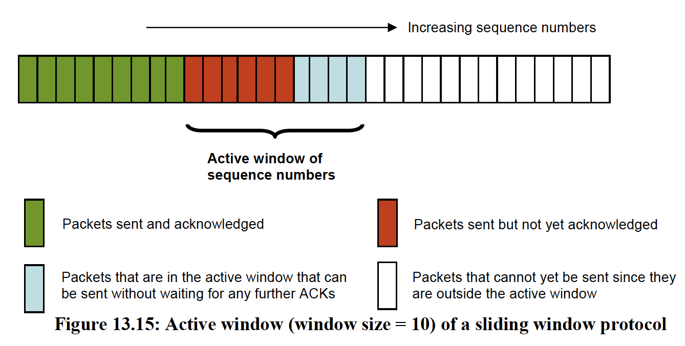
- to reduce number of ACK packets, will send a cumulative ACK
  - when receiving n packets with consecutive sequence numbers, will send single ACK - sender knows upon receiving single ACK that all n packets have been acknowledged
- for ACK packet loss, have timeout window when packets are initially sent, and will resend them if no ACK received within timeout window
- additional things to consider
  - choosing timeout values
  - choosing window size
  - out-of-order packets
  - when to ACK packets
  - when to move window
## Dealing With Transmission Errors
- to identify "good" from "bad" packet, source computes a **checksum**, value based on contents of packet and appends it to end of packet
  - destination does same computation to make sure the packets match
  - can potentially repair errors, but most likely will have to retransmit packet
## Transport Protocols on Internet
- **TCP (transmission control protocol)** - connection oreinted protocol
  - sets up connection between 2 endpoints
  - once connection is set up, data flow is a stream of bytes
  - does not deal with messages 
  - once connection is made, client sends requests, then server responds by sending series of objects that form webpage
  - tear down connection once done
  - **full duplex** - both sides can simultaneously send/receive data once connection is set up
  - *connection setup*: both sides negotiate initial sequence number for transmission
    - client sends server connection request message with info on initial sequence number for packets
    - server sends ACK to connection request with info on initial sequence number for packets
    - client allocates resources and sends ACK; once server receives ACK, server allocs resources for connection
    - client and server have officially established connection and can exchange data
  - *reliable data transport*: both endpts can send and receive data, and will have a guarantee that data will be sent without loss/corruption
  - *congestion control*: sender self-regulates network flow by adjusting window size
  - *connection teardown*
    - client sends teardown request, server sends ACK
    - server sends own teardown request, client sends ACK
    - client de-allocos resources for connection, and server does the same
    - client or server can initiate teardown
- **UDP**
  - does not have as much overhead/guarantees as TCP, results in it being faster
  - applications like VOIP prefer speed over packet loss, therefore UDP is a good fit
  - packets can be out of order/lost, and no self-control so can have problems with congestion
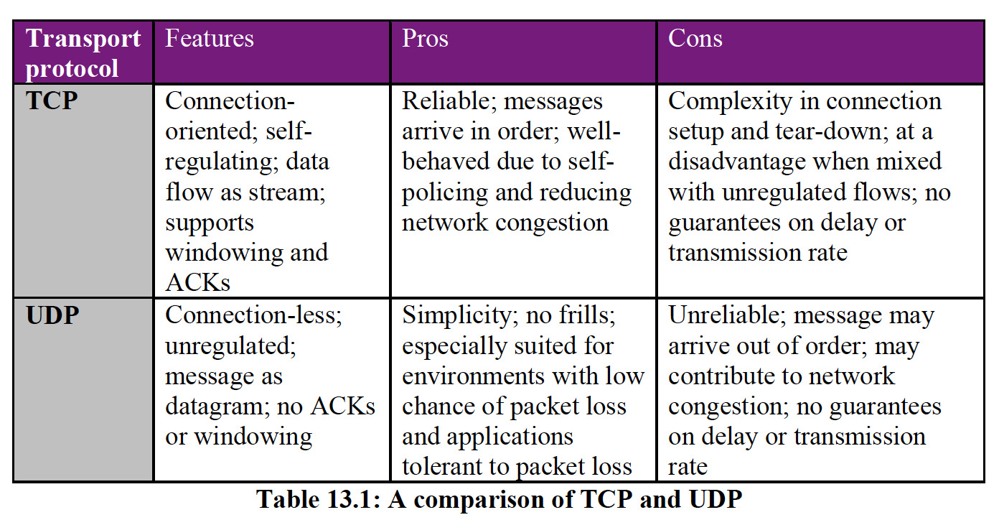
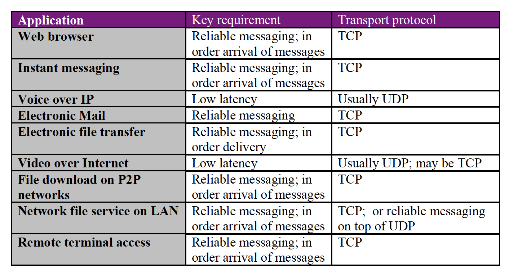
# Network Layer
- send packet handed to it at source from transport later to destination, and pass up incoming packet to transport layer at destination
- combining this functionality with transport layer not a good idea
  - many different types of network connections (wired/wireless)
  - data might need to go through several intermediate nodes to get to destination
    - in addition, these nodes simply need to forward packet to destination
  - allows insertion/deletion of network connections to be independent of transport
- network layer responsible for forwarding packet given destination address
  - maintains a routing table that contains a route from source to destination host
  - upon receiving a packet, either use the table to forward packet to destination, or pass up packet to transport layer if packet is at the destination
- key functionality needed
  - routing algorithms
  - service model: forward incoming packet on incoming link to outgoing link based on routing information
    - also called **switching**
- hardware that performs functionalities of network layer is called **router**
  - like an end host, except knows packet's destination
## Routing Algorithms
- **link state** - cost associated with neightboring links at a given host node
  - like edge lengths within a graph
- **Link state-dijkstra's**
  - least cost path, but requires complete information on edge costs
  - also needs to be synchronous
  - just look at 1332 notes :)
- **Distance vector algorithm**
  - async, and works with partial knowledge
  - node has to send packet to one if its neighbors - simply choose least cost one with regards to destination
  - each node maintains distance vector table
    - table has lowest cost route of sending packet to every destination in network through each of its neighbors
    - name comes from each node having vector of costs for reaching destination through its neighbors
  - psuedocode:
    - each node sends its least cost route to given destination to its neighbors, and each node updates its DV table
      - recomputes DV table entries if:
        - node observes change in link-state for any of its neighbors
        - node receives an update on least cost route from neighbor
- **Hierarchical Routing**
  - due to scale of internet, hierarchy approach is appropriate
  - organize routers on internet into regions called autonomous systems 
    - routers within the autonomous system may run link state or DV algorithms for routing hosts within the system
    - routers that communicate with destinations outside system are called **gateway routers**
      - use border gateway protocol (BGP)
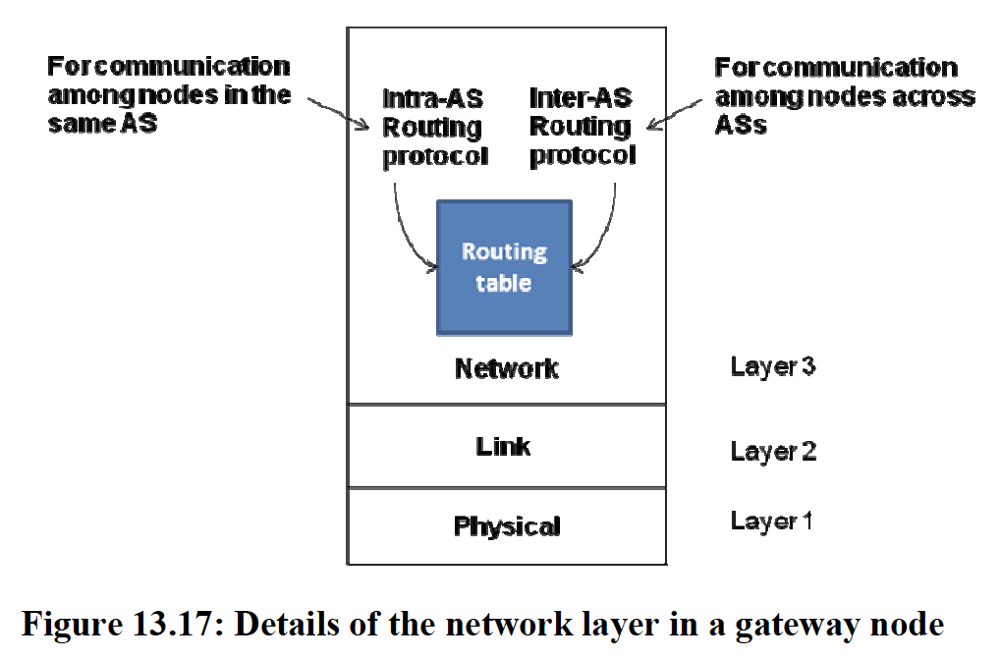
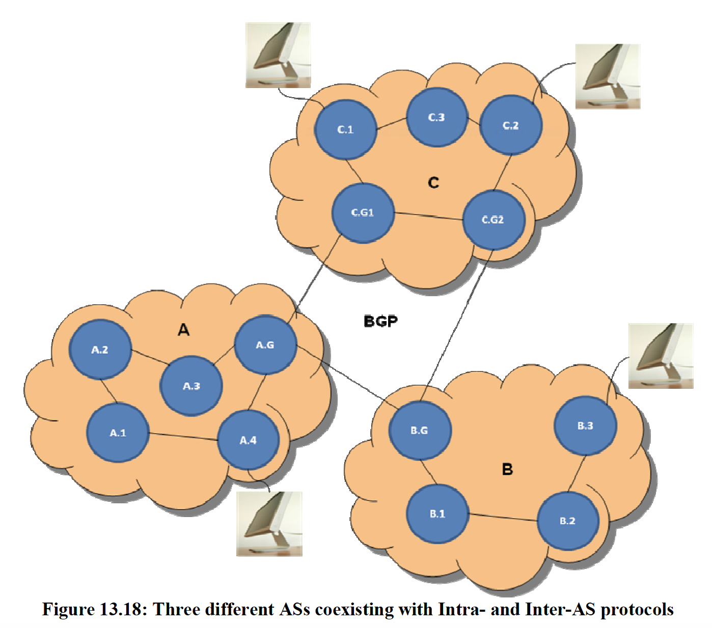
  - host connected to C.1 communicating with host connected to C.2
    - simply use intra-AS protocol
  - if A.4 needs to send packet to host at B.3
    - needs to send packets to A.G, and routing table will tell packet to be sent to B.G
    - A.G uses BGP to communicate with B.G
    - then use intra-AS protocol to send to node B.3
## Internet Addressing
- host vs router
  - host is an endpoint at the edge of a network, and single connection
    - 1 NIC
  - router is an intermediate stop with multiple hosts connecting to it
    - has multiple NICs
- phone number analogy
  - 3 digits: area code, 3 digits: exchange number, 4 digits: device #
  - multiple parts, like IP addresses
- IPv4 address - 32 bits
  - each unique interface has unique IP
  - PQRS - dotted decimal notation
  - ex) 128.61.23.216 - each part is decimal notation of number in binary
  - top 24 bits specify IP network, and bottom 8 bits identify specific device connected to network
    - dependso n how many devices will be connected to network; # of bits can change
  - IP network notation
    - `x.y.z.0/n` where n = # of bits reserved for network part of IP address
## Network Service Model
- packets go through many nodes before reaching destination
### Circuit Switching
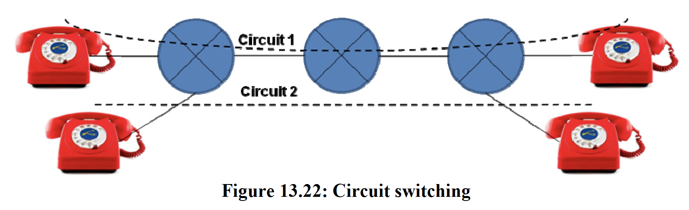
- analogy: making reservations for each form of transportation from USA to India
- network service model facilitates packet delivery 
  - there is not a single wire between 2 endpoints like telephone; there are lots of switches between endpts
    - dedicated circuit is established between 2 endpts while phone call is occurring (**circuit switching**)
- different number of switches between the 2 endpts of the call, and are physically connected
  - once call is established, network resources are reserved and quality of service is guaranteed
- physical link may have multiple circuits for multiple connections
  - can run out of circuits if too many calls are placed concurrently
### Packet Switching
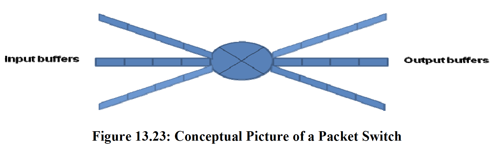
- alternative to circuit sqitching
- do not reserve bandwith on any physical links
  - analogy: simply show up at each station without reservation
- when packet arrives at switch, switch examines packet and sends it along appropriate link towards destination
- also called **store and forward networks** - switch cannot send packet until entire packet has arrived
- switch may have several physical links - each link has an input buffer
  - once entire packet arrives, examine routing table and send to output buffer to destination
    - queueing delay can happen depending on network congestion
  - if buffers are full, packet loss occurs
- when sending packets, flow is highly similar to pipelined execution in datapath
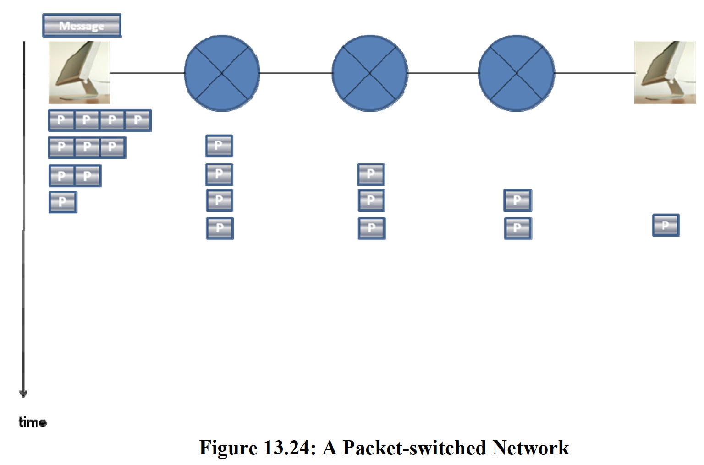
### Message Switching
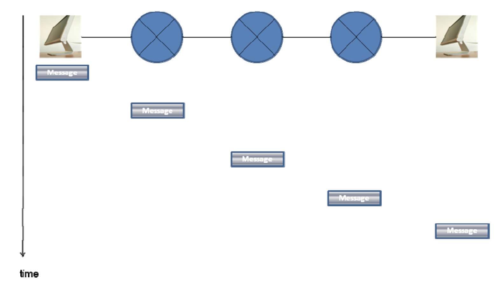
- switch stores and forwards the entire message rather than individual packets
- less overhead since don't need to check every packet
  - but, if bit errors occur, will happen to entire message instead of 1 packet
### Service Model with Packet Switched Networks
- packet switching is best because
  - can fully utilize bandwidth (no need to reserve bandwidth)
  - simpler to design and operate
  - most efficient
- internet uses packet switching in its network layer
- 2 network service models
  - datagram
    - every packet is stamped with destination address
  - virtual circuit
    - no physical resources reserved
    - establish route from source to destination during setup phase
      - source gets virtual circuit number
      - routers in between maintain a table that contains info about each virtual circuit currently managed by switch (incoming link, outgoing link)
      - simply look up virtual circuit number in table and send that way
    - teardown after done - deletes entry in table for switches in between
- actual implementation a bit more complex
## Network Routing vs. Forwarding
- driving to work analogy
  - routing would be deciding what streets to drive on
  - forwarding would be actually driving on the chosen route
- network layer has forwarding table that contains next node address given destination address
- how network routes are computed
  - computed in the background of the OS using a route daemon
    - creates routing tables, and updates forwarding tables accordingly
## Network Layer Summary
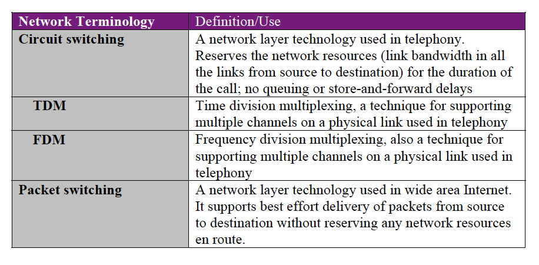
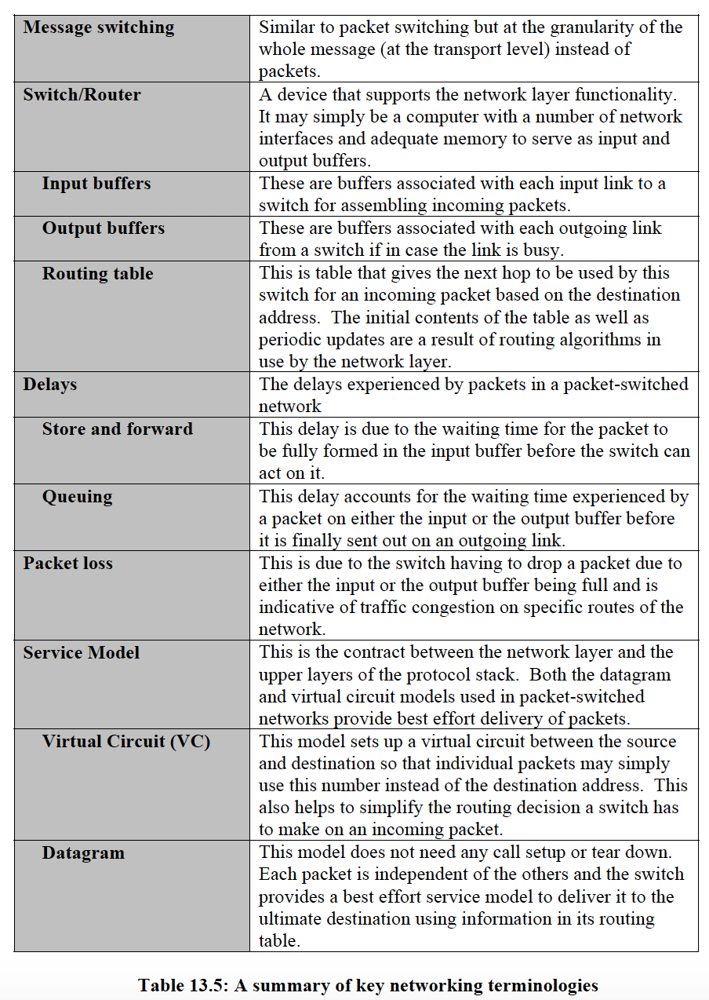
# Link Layer and Local Area Networks
- link layer responsible for acquiring the physical medium to transmit, and sending packet over physical medium to host
- link layer deals with frames instead of packets
  - packet may require several frames to be transmit
- protocols have 2 categories
  - random access
    - ethernet
  - taking turns
    - token ring  
- media access and control (MAC)
  - how protocol gains access to physical medium
## Ethernet
- cable that connect computers together
- like a bus
  - arbitration logic decides who has control of bus
## CSMA/CD
- carrier sense multiple access/collision detect(CSMA/CD)
  - type of random access protocol
- analogy - polite conversation among group
  - check if no one else is talking before talking
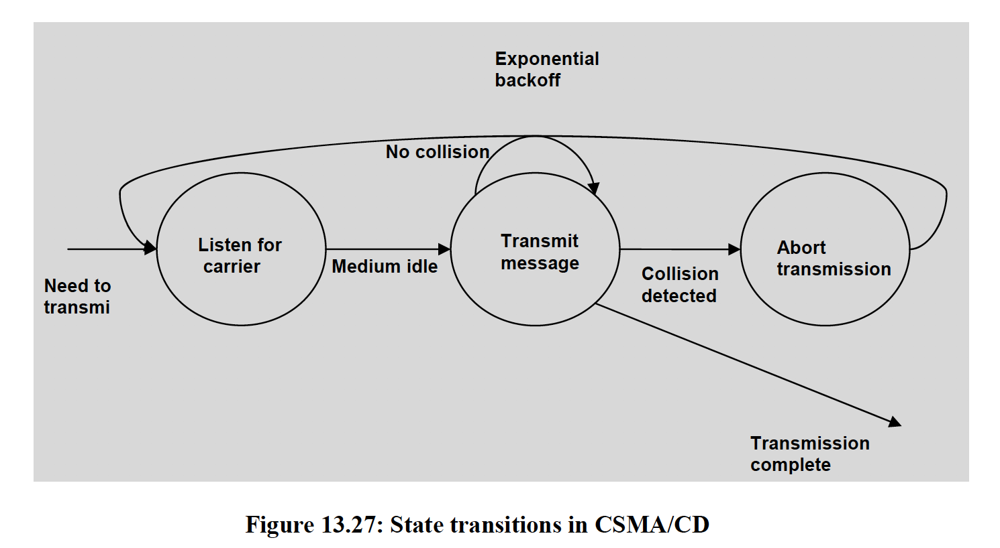
- general process
  - station(computer) wanting to transmit senses the medium (the cable) whether there is ongoing frame transmission; if there is, wait until medium is idle and then start transmission
    - when there is no electrical actvity, then it is idle
  - multiple stations sense cable simultaneously for idleness
    - if multiple units start to transmit, this is problem
  - after starting frame transmission, listen for collision
    - if station observes different electrical activity, then collision detected and transmission is aborted
    - wait a random amount of time before repeating the cycle of sensing, transmitting, and looking for collision until it completes transmission successfully
      - random time it waits before retrying increases exponentially with number of collisions experienced (**exponential backoff**)
- protocol uses base band signaling
  - framse digitally transmitted onto medium as binary
- **broadband** - simultaneous analog transmission of multiple messages onto same medium
## IEEE 802.3
- IEEE 802.3 - special version of CSMA/CD protocol; ethernet uses this
  - uses manchester code
    - ensures that there is voltage transition in the middle of each bit transmission, enabling synchronization of sender and receiver
    - if there is no voltage transition in duration of bit transmission, then assumes medium is idle
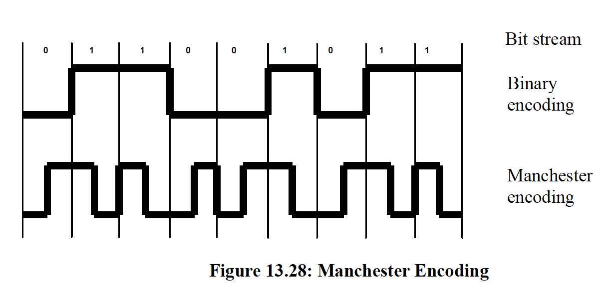
- most ethernets today are switched, meaning there is no collision
## Wireless LAN and IEEE 802.11
- CSMA/CA
  - CA = collision avoidance
  - used when stations cannot determine if ther are collisions on medium
- detecting collisions is problematic
  - assumes each station ca simultaneously send transmission and verify if its transmissions are being interfered with
  - hidden terminal problem
    - person 1 and person 3 are trying to talk to each other, but person 2 is in the middle and can hear person 1 and 3, but neither person 1 nor 3 can hear the other
      - collision occurs without station 1 or 3 knowing
- solution: explicitly get permission to send by sending Request to Send (RTS) control packet
  - destination responds with Clear to Send (CTS) packet, and source then can send frame to destination
  - RTS packets can collide, but since they are so small, damage is not very big
## Token Ring
- taking turns - alternative to random access
- simple idea: polling
  - master node polls each station in pre-determined order to see if it needs to transmit
  - upon getting the signal from master station, slave station will transmit message
- connect nodes in network in ring formation
- token - special bit pattern circulates on wire
  - node that wants to send frame waits for token, grabs it, puts frame on wire, and puts token back on wire
  - each node looks at header of frame to see if they are destination
    - destination or sender removes frame and regenerates token once received
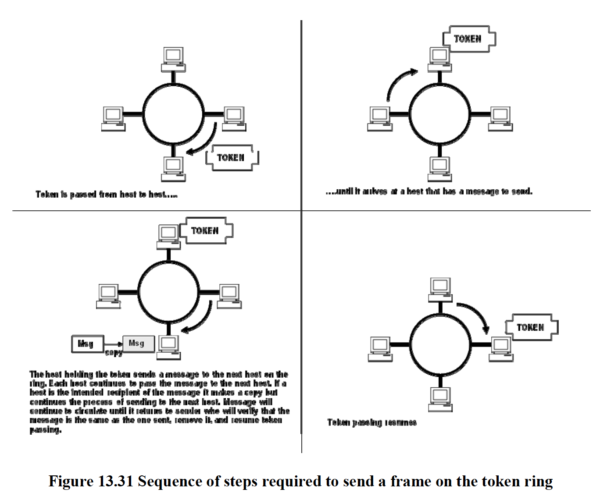
- no collisions, but can have lots of latency for frame transmission
  - if node dies, then ring is broken
  - if token is lost, LAN cannot function
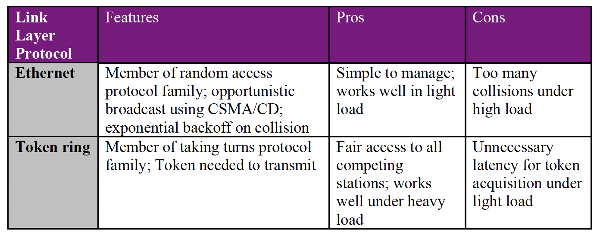
## Other Link Layer Protocols
- ethernet is most dominant today
- FDDI and ATM 
  - FDDI - used for fiber optic mediums
  - ATM - guaranteed quality of service through bandwith reservation on links and admission control to avoid congestion
- PPP - point to point protocol
  - used by dial up connections
# Networking Hardware
- **repeater**
  - electrical signals decay in strength over distance, so repeater boosts energy level of bits along a connection
- **hub**
  - basically ethernet in a box/multi-port repeater
  - relays bits received from 1 host to others
  - computer connected to a hub have to detect collisions
- **bridges & switches**
  - bridges separates collision domains from one another
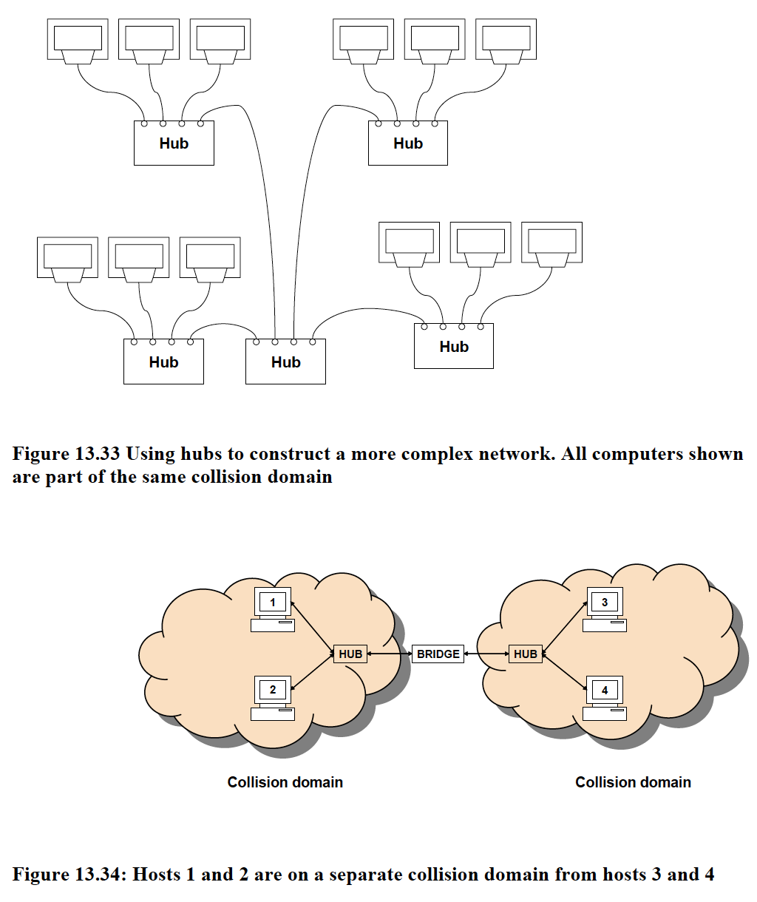
  - bridges typically connect limited number of collision domains compared to switches
- **VLAN**
  - example: 
  - if node 2 sends a broadcast packet, then nodes 6 and 7 will receive it, and no other nodes will
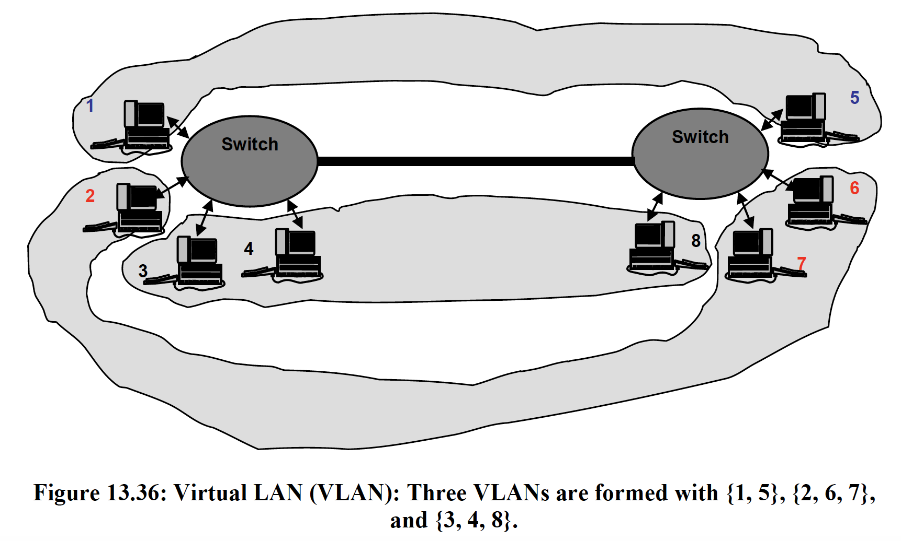
- **NIC**
  - allows computer to connect to network with hub/bridge/switch
  - either sends or receives packets at 1 time, not both
  - every NIC has a MAC address used by bridge to route packets to destination
  - packets have MAC address as MSB (header), and message as LSB (payload) inside LAN
  - outside LAN, us IP (internet protocol) talked about earlier
- **Router**
  - another host on a LAN that understands IP addresses
  - any node that sends message onto internet sends packet with header as MAC address of router (MSB)
  - payload are LSB, with IP address of destination and message
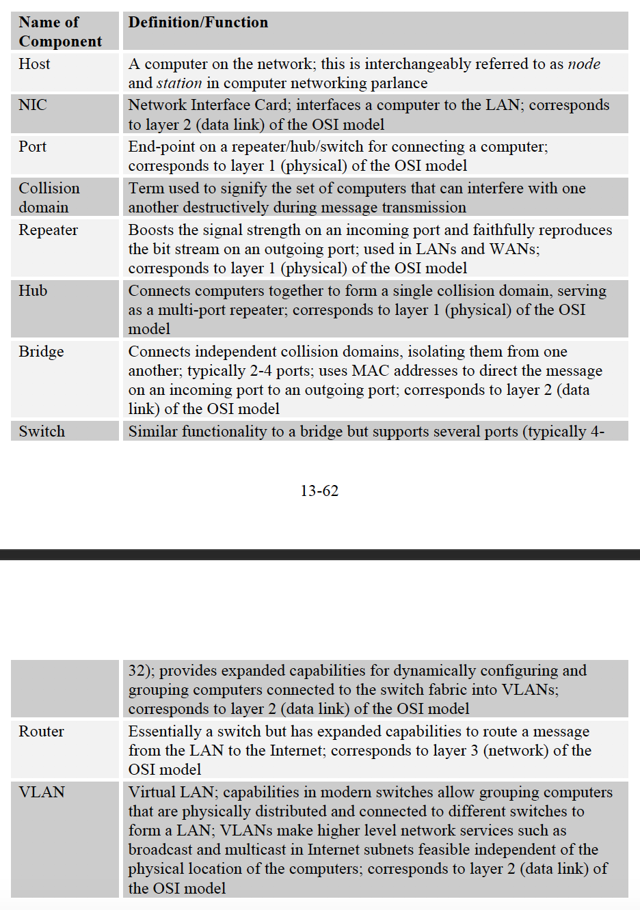
# Relationship between Layer of Protocol Stack
- TCP - most popular transport protocol
- IP - most popular network protocol
- TCP doesn't have to run on top of IP
  - can use many different network protocols
- do not have to check data integrity in packets
# Data Structures For Packet Transmission
- packet header
  - metadata that is part of each packet distinct from the actual data
    - destination address, sequence number, checksum
- transport layer takes message from app layer and breaks up into packets
  - puts a header in each packet
  - sample C code for packet for transport layer:
```c
struct header_t {
  int destination_address; /* destination address */
  int source_address; /* source address */
  int num_packets; /* total number of packets in
  the message */
  int sequence_number; /* sequence number of this
  packet */
  int packet_size; /* size of data contained in
  the packet */
  int checksum; /* for integrity check of this
  packet */
};
struct packet_t {
  struct header_t header; /* packet header */
  char *data; /* pointer to the memory buffer
  containing the data of size
  packet_size */
};
```
## TCP/IP Header
- structure of header depends on specifics of protocol at each level
- ex) TCP 
  - sequence number represents position of the first byte in segment with respect to total byte stream
  - since TCP is connection-oriented, header also contains source port and destination port
  - ACK number = next sequence number that is expected on connection
  - since TCP has congestion control, has window size field
    - each endpt observes amount of congestion, and adjust window size accordingly
  - other fields
    - SYN - signal start of new byte-stream, so endpts synchronize sequence number
    - FIN - end of byte stream transmission
    - ACK - signals that header includes ACK
    - URG - indicates if there is urgent data
    - IP address of source and destination come from network layer - pseudo-header
- IP packet layout: simple
  - IP header contains length of IP packet, source/destination, length, and fragment offset (where packet is in relation to message)
# Message Transmission Time
- processing delay at sender (**S**)
  - total time spent at the sender in different layer of protocol stack
    - transport elevel functions like breaking in to packets, appending header and checksum
    - network functions like looking up route for packet
    - link layer functions like media access/control, framing data
    - physical layer functions specific to medium for transmission
- transmission delay(**Tw**)
  - time needed to put bits on wire at sending end
  - affected by connectivity of computer to physical medium
  - **message size / network bandwidth**
- Time of flight (**Tf**)
  - delays experienced by message en route to destination
  - propogation delay - time for bits to travel on wire from A to B
    - factors: physical distance from a to b can be factor, but add up all link delays en route to destination instead to be precise
  - queueing delay - caused by switched en route, as well as different network protocols
- Processing Delay at receiver (**R**)
  - same as sender, but for receiver
- **Total time for msg transmission(End-to-end latency) = S + Tw + Tf + R**
- **Throughput = msg size / end-to-end latency**
- advanced example:

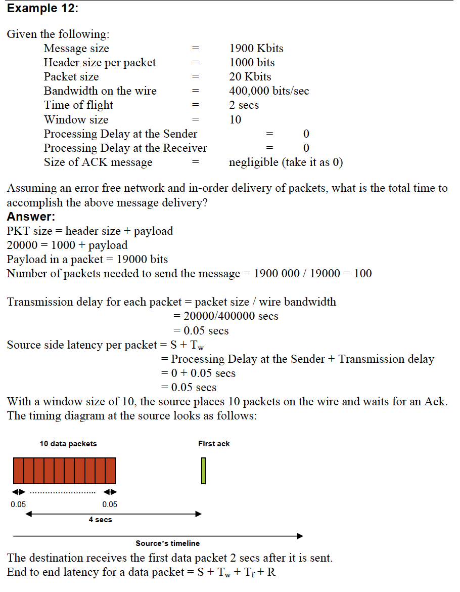
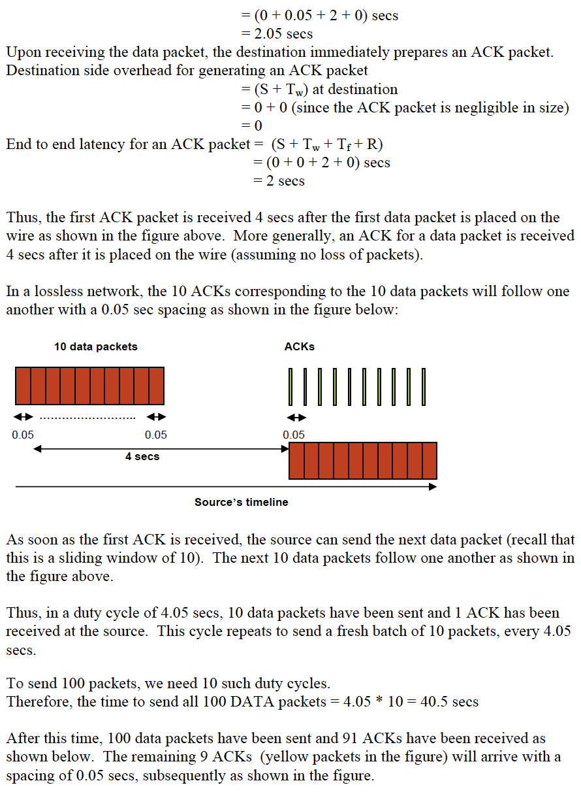
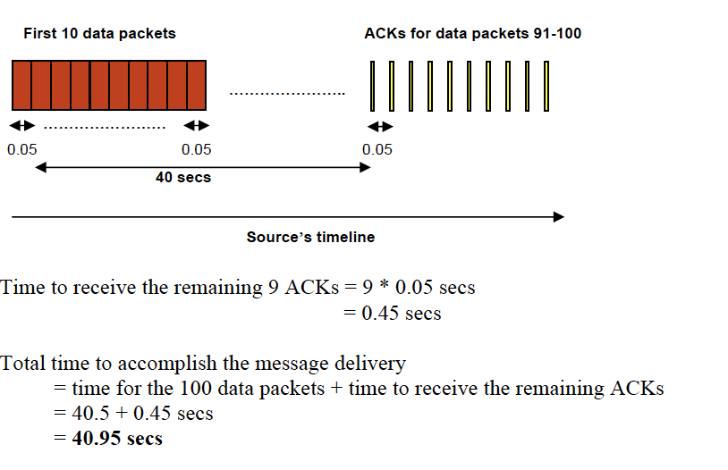
# Summary of Protocol Layer Functionalities
- App layer
  - HTTP, SMTP, FTP to support different types of apps like browser, mail, IM, video
- Transport Layer
  - delivers application messages between 2 endpts
  - TCP/UDP
- Network layer
  - delivers data handed to it by transport layer
  - fragment/reassembly for link layer, routing, forwarding
  - routing algos
- Data link layer
  - interface network layer to physical medium
  - MAC, framing packets, error detection (packet collision), error recovery
- Physical layer
  - mechanical/electrical details like medium data is sent on
# Networking Software and the OS
## Socket Library
- Interface provided by OS to network protocol stack
- TCP/IP are dominant protocols
- programs live above protocol stack
  - unix provides socket as abstraction for processes to communicate w/ one another
  - socket should support multiple protocols
    - different types of apps have different protocols that work best
## Implementation of Protocol Stack in the OS
- typically network and transport layers are implemented in software and are part of OS
- link layer is hardware
## Network Device Driver
- host may have multiple network interfaces
- NIC implements some link layer in protocol stack in hardware
  - device driver complements this hardware functionality to enable NIC 
- there is difference between network I/O and disk I/O
  - OS has to be ready anytime to receive packets
- NIC that connects to Ethernet NIC device driver
  - alloc/dealloc network buffers in host memory for sending/receiving packets
  - transmit network buffers, initiate DMA
  - register network interrupt handlers with OS
  - set up network to receive buffers, 
  - fielding hardware interrupts and making upcalls
# Network Programming Using Unix Sockets
- socket creation params
  - domain - helps pick protocol family to use for communication
    - IP if external, Unix internal if LAN
  - type - specifies app property (datagram or byte stream)
  - protocol - specifies protocol that satisfies domain and type specified
- preparation for interprocess communication
  - create socket for comminication
    - creates endpt of communication for server (like making telephone connection with no destination)
    - system call (**bind**) associates name (unique identifier) to socket
      - ex) IP has 2 ports: host adress, port #
    - **listen** call: tells OS how many calls can be queued for the socket
    - **accept** - need to accept connection request
- client process to connect:
  - create client socket
  - make **connect** system call: connects client socket to name published by server
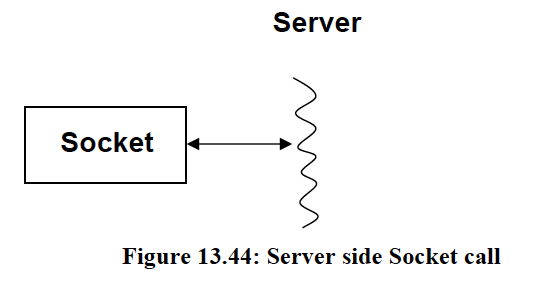
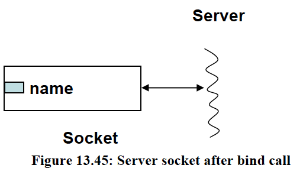
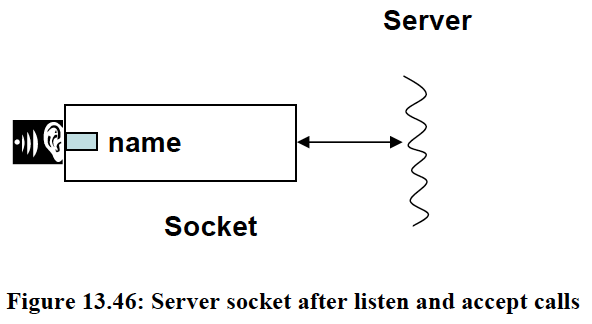
- to complete connection, callee must **accept** call
- 