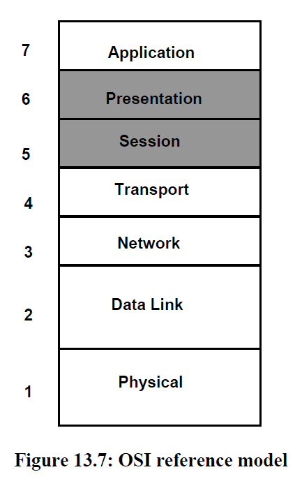

**Ch13: Fundamentals of Networking and Network Protocols**
- how do computers communicate with one another?

# Preliminaries
- goal is to focus on networking from perspective of hardware and OS points of view
- **socket** library provides API for developing network apps
  - implementing this API is first step
- **protocol stack** - abstraction that addresses networking issues
- **network device driver** - interacts with network interace card to connect to network

# Basic Terms
- **host** - computer that hooks onto network
- **NIC(network interface card**- peripheral controller
- "the network" is simply a composite of several networks
- what is the internet?
  - analogy: sending letter to grandma in india
    - write letter and put into mailbox, mailperson picks up letter
    - letter is sent to regional post office, which are sorted and sent to their respective regional post office destinations, which is finally sent to grandma in India
  - writing an email to mom in California
    - computer plugs into modem, and the modem connects to an ISP (internet service provider), which is a local cable company
      - since this is the access point to the internet, it is an access network
    - access network is like mailwoman - doesn't know how to get email to Cali, but knows how to send it to the regional ISPs
    - regional ISP knows how to talk to other regional ISPs across country/world
    - Mom's access point would be the final destination of email
- ISP systems are not directly connected to one another 
  - **routers** - sit in core on network and route messages accordingly
    - how does it know where to send?
      - like zipcode for mailing, networks use IP address
  - internet is network of networks
- **packets** - unit of data that is routed from origin to destination
  - traverses seres of queues at routers' input from source to destination
  - if heavy network traffic, then paacket can experience queueing delays, and if router is full, packet can be dropped, leading to **packet loss**
- **edge of network** - laptops, computers, servers
- **core of network** - machines that route from source to destination
- **LAN(local area network)** - connecting computer to school/office network
# Networking Software
- in OS, this is the protocol stack
- **network protocol** - language that defines syntax and semantics of messages for computer to interact w/ each other
- there is a maximum packet size limit for different technologies, as well as maximum transmission rate
  - if data is too big, it needs to be split into several packets
  - also, no guarantee that packets will arrive in same order they are sent (out of order delivery)
  - queueing delays also another problem
  - packet loss
  - bit errors in data 
1. Arbitrary message size and physical limitations of network packets
2. Out of order delivery of packets
3. Packet loss in the network
4. Bit errors in transmission
5. Queuing delays en route to the destination
- protocol stack addresses these problems
# Protocol Stack
- protocol layering - abstracts and separates certain concerns to different layers of stack
  - outgoing messages are pushed down stack
  - incoming messages are popped up

- **application layer**
  - supports network-based applications
  - examples: HTTP, SMTP, FTP
- **Transport layer**
  - responsible for taking application layer message nad moving it between ends of communication
    - breaking message into packets
  - TCP/UDP are dominant transport protocols
    - TCP (Transmission Control Protocol)- reliable, and in-order delivery of data using a byte stream
      - connection oriented - establishes connection between 2 endpoints, and tears it down once the connection is closed
    - UDP(user datagram protocol) - like sending call through US mail
      - messages that have strict boundaries (no relationship at protocol level between successive messages)
      - no connection is established/no teardown before/after sending message, and messages can arrive out of order
- **Network Layer**
  - responsibility to route the packets from transport layer
  - when sending packet, network layer finds a way to get packet to destination address
  - when receiving packet, passes packet up to transport layer
  - use IP to format information in the packet 
- **Link layer**
  - sending mail analogy - airplane, mailcar, are examples of different vehicles used to transport mail
  - Link layer is similar - provides protocol on how to move packet between nodes on internet
  - network layer gives link layer IP packet
  - link layer delivers fragments of IP to then next node, where the data is passed up to the network layer and repeated until it reaches the destination
  - many different link layer protocols
- **Physical layer**
  - physically moves the bits from one node to next
- example message sending with protocol stacks

- layering abstraction has many benefits
  - separation of responsibilities
  - makes it easy to add/change modules in a layer without changing other layers

## OSI Model

- adds presentation and session layers
  - session - manager of a specific communication session between 2 endpts
  - presentation - formats text input and does character conversion
## Practical Issues with Layering
- real implementations do not stick with OSI model
- TCP/IP protocol is already standard for transport/network layers, thus many existing protocols combine many layers of the OSI model
# Application Layer
- network app has 2 parts
  - client - sits on end devices like laptops and phones
  - server - part that provides the functionality of a network service (search engine)
  - examples of network apps: WWW, email
- different app layer protocols for different types of apps
  - HTTP - web clients and servers
  - SMTP - email
- protocols can transcend hardware architecture, and are independent of the platform
  - example: HTTP, SMTP
- OS can also provide own network services
  - example: UNIX has socket library for building network apps
# Transport Layer
- assume transport has API:
  - `send (destination-address, data)`
  - `receive (source-address, data)`
- functionality of transport layer
  - support arbitrary data size at app level
  - support in-order delivery of data
  - shield app from loss of data
  - shield app from bit errors in transmission
- 2 views of data:
  - byte stream
    - TCP
  - message
    - UDP
- must separate data into packets to comply with network, as well as assemble the packets to deliver in order
  - called **scatter/gather**
- need a **sequence number** to determine order of message
  - each packet gets a sequence number, so solves the out of order and arbitrary message size problem
- source needs confirmation that destination received packets, and that none are lost
  - positive acknowledgement

- **round trip time** - time taken for small message to be sent from sender to receiver then back to sender
  - estimates delay experienced to send and receive acknowledgement, set timeout values accordingly
## Stop and Wait Protocols
- simple approach
  - sender sends packet and wait for positive ACK
  - once packet is received, recipient generates and sends an ACK for the packet
    - contains info for the sender to show that the packet is acknowledged (Seq #)
  - sender wait for period of time called **timeout**. If within this period it doesn't get an ACK, then it retransmits the packet
- need sequence numbers still because ACK packets can be lost as well, so may need to resend
  - seq # lets sender know if incoming ACK is current or duplicate ACK
- since at a given time there is only 1 packet in transit, we don't need an infinitely increasing # to be our sequence number
  - simply have an alternating bit from 0 to 1 (alternating bit protocol)
- timeout value must bee greater than round trip time
## Pipelined Protocols