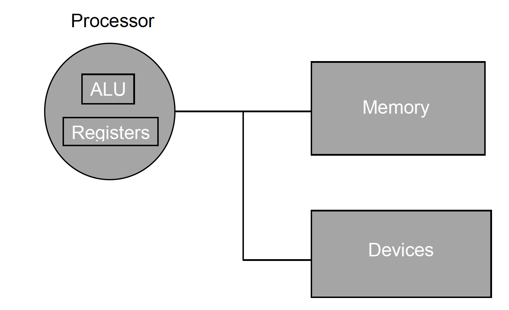
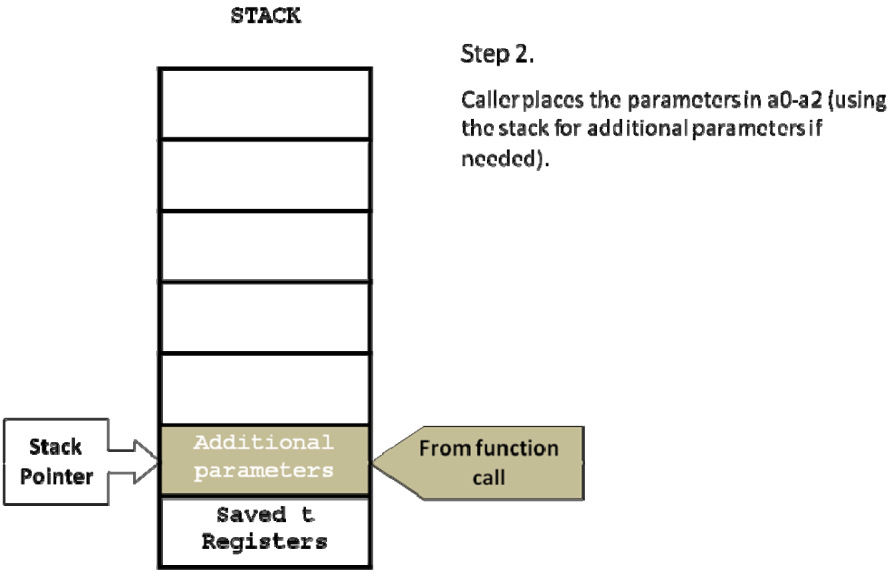
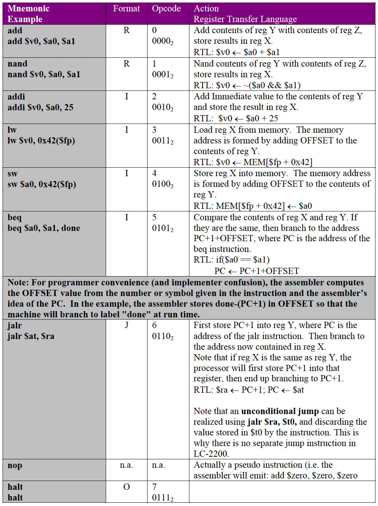

# Ch2: Processor Architecture
<!-- toc -->

- [Designing Instruction Set](#Designing-Instruction-Set)
- [Expressions and Assignments, Variable Reuse](#Expressions-and-Assignments-Variable-Reuse)
- [Granularity of Operands](#Granularity-of-Operands)
- [Endianness](#Endianness)
- [Packing Operands](#Packing-Operands)
- [Data Abstraction](#Data-Abstraction)
- [Arrays](#Arrays)
- [Conditionals](#Conditionals)
- [Switch Statement](#Switch-Statement)
- [Loops](#Loops)
- [Compiling Function Calls](#Compiling-Function-Calls)
- [Software Calling Convention](#Software-Calling-Convention)
- [Instruction-Set Architecture Choices](#Instruction-Set-Architecture-Choices)
- [Arch Styles](#Arch-Styles)
- [Instruction Format](#Instruction-Format)
- [LC-2200 ISA](#LC-2200-ISA)
- [LC-2200 Instruction Format](#LC-2200-Instruction-Format)
- [Instruction Details](#Instruction-Details)
- [Register Convention](#Register-Convention)

<!-- tocstop -->
## Designing Instruction Set
- Expressions and assignments (`var a = 7`)
- Data abstractions (classes/structs)
- Conditionals/loops
- Procedure calls (functions/recursion)
## Expressions and Assignments, Variable Reuse
- High level language:
    ```java
    int a = b + c; /* add b and c and place in a */ 
    int d = e – f; /* subtract f from e and place in d */
    int x = y & z; /* AND y and z and place in x */ 
    ```
    - take 2 operands and store result into 3rd operand
- Use registers to store operands
    - solves the issue of increasing sizes of memory addresses and storing them
    - 
- use immediate values to store constants
    - `addi r1, r2, imm; r1 ← r2 + imm`
- Since instructions only work with registers, need some way to get vars from memory into registers
    - `LD` and `ST` instructions
        - `ld r2, b; r2 ← b`
        - `st r1, a; a ← r1`
    - one operand is a memory location, the other is a register
- How to specify memory address?
    - introduce addressing mode: base+offset
        - address is computed as the sum of the contents of the register and an offset (an immediate value)
        - `ld r2, offset(rb); r2 ← MEMORY[rb + offset]` where `rb` is location of variable
## Granularity of Operands
- How wide an operand should be
    - In high level languages,
        - char is 1 byte
        - int is 4 
        - short is 2
- Different precisions
    - word - max precision that architecture can use for arithmetic/logic operations - 32 bits - int
    - half-word - 16 bits - short
    - byte - 8 bits - char
## Endianness
- How to order bytes within each word?
    - 1 word has 4 bytes
    
    - given a memory address `0x11223344`, could order it 2 ways:
        - 
            - this is big endian: most significant byte is first
        - 
            - little endian: least significant byte is first

- example
```c
int i = 0x11223344;
char *c;
c = (char *) &i;
printf("endian: i = %x; c = %x\n", i, *c);

what is printed?
```
    - if big endian, 0x11 printed; if little endian, 0x44 printed
## Packing Operands
- conserving memory by packing operands
- example
```c
struct {
    char a;
    char b[3];
}
```
 is a possible layout of memory
    - however, lots of wasted space, so can pack into 


- however, this may not always be the most efficient in terms of accessing data
```c
struct {
    char a;
    int b;
}
```
- if compilers packs this layout,
    - 
    - need to access 2 words to access int b; not efficient
    - so, compiler will lay out data structures so that data types are at word boundaries
    - 
## Data Abstraction
- compiler has no choice other than to allocate data abstractions into memory
- structs can be supported with base + offset
    - accessing any field just requires providing offset relative to base register
## Arrays
- also called vectors
- storage space not always known at compile time
- could try base+offset if index is fixed
    - `arr[5] = arr[5] + 1`
- however, most of the time index is not fixed
    - `arr[j] = arr[j] + 1`
    - use base+index addressing mode

## Conditionals
- if-then-else statement
    - need to evaluate predicate (if a==7) - can be done already using expression evaluation instructions
    - Need to change control flow of program
    - `BEQ R1, R2, offset` or `BEQ R1, R2, L1`
        - if R1 and R2 are equal, then PC = PC+offset, else, just go to next instruction after `BEQ` statement
            - this is PC relative addressing
        - if R1, and R2 are equal, jump to memory address at L1
        - conditional branch
    - don't need additional instruction for else statement
        - however, need unconditional jump statement
        - `j r_target` where `r_target` is target address of jump
        - reason we use this is b/c conditional jump is limited due to the instruction needing to specify registers; unconditional branch has more bits able to be used

## Switch Statement
- could be like a bunch of nested if statements, but instead doesn't
- uses a jump table with pointers to starting addresses of each code segments
- 

## Loops
- no new instructiosns needed for loops - have unconditional/conditional branches already

## Compiling Function Calls
- example:
    - programmer is in `main`, `main` calls `foo`, and once `foo` returns, go back to `main`
    - caller is the method that makes the procedure call
    - callee is procedure being called
- steps to compile procedure call:
    1. Ensure that the state of the caller (i.e. processor registers used by the caller) is preserved for resumption upon return from the procedure call
    2. Pass the actual parameters to the callee
    3. Remember the return address
    4. Transfer control to callee
    5. Allocate space for callee’s local variables
    6. Receive the return values from the callee and give them to the caller
    7. Return to the point of call


- state of caller
    - since we are using same set of registers for caller and callee, need to save registers of caller and restore them on return
    - so, we introduce a shadow register set where we will save registers of caller and will use to restore register set upon return
    - 
    - problem: cannot have infinite number of shadow registers (if current function calls another function)
        - instead, use stack in memory
- stack calling convention
    - use stack pointer: designate processor register as to store stack pointer
    - try to use registers first: use system memory sparingly as `LD/ST` instructions are slow and expensive

- storing return address
    - `JAL r_target, r_link`
        - where `r_target` is address we are jumping to and `r_link` is the address that we are saving to return to after procedure call ends

- Parameter passing - use processor registers, and use convention; if more parameters than registers, then use stack

## Software Calling Convention
- convention
    - Registers s0-s2 are the caller’s s registers
    - Registers t0-t2 are the temporary registers
    - Registers a0-a2 are the parameter passing register
    - Register v0 is used for return value
    - Register ra is used for return address
    - Register at is used for target address
    - Register sp is used as a stack pointer

- details about stacks
    - stack grows from high to low memory
        - pushing onto stack: decrement stack pointer and place value at memory pointed to by stack pointer
        - pop: takes memory location of where stack pointer points to and increments stack pointer

- building stack frame
    - 
    - 
    - 
    - 
    - 
    - 
    - 
    - 
    - 
    - 
    - 
    - 

- `Activation record`
    - The portion of the stack that is relevant to the currently executing procedure
    - 

- `recursion`
    - don't need anything else
- `frame pointer`
    - stack pointer may move during execution of the function
    - designate a register for frame pointer - contains known point in activation record for the function, and will never change
    - 

## Instruction-Set Architecture Choices
- additional addressing modes
    - indirect addressing mode
        - `LD @ra` - like LDI - go to address in register, and use that address to fetch word you want 
    - pseudo-direct addressing
        - uses top 6 bits of the PC and concatenate with the last 26 bits of instruction
        - 

## Arch Styles
- Stack oriented - operands work on stack
- memory oriented - operands work on memory
- register oriented - operands work on register
- hybrid

## Instruction Format
- 0 operand instructions
    - `HALT` `NOP`
- 1 operand
    - `NOT` `NEG` (2's complement) `INC/DEC`(increment or decrement operand)
- 2 operand
    - `ADD`
- 3 operand
    - `ADD R1, R2, R3`
 - generic structure

- instructions can be either
    - fixed length - slower, but easier implementation
    - variable length - complicates implementation

## LC-2200 ISA
- 32 bit
- register oriented
- little endian
- fixed length instruction
- 16 general purpose register, with separate PC register

## LC-2200 Instruction Format
- R-type
    - 
    - `ADD`, `NAND`
- I-type
    - 
    - `ADDI, LW, SW, BEQ`
- J-type
    - 
    - `JALR`
- O-type
    - 
    - `HALT`
## Instruction Details

## Register Convention
