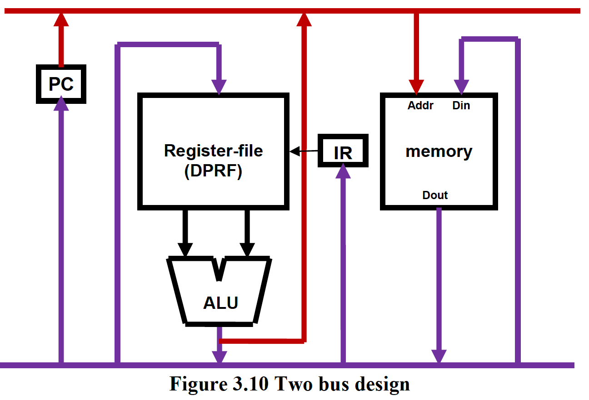

# Ch3 - Processor Implementation
<!-- toc -->

- [Architecture vs Implementation](#Architecture-vs-Implementation)
- [Circuits](#Circuits)
- [Hardware Resources](#Hardware-Resources)
- [Level vs Edge Triggered](#Level-vs-Edge-Triggered)
- [Connecting Datapath Elements](#Connecting-Datapath-Elements)
- [BUS-Based Design](#BUS-Based-Design)
- [Finite State Machine](#Finite-State-Machine)
- [Datapath Design](#Datapath-Design)
  * [Datapath Width](#Datapath-Width)
- [Width of Clock pulse](#Width-of-Clock-pulse)
- [Control Unit Design](#Control-Unit-Design)
  * [ROM + State Register](#ROM-State-Register)
- [FETCH Macrostate](#FETCH-Macrostate)
- [DECODE Macrostate](#DECODE-Macrostate)
- [EXECUTE Macrostate](#EXECUTE-Macrostate)
  * [ADD Instruction (R-type)](#ADD-Instruction-R-type)
  * [NAND (R-type)](#NAND-R-type)
  * [JALR (J-type)](#JALR-J-type)
  * [LW (I-type)](#LW-I-type)
  * [BEQ (I-type)](#BEQ-I-type)
- [Contol Unit Design](#Contol-Unit-Design)
  * [Microprogrammed Control](#Microprogrammed-Control)
  * [Hardwired Control](#Hardwired-Control)

<!-- tocstop -->
# READ ON WIDTH, WRITE ON EDGE
## Architecture vs Implementation
- can have same architecture, but different implementation based on needs
- can develop hardware and software in parallel
- maintains compatability with older hardware
- problems with implemetations
    - how to organize electrical components
    - cooling the hardware

## Circuits
- combo logic: 1 unique output for given set of inputs
- sequential logic:
    - remembers state
    - output depends on current state and inputs

## Hardware Resources
- ALU, Register file (collection of registers), Program counter, instruction register
- Dual ported register file: allows 2 registers to be read from at once
- Memory - separate from processor
    - not edge triggered - level logic, no clock
    - to read from memory, supply address to read from and read signal to memory; after certain amount of time, data will be available on data out lines
    - same thing for write, but supply value what you want to write into memory location
- ALU - combinational logic circuit
    - 2 inputs, 1 output
    - function selector which selects which functional unit is presented on output

## Level vs Edge Triggered
- level: outputs change when clock is high/low
- edge triggering: outputs change when clock transitions

## Connecting Datapath Elements
- example: trace through an add instruction
    - 1: use PC to specify to memory location of instruction
    - 2: instruction read from memory, stored in IR
    - 3: use register numbers from instruction to read registers from register file, perform operation using ALU, and write to the register specified back in register file
    - 
    - how many clock cycles?
        - need one clock cycle to transfer info from one storage element to another
        - 
        - 
- `Clock width`
    - look at all the possible delays:
        - time that has to elapse for the output of PC to be stable for reading
        - wire delay for the address to propagate from the output of PC to the Addr input of the memory
        - access time of the memory to read the addressed location
        - wire delay for the value read from the memory to propagate to the input of IR
        - and more...
    - width must be greater than all these delays, and we choose a width for the worst-case delay throughout the entire datapath

## BUS-Based Design
- quickly run into problem if we want to connect multiple datapath elements to each other - 32 wires (width of datapath) between datapath elements
- solutions:
    - single BUS design - have all elements share 1 wire
        - each datapath element has a tristate buffer connecting to BUS (triangle thing); tristate buffer must be selected to be "driving" the BUS in order to access
        - allows only 1 unit to use BUS at time
    - 2 BUS design
    - 
        - add instruction takes 2 clock cycles as well - but we did not need to connect every datapath element to each other

## Finite State Machine
- garage door example
- FSM is an abstraction for a sequential logic circuit

## Datapath Design
- CPU contains datapath and control unit
- ALU - can ADD, NAND, SUB
    - need temporary register to store 1 of the 2 operands
- MAR
    - holds address sent by ALU to memory
- register file - 16 32 bit registers
- 32 bit PC
- Memory with $2^{32} \times 32$ bit words

### Datapath Width
- 32 bits

## Width of Clock pulse
- key terms
    - each combo logic element (ex ALU) has a propogation delay from input to output
    - delay from access time where register enabled for reading to output
    - input must be stable for a set amount of time, and continue to 
    - wire delay
- must add up all worst case delays for clock cycle time

## Control Unit Design
- like the conductor of an orchestra (datapath)
    - gives cues for datapath elements to carry out functions
- signals control unit can assert:
    - Drive signals: `DrPC, DrALU, DrREG, DrMEM, DrOFF`
    - Load signals: `LdPC, LdA, LdB, LdMAR, LdIR`
    - Write Memory signal: `WrMEM`
    - Write Registers signal: `WrREG`
    - ALU function selector: `func`
    - Register selector: `regno`

### ROM + State Register
- even though we have FSM to store macrostates(FETCH, DECODE, EXECUTE), each macrostate will have microstates to carry out details of each macro state
    - we can encode them into a state register-
        - ex) if FETCH has 3 microstates,
        ```
        ifetch1 = 0000
        ifetch2 = 0001
        ifetch3 = 0010
        ```
- to generate control signals,
    - use a table with bits corresponding to each control signal-if bit is 1, assert; if not, don't
    - 
    - must add a next state column to each entry

- control unit implementation
    - 
    - this is a ROM-can freeze contents of the memory
    - at each clock tick, state register advances to next state specified by ROM
        - ROM output serves as a bit mask for the clock signal

- connecting datapath to control unit
    - connect datapath elems to corresponding signals coming out of ROM
- control unit process:
    - The state register names the state that the processor is in for this clock cycle.
    - The ROM is accessed to retrieve the contents at the address pointed to by the state register.
    - The output of the ROM is the current set of control signals to be passed on to the datapath.
    - The datapath carries out the functions as dictated by these control signals in this clock cycle.
    - The next state field of the ROM feeds the state register so that it can transition to the next state at the beginning of the next clock cycle.

## FETCH Macrostate
- fetches instruction from memory address pointed to by PC and loads it into IR, and increments PC
- need to:
    - We need to send PC to the memory
    - Read the memory contents
    - bring memory contents into IR
    - increment PC
        - all steps can be accomplished within 1 clock cycle
- exact steps:
    - ifetch1: PC → MAR
    - ifetch2: MEM[MAR] → IR
    - ifetch3: PC → A
    - ifetch4: A+1 → PC
- can simplify
    - ifetch1: PC → MAR, PC → A
    - ifetch2: MEM[MAR] → IR
    - ifetch3: A+1 → PC


- control table:
    - 
    - each table entry is a `microinstruction`, entire ROM table is called `microprogram`

## DECODE Macrostate
- once `ifetch3` is done, go to decode macrostate
- goal: examine contents of the IR to figure out what the instruction
    - once we know instruction, we can go to part of microprogram that implements that instruction
    - think of it like a multi-way branch based on the OPCODE of instruction
    - 
- 10 bit control logic:
    - 4-bit opcode from IR
    - 1 bit from Z-register (for conditional branching)
    - bottom 5 bits are from 5-bit regsiter (microstate)

## EXECUTE Macrostate
### ADD Instruction (R-type)
- r-type format:
    - 
- need to read from 2 registers and write into a third register
    - we have MUX to decide if we want to write to destination register, or read from source register
    - use a 2 bit `REGSEL` input to select register (00=Rx, 01=Ry, Rz=10)
- 3 microstates:
    - add1, add2, add3


- after executing, return to FETCH macrostate

### NAND (R-type)
- same thing, except do NAND operation instead of add

### JALR (J-type)
- format:

- puts return address into register Ry, and loads address at Rx into PC
- 
- 
### LW (I-type)
- LW loads memory address at RegY + offset into Rx
- I-type format:
    - 
- DrOFF enables sign extended offset to be loaded onto BUS
    - 
    - 

### BEQ (I-type)
- instruction compares 2 registers, and if the contents are equal, jumps to offset
    - to compare registers, we subtract the 2 registers and check if the result is 0
        - we have a 1-bit z register that checks if the value on the bus is 0
    - if z register is not set, we go back to `ifetch1`. else, continue with microstates of `beq`

## Contol Unit Design
### Microprogrammed Control
- advantages:
    - control logic contained within ROM, so can be easily maintained
- disadvantages
    - slow to access ROM 
    - horizontal microcode = not space efficient - most bits of microcode for each control signal are 0, meaning they are not needed

### Hardwired Control
- the ROM table is basically a truth table
    - it follows that we can implement the boolean logic functions corresponding to the outputs
- implemented using combinational logic
- time and space efficient