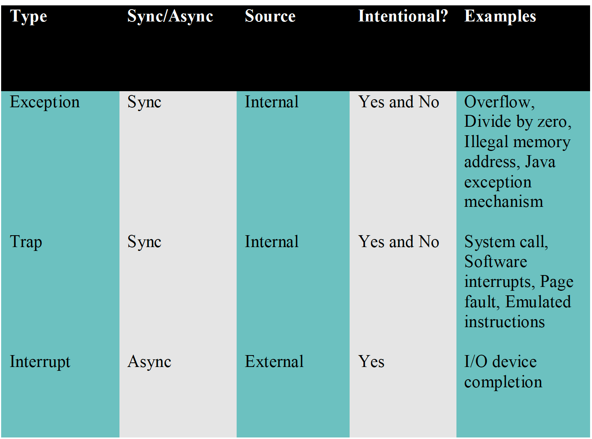
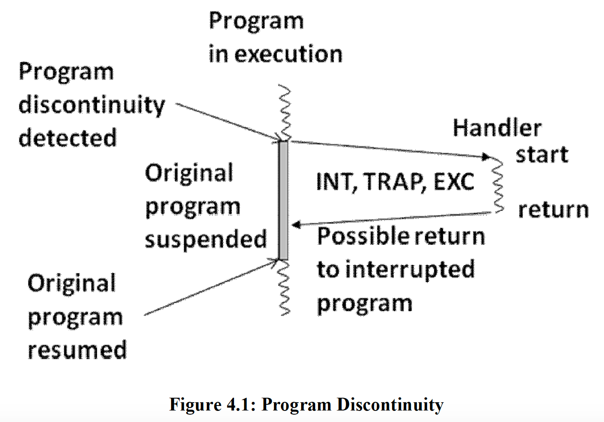
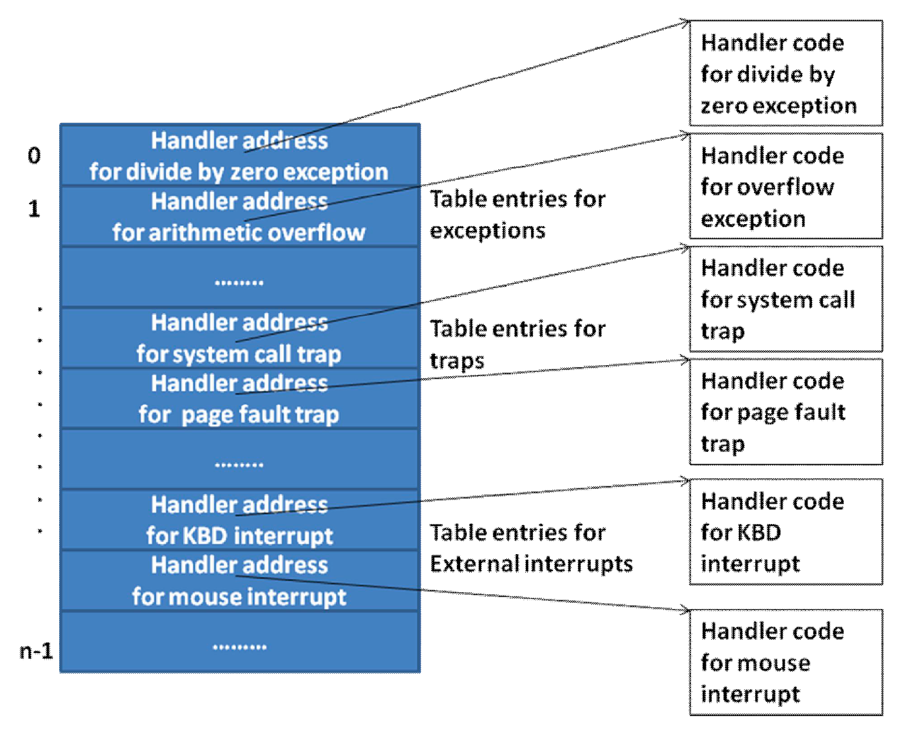
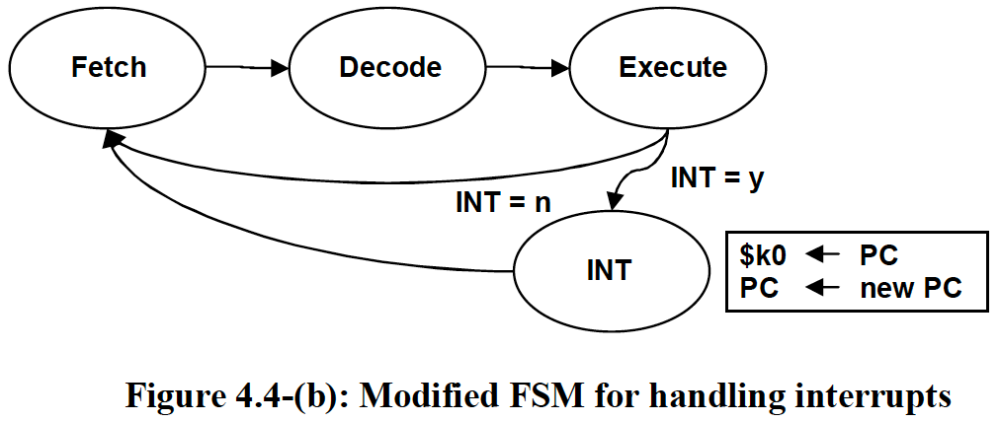
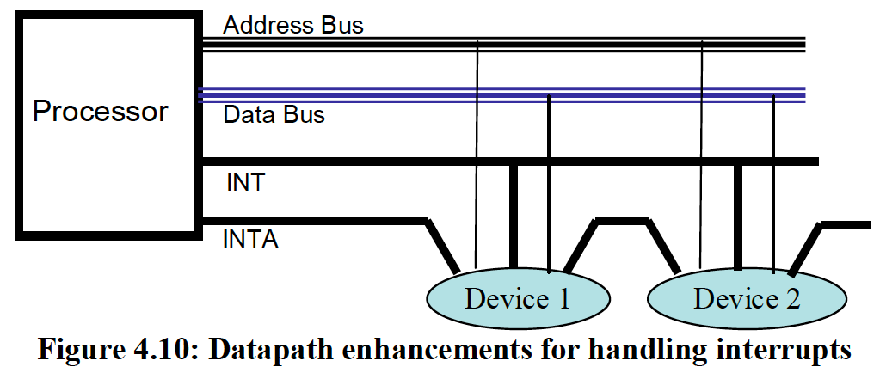
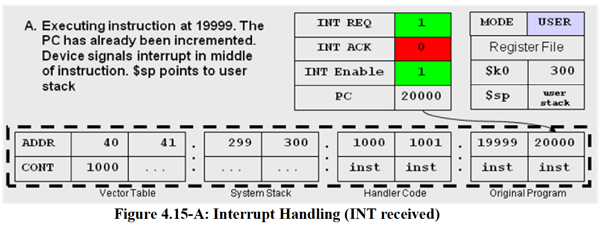
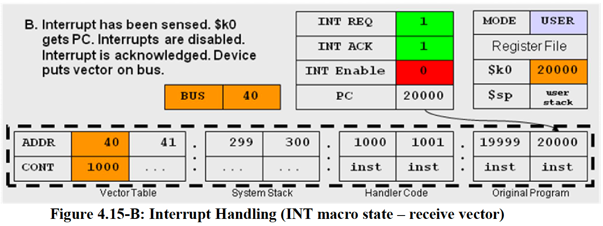
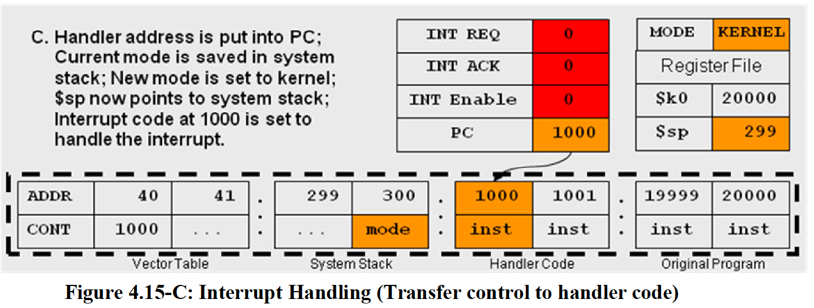
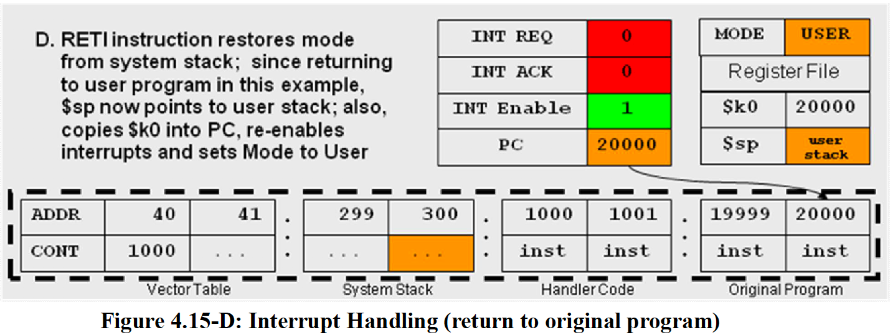

# Ch4: Interrupts, TRAPS, Exceptions
<!-- toc -->

- [Discontinuities in Execution](#Discontinuities-in-Execution)
  * [Interrupts](#Interrupts)
  * [Exceptions](#Exceptions)
  * [Traps](#Traps)
- [Dealing W/ Discontinuity](#Dealing-W-Discontinuity)
- [Architectural Enhancements](#Architectural-Enhancements)
  * [FSM Modifications](#FSM-Modifications)
  * [Simple Interrupt Handler](#Simple-Interrupt-Handler)
  * [Cascading Interrupts](#Cascading-Interrupts)
  * [Returning From Handler](#Returning-From-Handler)
- [Hardware Details for Handling Discontinuities](#Hardware-Details-for-Handling-Discontinuities)
  * [Datapath Details](#Datapath-Details)
  * [Receiving address of Handler](#Receiving-address-of-Handler)
- [Saving/Restoring Registers](#SavingRestoring-Registers)
- [Example Runthrough](#Example-Runthrough)

<!-- tocstop -->
- student asking question in lecture analogy
    - can let students ask questions periodically or let them raise their hand anytime

## Discontinuities in Execution
- synchronous vs async
    - sync: well-defined point in execution
    - async: unexpected in context of other events
### Interrupts
- how devices get attention of the processor
- async
### Exceptions
- program performing illegal operations
- sync
### Traps
- program makes system calls to read/write files
- also called software interrupts
- synchronous



## Dealing W/ Discontinuity
- processor detects discontinuity
- redirecting processor to deal w/ discontinuity is OS's responsibility
- to deal with the discontinuity
    - processor simply needs to execute different set of instructions corresponding with the discontinuity-called a **handler**
    - much like a procedure call, except can happen at any time in program, and may/may not return to interrupted program



- tricky things
    - discontinuity can happen at any time
    - can be unrelated to current program, so must save PC somehow
    - must determine what address to go to once discontinuity is detected
    - must know how to resume normal program execution
- to solve this, data structure called **interrupt vector table** exists
    - maintained within OS in memory that is known to the processor
    - each discontinuity is given a unique # that is called a vector-used as an index
    - OS sets this up at boot time


- we have trap/exception register (ETR)
    - internal to processor, stores this vector when one is detected

- overall process
    - architecture defines exceptions and specifies vectors
    - OS defines exceptions and specifies vectors
    - OS sets up IVT at boot time for addresses of handlers
    - hardware detects exceptions/traps and puts vector values into ETR
    - hardware detects external interrupts and puts vector into interrupt device
    - hardware uses vector value as index into IVT to get handler address to transfer control of program to

## Architectural Enhancements
- when should processor acknowledge interrupt?
    - after current instruction executes
- how does processor know there is an interrupt?
    - add hardware line on datapath bus - after each instruction, we see if there is an interrupt
- how to save return address
    - after there is an interrupt detected, go to special macrostate called INT

### FSM Modifications

### Simple Interrupt Handler
```
save processor registers;
execute device code;
restore processor registers;
return to original program;
```
- handler must save and restore all visible registers-has no way of knowing which ones aren't being used

### Cascading Interrupts
- problem with simple handler: if there is another interrupt, then we lose the return address to original program
- we need 2 instructions to prevent this from happening
    - disable and enable interrupts
- process:
```
Handler:
/* The interrupts are disabled when we enter */
    save $k0;
    enable interrupts;
    save processor registers;
    execute device code;
    restore processor registers;
    disable interrupts;
    restore $k0;
    return to original program;
```
- since we disable interrupts, a 2nd interrupt cannot occur until we return to the original program, thus removing the problem of losing our original PC.

### Returning From Handler
- at first glance maybe we could just use `JALR` to the address stored in `$k0`
    - however, interrupts must be enabled, and if we enable interrupts then return, another interrupt can occur from that
- so, introduce another instruction
    - `RETI`
    - loads PC from `$k0`, then enables interrupts

## Hardware Details for Handling Discontinuities
### Datapath Details
- multiple data lines connecting processor with memory
    - any device that wants to interrupt CPU asserts onto INT line
        - multiple devices can assert at the same time, unlike BUS
    - once processor is interrupted, it asserts the INTA line, which is daisy chained to all devices


- each pair of INT and INTA lines corresponds to a priority level-based on speed of device
- instead of daisy chaining devices together, modern architecture uses interrupt controller, an external device
### Receiving address of Handler
- once INTA signal is sent from processor to device, device puts its vector onto data bus
- processor then uses the vector to lookup in the vector table and retrieve handler address, which is loaded into PC
- vector table is normally in low memory
- summary of process
    - device asserts INT line
    - once processor completes current instruction, checks INT line
    - if INT line = y, then processor goes to INT macrostate and asserts INTA line
    - once device receives INTA, places vector onto data bus
    - processor receives vector and looks up entry in IVT
    - processor saves current PC into $k0 and loads PC with value from IVT

## Saving/Restoring Registers
- can't use a stack-interrupt can happen without current program running
- instead use 2 stacks
    - user stack
    - system stack
- once INT macrostate is entered, FSM performs stack-switching
    - to do this we have duplicate stack pointer - one that system uses (simply have duplicate register to store system stack pointer) and one for the user
    - privelaged mode-add a mode bit to processor, switch between user (user stack) and kernel (system stack) modes
        - RETI sets mode bit back to user
    - also allows us to restrict the writing to $k0, and enabling and disabling of interrupts
- INT macrostate
```
INT macro state:
    $k0 PC;
    ACK INT by asserting INTA;
    Receive interrupt vector from device on the data bus;
    Retrieve address of the handler from the interrupt vector table;
    PC handler address retrieved from the vector table;
    Save current mode on the system stack;
    mode = kernel; /* noop if the mode is already kernel */
    Disable interrupts;
```
- RETI instruction
```
RETI:
    Load PC from $k0;
    /* since the handler executes RETI, we are in the kernel mode */
    Restore mode from the system stack; /* return to previous mode */
    Enable interrupts;
```
## Example Runthrough



