# Ch5: Processor Performance and Pipelines

## Space and Time Metrics
- Memory footprint - how much memory instruction occupies
- execution time - how long it takes to execute
- in the past, used CISC architecture to execute less but more complex instructions = smaller memory footprint
    - where this logic breaks down
        - many programs don't use a large portion of the instruction set in execution
        - pipelining decreases these advantages
        - not very useful to compiler writers
        - caching memory
- what determines execution time
    - \# of instructions
    - \# of microstates for each instruction - clocks per instruction `CPI`
    - clock cycle time of processor

- $\textbf{Execution time} = n \times CPI_{avg} \times \text{clock cycle time}$

## Instruction Frequency
- how many times an instruction occurrs
- `static frequency`: \# of times instruction occurs in the compiled code
    - if instruction has a high static freq, we can try and optimize the amount of space it occupies in memory
    - optimizing this is not very practical
- `dynamic freq`: \# of times instruction actually runs in program
    - if instruction has high dynamic feq, then try and optimize the datapath/control to make CPI low 

## Benchmarks
- set of programs that are representative of the workload of processor
    - ex) video game processors benchmarked w/ video games
- useful metrics
    - total execution time
    - arithmetic mean of program execution times - biases to high
    - weighted arithmetic mean: can weight individual programs based on how frequently you use them
    - geometric mean: reduces the arithmetic mean biases for outliers, if you don't know how frequently
    - harmonic mean: also reduces biases for high values, used for ratios
- SPEC - common set of benchmarking tools

## Increasing Processor Performance
- increase clock speed: rearranging datapath elements so that worst-case delay is lowest
- Lowering CPI with datapath organization: using more than 1 bus
- reduce amount of executed instructions: more complex instructions
## Speedup
- measuring performance improvement

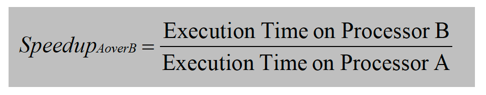
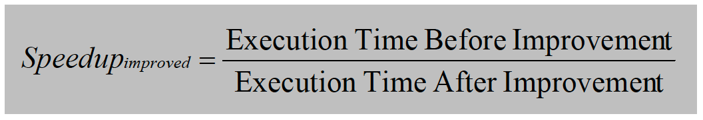
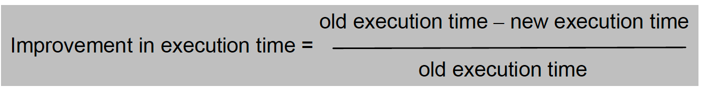
- Amdahl's law: measure how much a portion of execution time is impacted
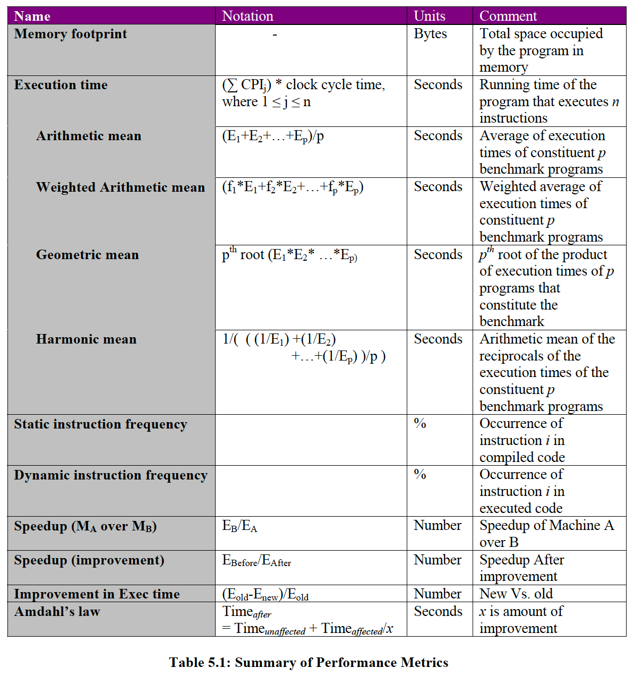
## Increasing Throughput of Processor
- instead of focusing on latency improvements, focus on throughput: \# of instructions executed by CPU per unit time
    - instead of clock cycles per instruction, focus on instructions per clock cycle
    - called `Pipelining`

## Intro to Pipelining
- sandwich line analogy: assembly line

## Intruction Processing Assembly Line
- while current instruction is decoding, fetch next instruction:

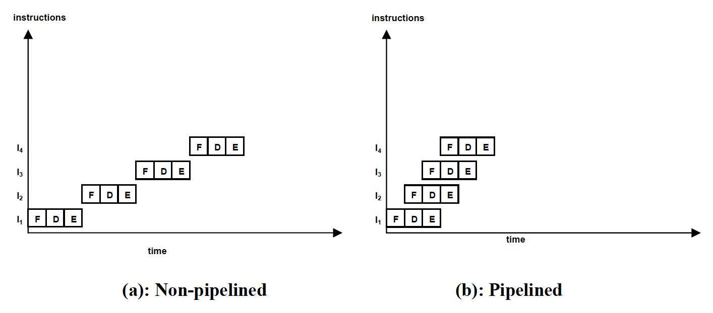

## Problems with Simple Pipeline
- multiple instruction can be using the same datapath elements
    - sol: add extra IR, memory, ALU for fetch stage
    - split memory into I-mem and d-mem: instruction memory/data memory (stores data structures)
- amount of work done at each stage is not the same
    - slowest stage limits the speed of assembly line, so must split work evenly

## Fixing Problems
- decode has little work relative to other stages - assign more work here
    - can read registers contents ahead of time-register bits in instruction are always fixed

- 5 stages
    - IF: fetches instruction pointed to by PC into IR, increments PC
    - ID/RR: decodes instruction and reads register file to pull out 2 operands (must be dual ported)
    - EX: Does arithmetic and logic operations for instruction
    - MEM: reads/writes from D-mem for LW and SW instructions; if not, do nothing in this stage
    - WB: writes to destination register ($R_x$) if instruction needs it

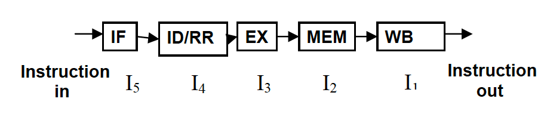
- buffering/pipeline register: once stage is completed, place results in a well-known place for next stage to pick up
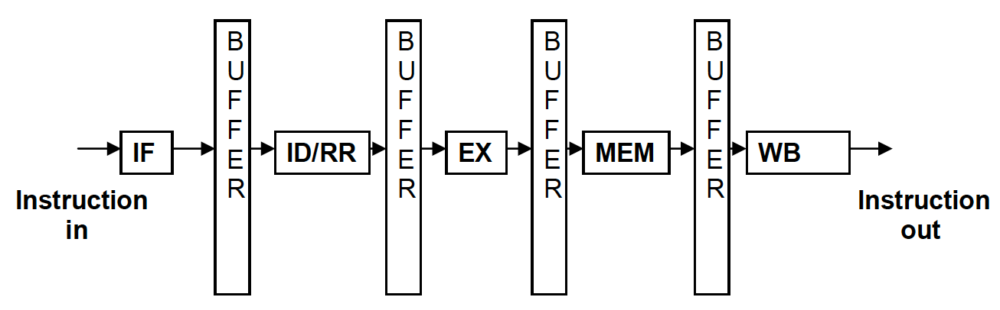
## Datapath Elements for Pipeline
- IF:
    - need PC, ALU, I-MEM
    - pipeline register after this should contain instruction
- ID/RR:
    - need dual ported reg file
    - pipeline register stores contents of registers read (A and B), results from decoding instruction (opcode and offset if needed)
- EX:
    - need to determine worst-case resource - BEQ instruction
    - need 2 ALUs, and to keep track of PC between stages
    - pipeline register store result of arithmetic operations corresponding to the instruction
- MEM:
    - needs D-MEM
    - if instruction isn't LW or SW, simply copy input to output
    - if LW, pipeline register contains D-MEM contents read, destination register, opcode
    - for SW, output is simply opcode, don't need to do anything for WB
- WB:
    - needs a DPRF, only used for instructions that have destination registers
        - no conflict with ID, because ID is reading and WB is writing 

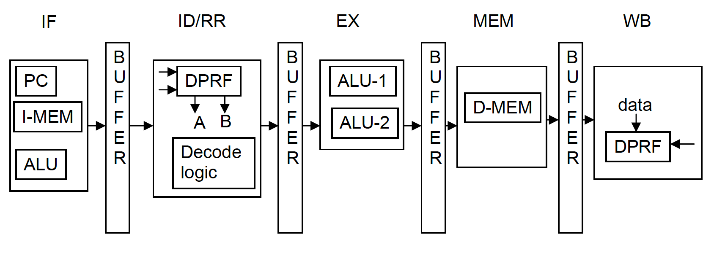
- CPU is in all states in pipeline at once
    - CPI of processor is 1 (retire 1 instruction per clock cycle)
- performance is highly dependent on memory
    - memory caches lower memory access times

## Pipeline-Conscious Structure and Implementation
- location of fields in the instruction remain unchanged for different instructions (register bits are always in the same place)
- equal amount of work in each stage

## Tracing Instruction Through Pipeline
- buffer outputs
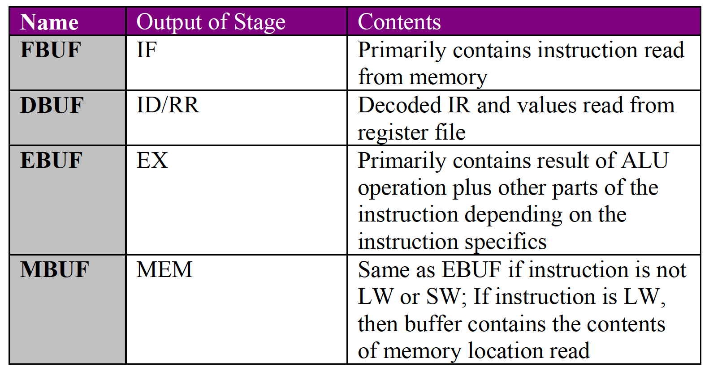
- add instruction 
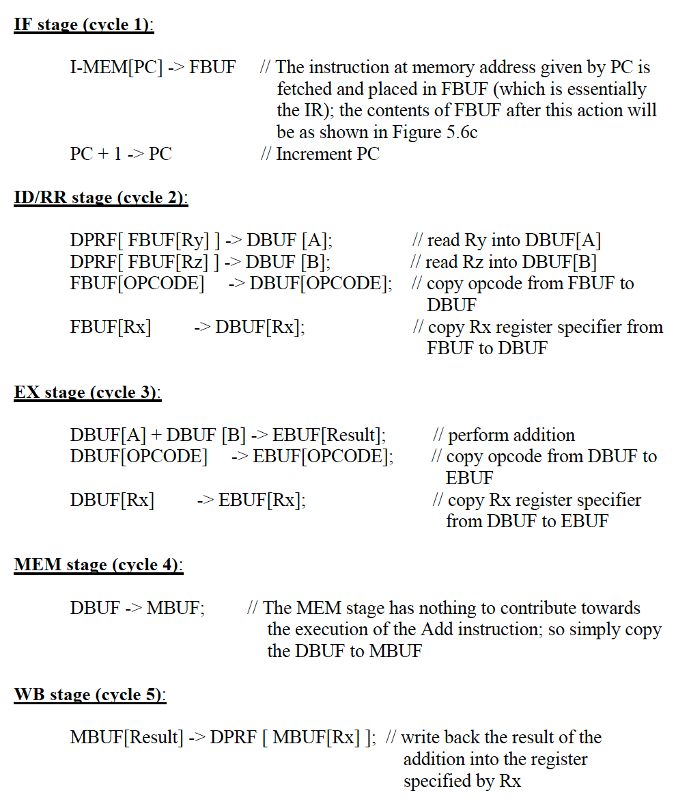

## Pipeline Register Design
- size of each pipeline register depends on maximum number of bits required to pass each instruction
    - ID/RR register will be the biggest
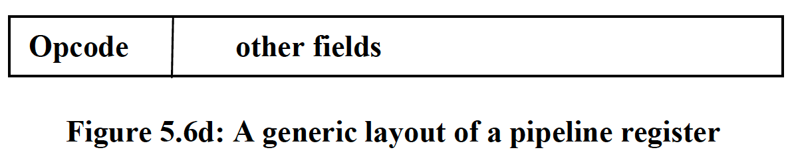

## Hazards
- 3 types of hazards
    - structural, data, control
    - these reduce pipeline efficiency, so executes less than 1 instruction/clock cycle
    - if pipeline is not ready, simply use NOP instruction instead 
### Structural Hazard
- limitations in hardware resources
    - ex) single BUS
- if need more than 1 clock cycle, then let previous/next stage know through `feedback lines`
- example: need 2 clock cycles for beq- only 1 ALU
- executing beq instruction
    - beq goes to EX
    - assert stay to previous feedback lines
    - write NOP opcode to output buffer for 1st clock cycle
    - finish next clock cycle for BEQ
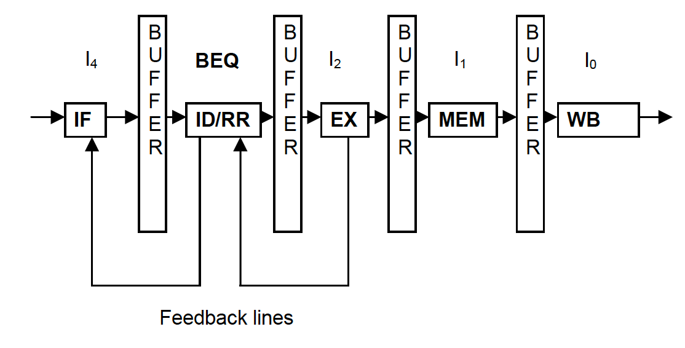
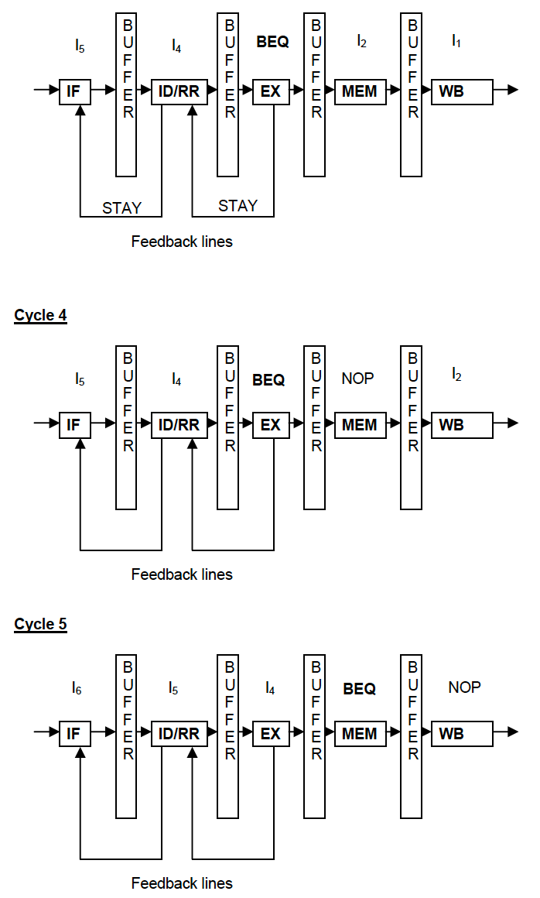
- terminology
    - pipeline is stalled when instruction can;t go to next stage
    - introduce a bubble for the stall
    - NOP is the actual "bubble"
### Data Hazard
- Read after write:
    - `add r1, r2, r3`
    - `add r4, r1, r5`
    - hazard b/c r4 depends on value of R1
- Write after read (WAR)
    - `add r4, r1, r5`
    - `add r1, r2, r3`
    - reading from r1 then writing to r1
- Write after write hazard
    - `add r1, r4, r5`
    - `add r1, r2, r3`
    - writing to r1 twice in succession

#### Solving RAW - Data Forwarding
- Less of a problem if there are some instructions in between read and write
- simply stall instruction that causes hazard until register value if available 

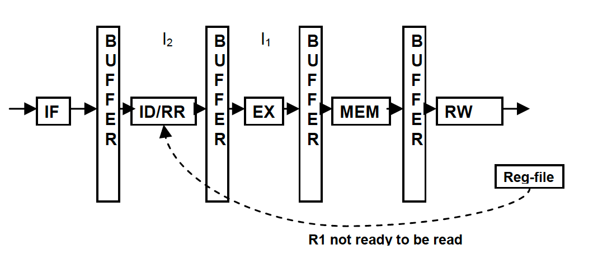
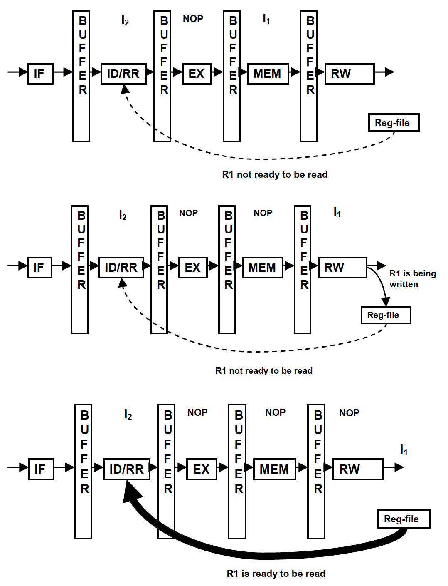
- ID/RR has busy bits to know when to stall
    - have a bit for each register
    - clear the bit once WB stage is clear
- optimizations
    - if stage generates new value for register, will look for stages that are waiting for new value
    - add another bit for read pending (RP)
    - if any EX, MEM, RW stage sees that (RP) bit is set for register when it is generating new value, then it sends the value immediately to ID/RR
- eliminates need for bubbling 

#### RAW Hazard - LW
- example
    - `ld r1, 0(r2)`
    - `add r4, r1, r4`
- using forwarding, just need to bubble once to MEM stage if instructions are after each other

#### WAR and WAW
- WAW - not a problem because first write would have been useless in the first place then
- WAR - not a problem because value that you read is already onto the pipeline before you write to it

### Control Hazard
- breaks in execution to to conditional branches
- conservative way: stop new instructions from entering pipeline
    - if no branch, then just stall for 1 cycle and continue normally
    - if branch, need to fetch instruction from new address in PC
#### Dealing With Branches
- delayed branch
    - assume that instruction after branch always executes (means that just continue sequentially in program) - so, always execute a NOP instruction after branch instruction
        - to optimize this, compiler looks at instructions to find a useful instruction that won't affect program semantics
        - called the `delay slot`
- branch prediction
    - assume branch will always be one way (either always branch or never branch) and let instructions into pipeline once branch is detected
- recovering from mispredictions
    - need to be able to terminate instructions in pipeline and start fetching from alternative path - called `flushing`
    - IF and ID/RR stages stop once they receive signal (even while executing instructions) and start bubbling
- examples
    - correct prediction: no bubbling needed
    - 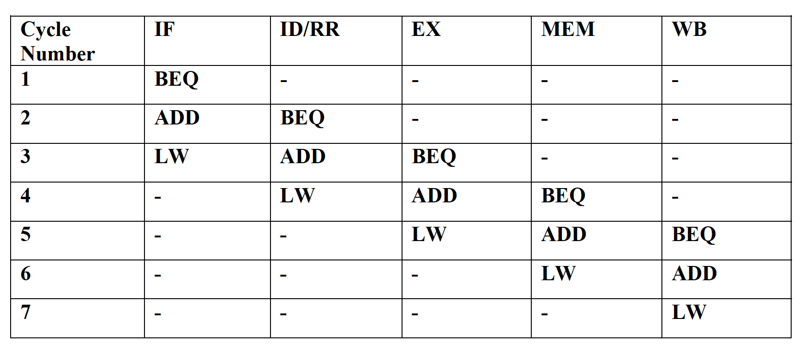
    - incorrect prediction: IF and ID/RR bubble, fetch correct instructions
    - 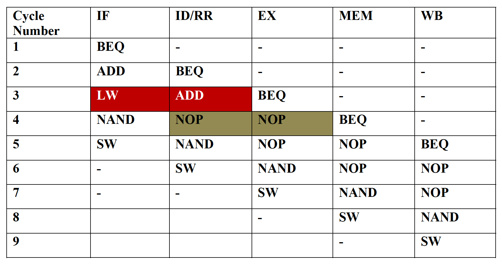
- how branch prediction is implemented
    - example: if target address is lower than current PC value, then most likely will branch
    - forward branches are less common than backwards branches

- branch prediction w/ target buffer
    - similar to branch prediction, but uses branch target buffer hardware
        - each entry of this table contains
            - address of branch instruction
            - if taken/not taken
            - address target of branch instruction
        - records the history of branches encountered within program
            - whenever branch is encountered, look up in the table (done in IF stage); if new, record the outcome
            - else, if found, in the IF stage, start fetching instructions from target address from lookup table
            - like hashma

### Summary of Dealing W/ Branches
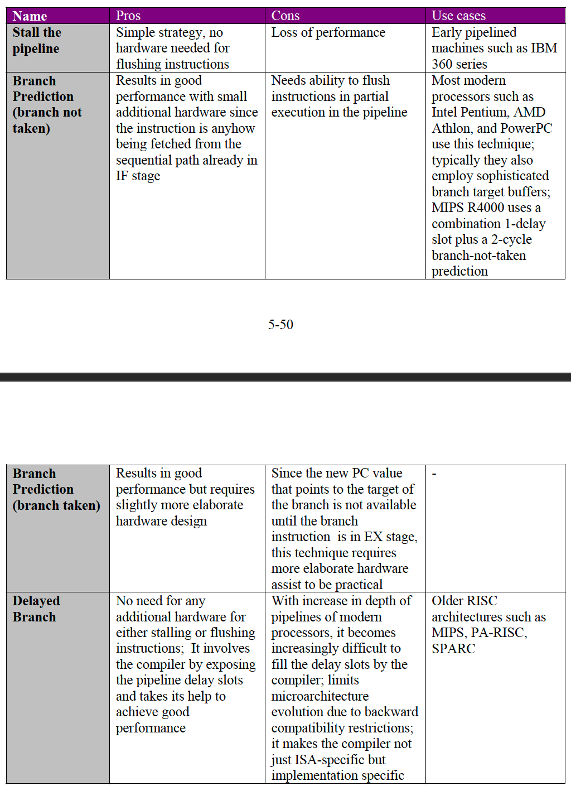

## Program Discontinuities Within Pipeline
- options when discontinuity detected
    - stop new instruction from entering pipeline
    - wait until instructions that are partially done to finish (draining)
    - go to interrupt state
    - can flush pipeline entirely (abandon instructions)
- most practical:
    - interrupt caught at certain stage; stages ahead will complete, while stages before will be flushed

