# Ch6: Processor Scheduling
- how do we want to prioritize activites processor has to do?
- [Ch6: Processor Scheduling](#ch6-processor-scheduling)
  - [Programs and Processes](#programs-and-processes)
  - [Scheduling Environments](#scheduling-environments)
  - [Scheduling Basics](#scheduling-basics)
  - [Performance Metrics](#performance-metrics)
  - [Non-Preemptive Scheduling Algos](#non-preemptive-scheduling-algos)
    - [FCFS - First Come, First Served](#fcfs---first-come-first-served)
    - [SJF - Shortest Job First](#sjf---shortest-job-first)
    - [Priority](#priority)
  - [Preemptive Scheduling Algos](#preemptive-scheduling-algos)
    - [Round Robin Scheduler](#round-robin-scheduler)
      - [Details of Round Robin Algo](#details-of-round-robin-algo)
  - [Combining Priority and Preemption, Meta Schedulers](#combining-priority-and-preemption-meta-schedulers)
  - [Scheduling Environments](#scheduling-environments-1)
  - [Summary of Algorithms](#summary-of-algorithms)
  - [Linux Scheduler](#linux-scheduler)
## Programs and Processes
- Operating system is simply a program
    - sole purpose is to execute user programs 
- how memory is layed out 
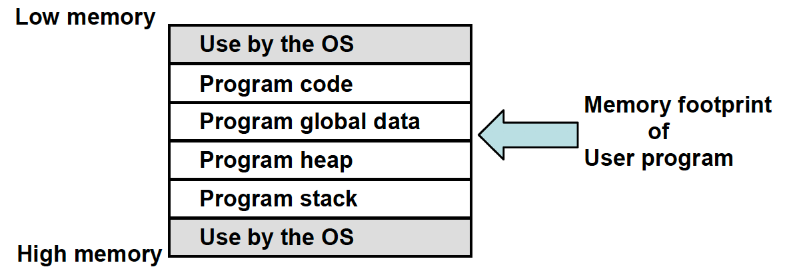
- program creation
    - code program in a high level language using an editor
    - compiler compiles code into binary 
    - linker links code with libraries that we have used in program, which outputs binary as well
- loader looks at disk and creates memory footprint
- we will focus on `scheduler`
    - allocate processor resources to programs
    - algorithm that chooses the best program to run first
    - 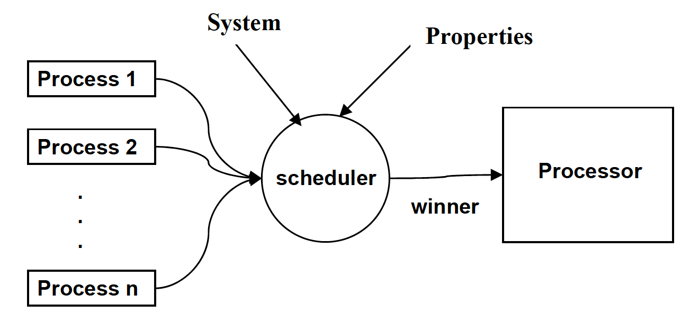
- `process/job` - program in execution + threads that are executing program
- properties to determine priority
    - static:
        - expected running time/memory usage
    - dynamic:
        - available memory, arrival time of program
- `tasks/threads`: units of work
- `thread of control`
    - based on logic/flow of program, multiple threads can decide to traverse paths through program

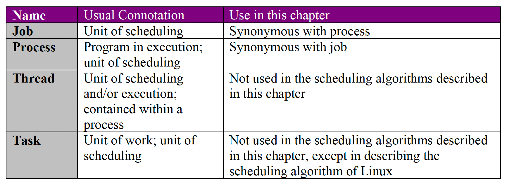

## Scheduling Environments
- `multiprogrammed`-loads multiple programs into memory from disk
- long-term scheduler: used in batch-based OS
    - balanced resources within system (processor, disk, memory)
- loader: creates memory footprint whenever user runs a program
- medium-term scheduler: used in modern OS
    - monitors use of dynamic memory usage to determine whether to increase number of processes running and competing for CPU (degree of multiprogramming)
    - tries to control `thrashing` - where current memory requirements of processes exceed memory capacity, resulting in slowdown in execution for all programs
- short-term scheduler: modern OS
    - select a process from current set of processes in memory 
    - focus of chapter
- dispatcher 
    - takes selection of short term scheduler and sets of processor registers for the program selected

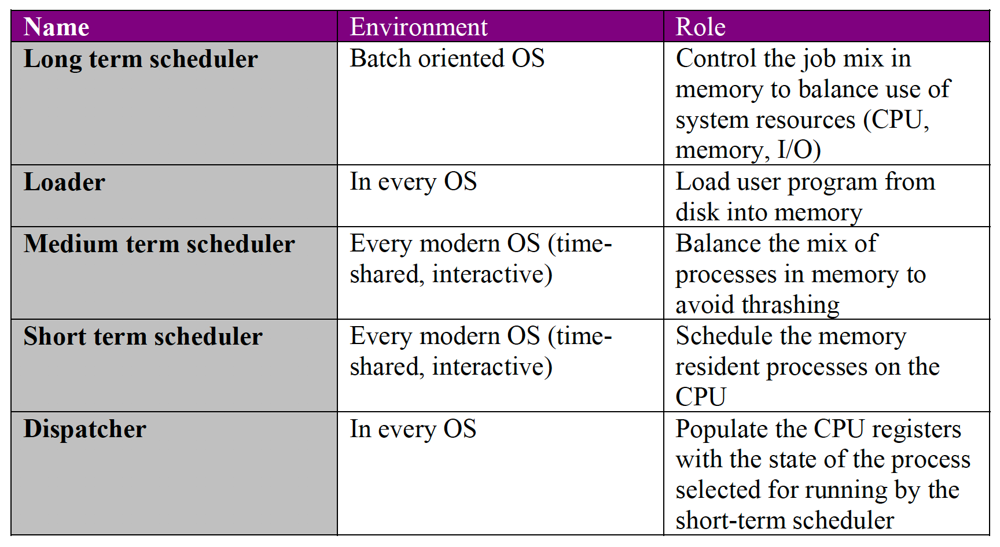

## Scheduling Basics
- typical behavior when handling program
    - cycles between CPU burst(rendering information) and I/O burst (write/read)
        - cpu burst: stetch of time within process w/ out IO call
        - I/O burst: reading a file; doesn't need CPU

- types of schedulers:
    - preemptive - scheduler voluntarily takes away control from current process
    - non-preemptive - process either completes or lets processor take over on its own

- general process of scheduler:
    - get attention of processor 
    - save state of currently running process
    - select new process to run
    - dispatch new process to processor (load processor registers with saved state of newly selected process)
- state of program
```c
enum state_type {new, ready, running, waiting, halted};

typedef struct control_block_type {
    enum state_type state; /* current state */
    address PC; /* where to resume */
    int reg_file[NUMREGS]; /* contents of general process registers */
    struct control_block *next_pcb; /* list ptr */
    int priority; /* extrinsic property */
    address address_space; /* where in memory */
} control_block;
```
- properties that a scheduler may know about process stored in structure called `process control block(PCB)`
    - one PCB for each process stored in a linkedlist - called the `ready queue`
        - most important data structure in scheduler - efficiency of this is key to scheduler performance
- OS also maintains an I/O queue similar to ready queue for processes that are waiting on I/O
- CPU uses ready queue to schedule processes
    - scheduler knows exactly which PCB is currently running
    - save state in PCB of current running process
    - selecting next state is simply copying PCB info into processor registers
- I/O and system calls are discontinuties, and processor waits until processor is in a clean state (instruction is completed); because of this, no need to save processor registers that aren't visible to programmer

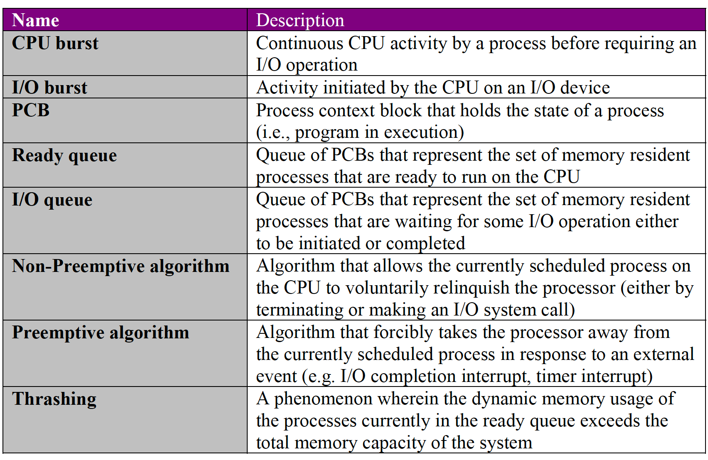

## Performance Metrics
- try to get computer running user program and less of the OS
- CPU utilization: % of time processor is busy
- throughput: jobs/second
- avg turnaround time: avg elapsed time for jobs to enter and exit system
- wait time
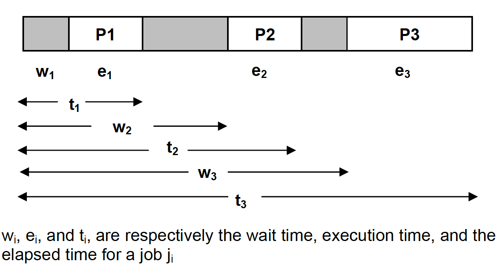
    - throughput: $\frac{3}{t_3}$ jobs/sec
    - avg turnaround time: $\frac{t_1+t_2+t_3}{3}$ secs
    - avg wait time: $\frac{(t_1-e_1)+(t_2-e_2)+(t_3-e_3)}{3}$ secs
- qualitative metrics:
    - starvation: when job is not making any progress: when response time is unbounded
    - convoy effect: when a long-running job dominates CPU usage; high variance in response time

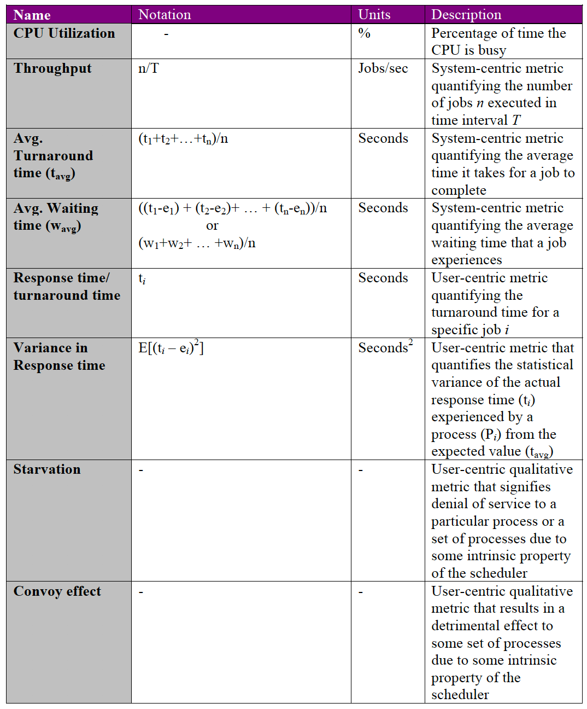

## Non-Preemptive Scheduling Algos
- FCFS, SJF, Priority

### FCFS - First Come, First Served
- based on arrival time - which process was called first
- guarantees no starvation - no denial of service for any process
- problem: response times can vary a lot
    - example: long process arrives before short process
        - like a slow person holding up a line with a lot of groceries while you only have 1 item
- example:
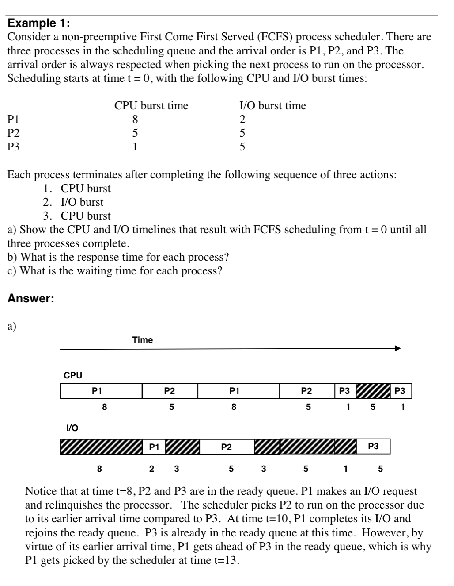
### SJF - Shortest Job First
- uses CPU burst time to determine which job is shortest
- provides best avg waiting time, and eliminates convoy effect
- potential for starvation
    - example: shorter jobs keep entering, so a process might have to wait forever
        - solution: `aging`: gives preference for jobs that have been in the queue for a while
- example: 
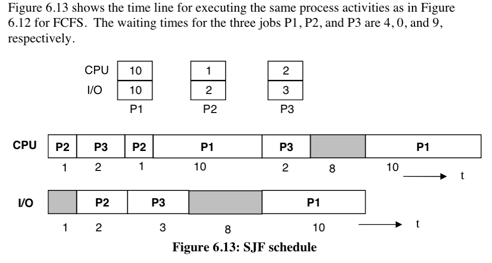
### Priority
- assign small integer value for each process to use as its priority
    - extrinsic property, so scheduler has complete control
    - very flexible
- also has problem with starvation and potential convoy effect
    - example high priority process also has long runtime

## Preemptive Scheduling Algos
- scheduler can assume control whenever it wants - means that it can stop a process currently running
- scheduler can save the state of the currently running process for resuming
- algos discussed previously (fcfs, sjf, priority) can be made preemptive
    - FCFS case: whenever process joins ready queue after i/o completion, scheduler can preempt currently running process(if the process that is joining the ready queue's arrival time is faster)
    - SJF/priority: scheduler reevaluates and makes decision to preempt current process whenever process joins/rejoins ready queue upon I/O completion
- SRTF(shortest time remaining first) - special case of SJF with preemption
    - scheduler has estimate of running time of each process
        - when process rejoins queue, scheduler computes remaining time for job and places the process within the ready queue according to the remaining time
        - if process that rejoins has lower time to complete, then preempt current process
    - example:
    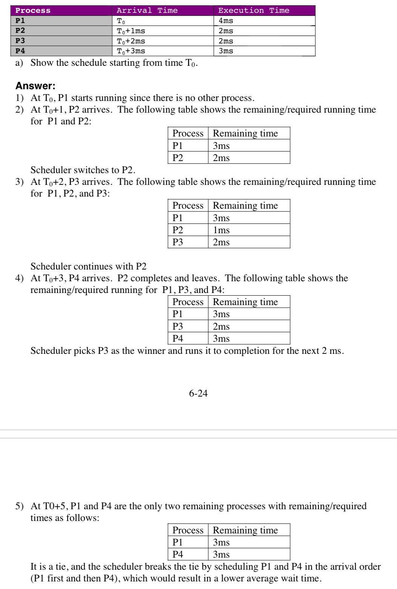
### Round Robin Scheduler
- every process gets share of processor (preemptive)
    - works well w/ time-shared environments
- scheduler assigns processor in "time quantum units" (`q` or `timeslice`)
    - each process in ready queue gets its share of processor for timeslice `q`
        - if process deosn't need `q` amount of time, just use minimum and leave queue
        - once timeslice is up, currently scheduled process placed at end of ready queue, and next process goes
- example
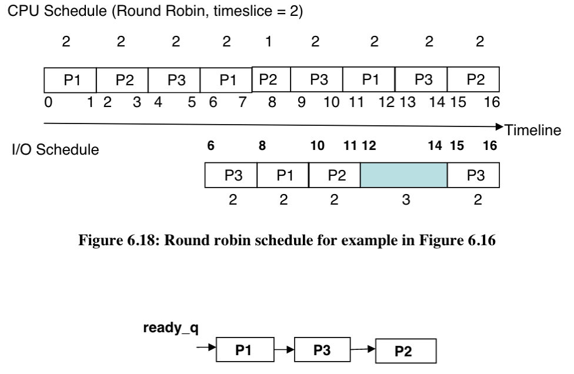
#### Details of Round Robin Algo
- hardware device (timer) interrupts processor once timeslice `q` is up
    - interrupt handler for timer is bit part of round robin
- runthrough of process
    - consider user program running on processor
    - once timer interrupts, interrupt handler takes control of processor (ch4 details)
    - handler saves current running program into PCB and gives control to scheduler (called `upcall`)
        - in general, upcall is when system function is called from a lower level of system software
    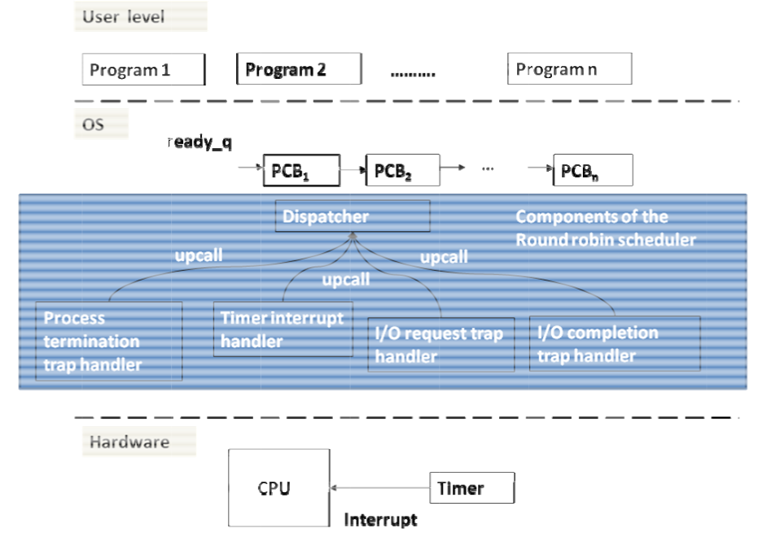
```
Dispatcher: 
    get head of ready queue;
    set       timer;              
    dispatch;       
Timer interrupt handler: 
    save context in PCB; 
    move PCB to the end of the ready queue; upcall to dispatcher; 
I/O request trap: 
    save context in PCB; 
    move PCB to I/O queue; 
    upcall to dispatcher; 
I/O completion interrupt handler: 
    save context in PCB; 
    move PCB of I/O completed process to ready queue; upcall to dispatcher; 
Process termination trap handler:        
    Free PCB;       
    upcall to dispatcher; 
```
- 4 ways that current program gives up processor to scheduler (look in code above for details)
    - i/o request trap: program makes an i/o call
    - timer interrupt handler: amount of time has exceeded timeslice
    - process termination trap handler: program terminates by itself
    - i/o completion interrupt handler: when program completes i/o request, processor receives interrupt, and saves current process into its respective PCB, and adds the program that just completes the i/o request to ready queue
## Combining Priority and Preemption, Meta Schedulers
- combining priority and preemption - have multi level ready queue, with lower priority being at the lower levels, and high priority being at the upper levels
    - have preemption where there is a fixed time for each process at a priority level
- meta scheduling
    - OS may have several ready queues, each with own algorithm
        - example: interactive jobs may be scheduled in round robin, and background jobs may be in FCFS
        - meta scheduler sits above these schedulers and timeslices among each of the ready queues
## Scheduling Environments
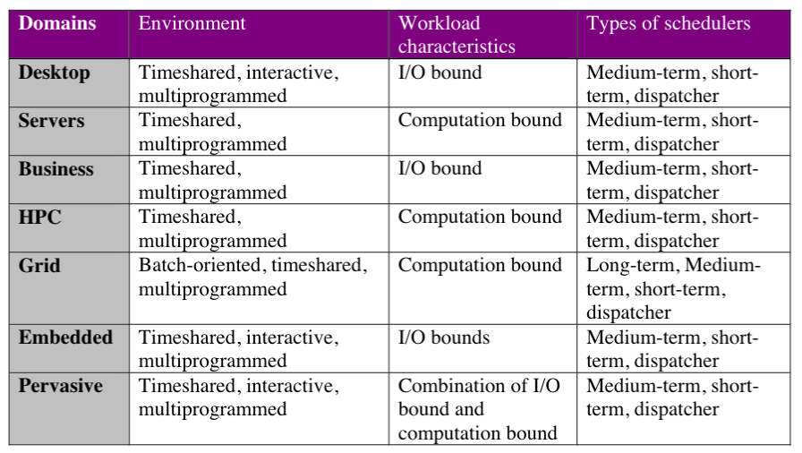

## Summary of Algorithms
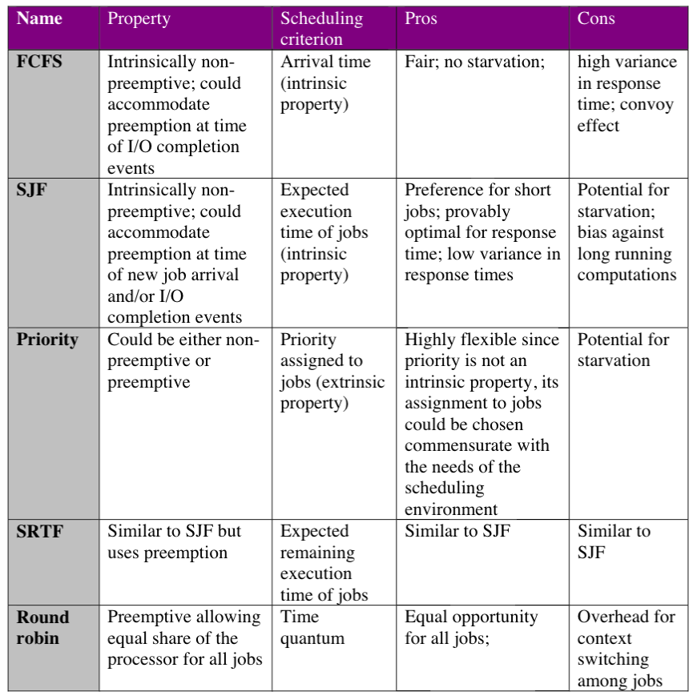
## Linux Scheduler
- wants to cater to desktops as well as server environments
- desktops need fast interactivity, and servers simply need efficiency
- 3 types of tasks
    - real time FCFS, real time round robin, timeshared
- uses a runqueue data structure
    - has 2 arrays - active and expired
        - active array has tasks that need cpu
        - expired array for tasks that are doing i/o
- algorithm
    - pick highest priority task from active array
    - if task runs out of time quantum or makes an i/o call, put it into expired array
    - if tasks completes i/o, place into active array w/ priority level
    - if there are no elements in active array, set expired as active array (flip pointers)