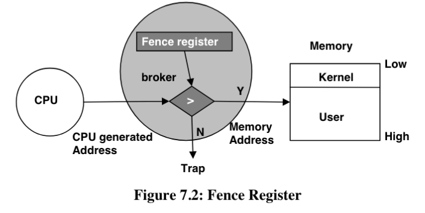
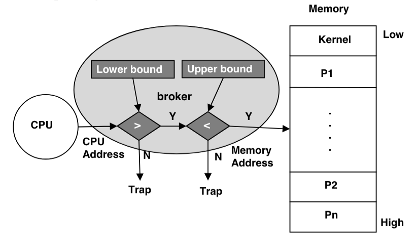
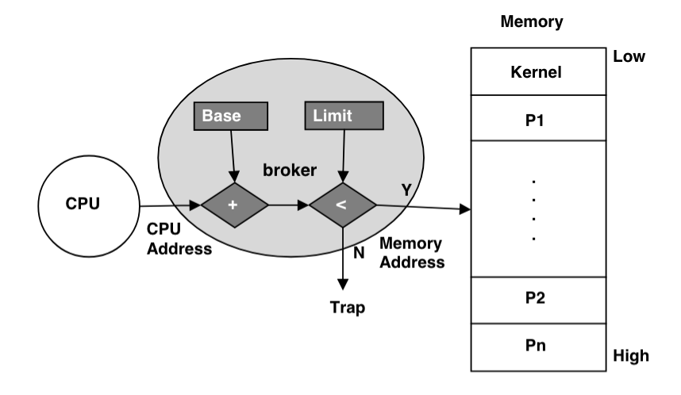
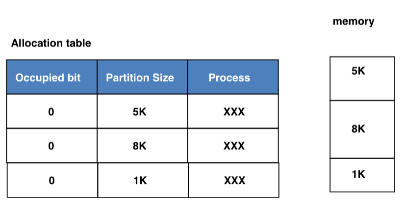
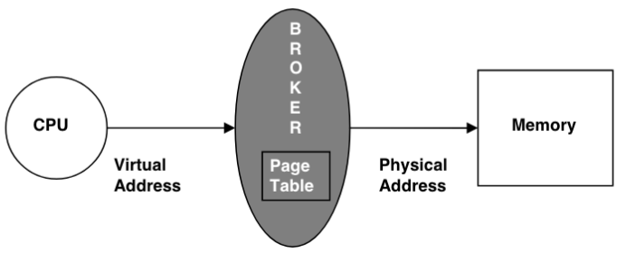
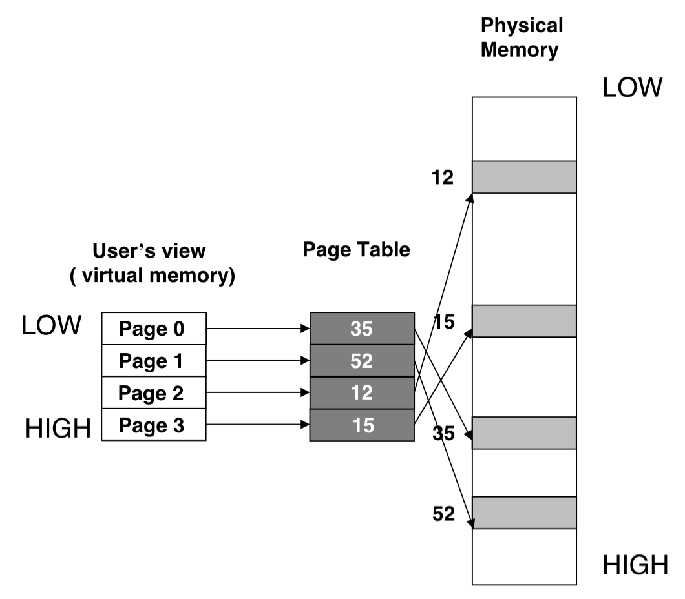
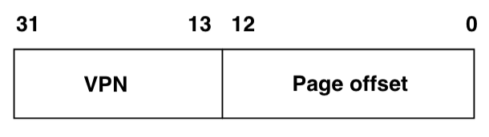
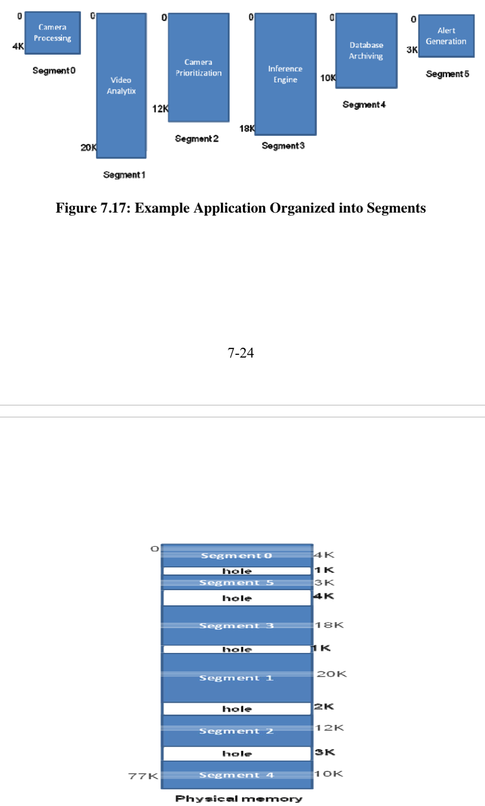
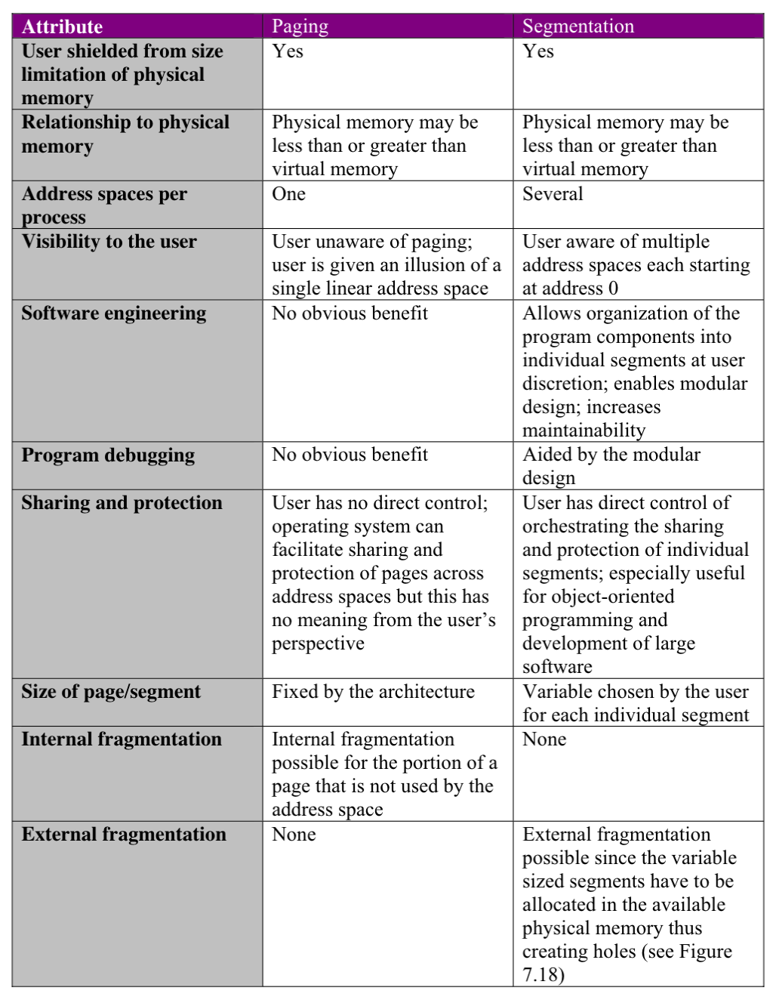

# Ch7: Memory Management Techniques
- [Ch7: Memory Management Techniques](#ch7-memory-management-techniques)
  - [Memory Manager Functionalities](#memory-manager-functionalities)
  - [Simple Schemes For Memory Management](#simple-schemes-for-memory-management)
    - [Separation of User and Kernel](#separation-of-user-and-kernel)
    - [Static Relocation](#static-relocation)
    - [Dynamic Relocation](#dynamic-relocation)
  - [Memory Allocation Schemes](#memory-allocation-schemes)
    - [Fixed Size Partitions](#fixed-size-partitions)
    - [Variable Size Partitions](#variable-size-partitions)
    - [Compaction](#compaction)
  - [Paged Virtual Memory](#paged-virtual-memory)
    - [Page Table](#page-table)
    - [Paging Hardware](#paging-hardware)
    - [Page Table](#page-table-1)
    - [Relative Sizes of Physical and Virtual Memories](#relative-sizes-of-physical-and-virtual-memories)
  - [Segmented Virtual Memory](#segmented-virtual-memory)
    - [Hardware for Segmentation](#hardware-for-segmentation)
  - [Paging vs Segmentation](#paging-vs-segmentation)
    - [CPU Generated Address Interpretation](#cpu-generated-address-interpretation)
## Memory Manager Functionalities
- garbage collection: automatically frees memory that is not being currently used by program
- focus is on how OS manages memory
- memory management functionality
    - improved resource utilization: gives memory dynamically when program needs it, and free it when program is not using it
        - example: windows has lots of background processes(daemon processes) running even though there are only a couple applications open
    - independence and protection: protect processes from writing to other parts of memory, as well as not corrupt other programs
    - liberation from resource limitations: must give programmer illusion that computer has lots of memory
    - sharing of memory by concurrent processes: sometimes processes want to share memory. Some examples include multiple browser windows (implicit sharing) and copy pasting from one program into another (explicit sharing)
        - `broker`: piece of hardware that provides mechanisms for memory management policies - maps logical memory address to physical memory address
## Simple Schemes For Memory Management
### Separation of User and Kernel

- kernel space = OS, user space = user programs
- must ensure boundary between both spaces
- 3 architecture elements: 
    - mode bit signifying user/kernel mode
    - privelaged instruction that can change this mode bit
    - fence register: memory manager sets the fence register when user program is scheduled, and hardware validates the processor generated address by checking it against the value stored in the register
        - example: if fence register holds x10000, then if in user mode, CPU generates address less than x10000, then it knows that it is invalid, since only in kernel mode can we access that below x10000.
- use traps to switch to kernel mode - do this implicitly when running system call
### Static Relocation

- refers to memory bounds for process being set when process is linked and creating an executable
- provides 2 registers - lower and upper bound 
    - part of the PCB
    - writing to these registers is a privelaged instruction
    - memory manage sets values from PCB into bounds registers
    - linker allocates region in memory for process
    - loader fixes the lower and upper bound registers and never changes them for the life of the program
- "Swapping" - moving inactive process from memory to disk, and vice versa
    - in the context of static relocation, due to the fixed bounds, the manager swaps the process back into the same exact spot in memory as it bwas before
    - problem arises when memory is being used - cannot swap yet
    - compilers can automatically compute unused space and mobe the bounds accordingly in memory once program is about to be loaded
- datapath implementation: need 2 comparators
### Dynamic Relocation

- can place executable anywhere in memory that can accommodate needs of process - can be changed during execution of program
- 2 registers: base and limit
    - CPU address is always shifted by the base
    - these are part of the PCB of every process
- every time program is loaded/swapped, loader assigns values for base and bound registers of process
    - memory manage records the values into the PCB
- example: program1 has memory footprint of 4000
    - loader assigns range 10001 to 14000
    - memory manager sets base to 10001 and limit 14001 in the PCB for P1
    - when P1 is executing, every address is shifted by 10000
- results in better memory utilization
- datapath implementation: need adder followed by comparator
## Memory Allocation Schemes
- assuming base + limit register for memory manager
### Fixed Size Partitions
- divide memory into fixed size partitions
- use an alllocation table
    - 3 attributes: occupied bit (partition in use or not), partition size, and process

- when process requests memory, it is given smallest partition that fits the memory chunk requested, sets the occupied bit
    - example: if memory is partitioned into 1kb, 5kb, and 8kb, and process requests 6kb, it gets 8kb partition - 2 kb is wasted
        - this 2 kb wasted is called `internal fragmentation`
        - difference between partition size and space process actually occupies
- if process requests a partition size that is too great for the partitions remaining, it is not possible to satisfy request
    - called `external fragmentation`
    - sum of all the non-contiguous memory fragments
### Variable Size Partitions
- builds allocation table on the fly instead of making fixed partitions from the start
- solves internal fragmentation - no wasted space
- once processes complete, memory can be used again - manager merges adjacent entries in allocation table if they are free
- options on how to allocate
    - best fit - find best fit for new request
    - first fit - finds first partition that can fit request
### Compaction
- used when external fragmentation goes beyond tolerable limits
    - can relocate memory for processes to create contiguous space
- problem: very expensive in terms of time complexity and virtually impossible to accomplish if there are a lot of processes to be compacted
## Paged Virtual Memory
- user's assumption is that memory is contiguous
- use `virtual memory` and `paging`
- broker divides up contiguous memory into logical entities called pages
    - physical memory consists of page frames
    - both are same fixed size, `pagesize`
- analogy - students visiting professor using picture frame
    - professor has single frame for a photo, simply swaps photo out for corresponding student that is visiting him, since they visit him one at a time
- broker maintains mapping between logical page and physical frame
    - memory manager creates mapping for each program

- user view of memory is called `virtual memory` and logical pages as `virtual pages`
- CPU generates virtual addresses, and broker translates this to the physical address using the page table
- broker only needs to maintain contiguous memory within each page

### Page Table
- given that virtual pages are fixed size and addresses within page are contiguous, can give 2 attrivutes for a virtual page:
    - virtual page number (VPN), and offset within the page
    - page size is $n$, and offset size is $log_2n$
    - virtual address layout: low order bits are offset, high order bits are the VPN

- translating from virtual to physical address
    - look up in page table to find physical frame number (PFN) corresponding to the VPN
    - page table resides in memory
        - page table base register (PTBR) contains the base address of page table for current process
        - this register is part of the PCB
### Paging Hardware
- add PTBR to datapath
- overall flow:
    - cpu computes address of page table entry that corresponds with the VPN using the contents of the PTBR
    - PFN fetched from the entry is added to the page offset to get physical address
- need 2 memory retrievals 
    - sped up using translation lookaside buffer(TLB) to store recent address translations
### Page Table 
- memory manager sets up page table on process startup
    - hardware uses table for address transaltion
    - also a data structure under the memory manager
### Relative Sizes of Physical and Virtual Memories
- can have more physical memory than virtual memory
    - used for processes that hog a lot of memory
## Segmented Virtual Memory
- house analogy - each room has a functional duty (kitchen room, living room, bedroom)
- partition address space like the house analogy - multiple, each with own function and separate from one another
    - example: heap, data, code address spaces
    - good for debugging as well
- each address space is called `segment`. Each segment has
    - unique segment number
    - segment size
- address has 2 parts
    - low order bits = segment offset
    - higher order bits = segment number
- broker looks up in segment table to convert this address into a physical address
- example: program that has been segmented

### Hardware for Segmentation
- segment table is a data structure similar to page table
    - each entry is callsed segment descriptor-has start address and size of segment
- needs segment table base register (STBR)
## Paging vs Segmentation
- both are techniques for implementing virtual memory

    - segmentation has the possibility of external fragmentation
- in order for system for be efficient, data transfer from disk to memory must be efficient - paging is more efficient b/c page size is a system attribute
- best technique - paged segmentation
### CPU Generated Address Interpretation
- number of bits in CPU address depends on memory addressing capability of processor
- physical address depends on size of physical memory

