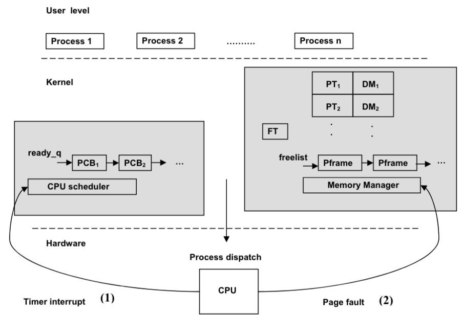

# Ch8: Details of Page-Based Memory Management
## Demand Paging
- can expect that memory will not need entire memory footprint for proper execution
- so, don't need to load entire program into memory on startup
    - only load what we need on demand `demand paging`
### Hardware for Demand Paging
- we don't know if page is in memory yet
    - need to add a `valid` bit to each table entry
- Page table entry being invalid is `page fault exception/trap`
    - handles page not being memory by bringing in the missing page from the disk
- in pipeline, IF and MEM stages are susceptible to page faults
    - this is because they need memory access
- For instruction restart:
    - once stage in pipeline encounters page fault, pipeline drains instructions after it (fully executes those), and drains the instructions before it(stops execution)
        - this is fine because instructions that come before it do not modify memory/processor registers at all
### Page Fault Handler
- basic steps are just like regular interrupt handler (saving PC to $k0, save process regs, enable int, etc)
- differences
    - find free page frame
    - load virtual page from disk into page frame
    - update page table 
    - put PCB of process into ready queue of scheduler
### Data Structures for Demand-Paged Memory Management
- `freelist` of page frames: contains info on currently unused page frames - only contains page frame number
    - mem manager uses this to service page fault
    - any frame in this list can be used to service page fault
    - starts with all page frames on boot up
- `frame table`
    - given a frame number, it gives process ID and virtual page number that occupies page frame

- `disk map`: maps process virtual space to locations on disk that contain contents of the pages

### Anatomy of Page Fault
- find free page frame: page fault handler looks at free list of page frames
    - must make room in physical memory to make room for faulting page - physical frame is called the `victim`
    - do this if free list is empty
- picking victim page: manager determines the victim process that owns it
    - uses frame table for this
        - clean page: has not been modified by program from the time it was brought into memory from disk (disk copy and memory copy of program are the same)
        - dirty page: has been modified by program
    - if page is clean, then simply set the page table entry corresponding to the page as invalid (contents do not need to be saved)
    - if page is dirty, manager writes back to the disk (flushing the disk), and finds the location on the disk using disk map
- loading faulting page
    - using disk map for faulting process, manager reads page from disk into page frame
- update page table for faulting process & frame table
    - manager sets mapping for page table entry of faulting process to point to page frame, and makes entry valid
    - updates frame table to reflect change in mapping to page frame
- restarting faulting processes
    - manager places PCB of faulting process into ready queue of scheduler
- example: page fault at VPN = 20, free list is empty, and manager selects PFN=52 as victim, which currently houses VPN=33. This VPN becomes invalid after process is done

- page fault handler must nebver page fault
## Interaction between Process Scheduler and Memory Manager
- code for memory manager/cpu scheduler are in kernel memory
- user processes are in user memory
- once cpu scheduler dispatches a process, runs until
    - hardware timer interrupt CPU resulting in upcall (function call from low to higher level of software)that maybe causes process context switch 
    - process incurs a page fault resulting in upcall to memory manager that results in page fault handling(described above)
    - process make system call (like I/O) resulting in another subsysten getting upcall to take necessary action

## Page Replacement Policies
- how to pick a victim page to evict from physical mem when free list is empty and page fault occurs
- ideal policy should
    - result in least amount of page faults
    - not have page fault occur for same page twice
- 2 options
    - `local victim selection`: steal physical fram from faulting process itself to satisfy the request
        - no need for frame table, but poor mem management
    - `global victim selection` - steal physical frame from any process
        - heuristic used depends on algo
        - good mem usage
- typically use global page replacement policy
### Belady's Min
- choose physical frame from process that is not referenced for longest time in the future - most ideal
- theoretical, not physically possible
### Random Replacement
- replace page at random
- doesn't need hardware support, and no extra data needed to store
- worst performance
### FIFO
- affix a timestamp to when page is brought into memory
- replace page with longest resident time as victim
- no hardware needed
- circular queue used
    - head is longest resident time physical frame
    - has a queue full flag - size = njumber of physical frames in use
    - if queue full (head == tail)
        - replace page at head 
    - used for free list and frame table

### LRU
- least recently used page is replaced
- use a push down hardware stack
    - bottom of stack is least recently used page
- hardware needs to track every memory access from CPU 
- instruction set needs special instructions to read bottom of stack
#### Approximate LRU - Small Hardware Stack
- not actually viable to implement full LRU
    - stack has as many entries as # of physical frames - too large
    - every access requires modification to stack - expensive
- size of stack will be small number - hold last $n$ references, so don't choose those $n$ pages to replace
    - algo picks page that is not in stack as victim
#### Approximate LRU - Reference bit per Page frame
- track references to pages
    - have reference bit per page frame
        - hardware sets this bit when CPU accesses any location within page, software reads and resets it
- choosing victim algorithm
    - memory manage maintains bit vector per page frame, called `reference counter`
    - periodically memory manager reads reference bits of all page frames and puts them in the most significant bit of frame reference counters
        - counters are right shifted when bit is dumped
        - after reading reference bits, memory manager clears them - done every time quantum
        - counters stores references for every $n$ bits, so for every $n$ time quanta
    - refernce counter with smallest abs value is least recently referenced page, and will be replaced
- paging daemon carries out avove algorithm
### Second Chance Replacement
- extension of FIFO algo using refernce bits
- use reference bit to indicate that page has second chance to stay in memory
- algo:
    - OS clears all reference bits, and as program runs, hardware sets reference bits for pages of program
    - if page had to be replaced, memory manager chooses replacement in FIFO way
    - if chosen victim's reference bit is set, the n manager clears reference bit, gives it new arrival time, and repeats step 1 (page moved to end of FIFO queue)
    - victim is first candidate in FIFO queue that's reference bit is not set
- think of it like a circular queue with pointer pointing to the FIFO candidate
    - as it moves towards the eventual victim, mem manager clears reference bits of pages it encounters
    - pointer moves like a clock-`clock algorithm`
### Review of Page Replacement Algos

## Optimizing Memory Management
### Pool of Free Page Frames
- don't wait until page fault to select victim
- memory managers always keep a minimum number of page frames ready for allocation to satisfy page faults
- page daemon periodically checks if there are minimum # of page frames in free list, if not, runs the replacement algorithm to free frames until threshold is met
#### Overlapping I/O With Processing
- don't need to write back to disk for page frame since we are simply adding page frame to free list
- since I/O runs concurrently with processor, simply schedule a write i/o for a dirty victim page frame
- so, we can add dirty page to free list, and simply skip over it when looking for page to satisfy fault
#### Reverse Mapping To Page Tables
- in order to meet minimum threshold, paging daemon may take away page frames currently mapped into running processes
    - this will cause another fault, so if manager has not reassigned page frame to different process, then we can retrieve the page from the free list and give it to the faulting process
- need to keep track of the VPN the node housed last in the freelist 
- when page faults, memory manager compares the page ID and the VPN of faulting process to entries in freelist
    - if match, then manager re-establishes original mapping in the page table for the faulting process
### Thrashing
- when system is not getting useful work done
- can have low CPU activity with high degree of multiprogramming
    - too much paging activity
        - each process needs sufficient amount of memory, otherwise will page fault
    - therefore, if too many processes are in memory (high multiprogramming), must reduce multiprogramming
- `thrashing`
    - when processes spend more time paging than computing
- to prevent this, ensure sufficient number of page frames are allocated for each program so they do not page fault frequently
    - principle of locality - each program only accesses small portion of its memory footprint
        - memory portion may change over time, but is gradual
        - also pages used by program are not always consecutive
### Working set
- locus of activity - size of program activity
- to determine locus of activity, we use `working set`
    - set of pages that defines locus of activity
    - is not fixed
- `working set size`: # of distinct pages touched by process
- `memory pressure`: summation of all working set sizes of processes competing for resources
### Controlling Thrashing
- if total memory pressure exerted is greater than total available physical memory, then memory manager decreases degree of multiprogramming, and vice versa
    - to determine WSS, daemon samples on intervals the reference bits that are turned on and records them
- use the observed page fault rate
    - low water mark and high water mark to mark excessive faults(decrease multiprogramming), or a low number of faults (increase multiprogramming)
## Other Considerations
- OS takes other measures to reduce page faults
    - ex) when memory manager swaps out process, it remembers current working set of the process
- I/O and memory can coordinate activities
    - ex) I/O initiates transfer from physical frame to disk, and paging daemon selects the same frame as a victim
## Translation Lookaside Buffer (TLB)
- when page faults happen, still need 2 memory accesses
    - address translation
    - data/instruction
- `TLB` is a small hardware table where CPU holds recent address translations

- valid/invalid bit - no entries are valid when CPU starts up
- has 2 parts
    - one part holds translations in kernel address space, and the other for user address space
### Address Translations with TLB
- hardware checks if there is a valid translation in the TLB for the CPU address
    - called a `hit` if there exists a translation
    - on a `miss`, the page table in memory supplies PFN
- address translation can be fully done in software
    - hardware raises TLB fault if it doesn't find a translation
    - OS takes over, and enters translation into TLB
- TLB is a hash table that contains VPN-PFN pairs
    - hardwarer looks for match for given VPN
    - called `CAN`(content addressable memory/associative memory)
    - special case of caching - keeping small stash of information closer to point of use than the permanent location of the information
## Advanced Memory Management Topics
- process page table theoretically is too big for physical mem
### Multi-Level Page Tables
- break down single page table into multi-level page table
- example 2 level table:
    - split virtual address into 2 parts: one part for each level in table
        - allows you to store other levels other than the first in virtual mem
### Access Rights As Part of Page Table Entry
- must have appropriate read/write access, as well as able to share memory with each other
### Inverted Page Tables
- essentially a frame table
- eliminates a need for per-process page table