# Ch9: Memory Hierarchy
- [Ch9: Memory Hierarchy](#ch9-memory-hierarchy)
  - [Concept of a Cache](#concept-of-a-cache)
  - [Principle of Locality](#principle-of-locality)
  - [Basic Terms](#basic-terms)
  - [Multilevel Memory Hierarchy](#multilevel-memory-hierarchy)
  - [Cache Organization](#cache-organization)
  - [Direct-Mapped Cache Organization](#direct-mapped-cache-organization)
    - [Cache Lookup](#cache-lookup)
    - [Fields of Cache entry](#fields-of-cache-entry)
    - [Hardware for Direct Mapped Cache](#hardware-for-direct-mapped-cache)
  - [Repercussion on Pipelined Processor Design](#repercussion-on-pipelined-processor-design)
  - [Cache read/write algos](#cache-readwrite-algos)
    - [Read access to the cache from CPU](#read-access-to-the-cache-from-cpu)
    - [Write access to cache from CPU](#write-access-to-cache-from-cpu)
      - [Write Through Policy](#write-through-policy)
      - [Write back Policy](#write-back-policy)
      - [Comparison of Write Policies](#comparison-of-write-policies)
  - [Dealing with Cache Misses in Pipeline](#dealing-with-cache-misses-in-pipeline)
    - [Effect of Memory stalls due to cache misses on pipeline performance](#effect-of-memory-stalls-due-to-cache-misses-on-pipeline-performance)
  - [Exploiting Spatial Locality to Improve Cache Performance](#exploiting-spatial-locality-to-improve-cache-performance)
    - [Performance implications of increased blocksize](#performance-implications-of-increased-blocksize)
  - [Flexible placement](#flexible-placement)
    - [Fully associative cache](#fully-associative-cache)
    - [Set associative cache](#set-associative-cache)
    - [Extremes of Set Associativity](#extremes-of-set-associativity)
  - [Instruction and Data Caches](#instruction-and-data-caches)
  - [Reducing Miss Penalty](#reducing-miss-penalty)
  - [Cache Replacement Policy](#cache-replacement-policy)
  - [Recapping Types of Misses](#recapping-types-of-misses)
  - [Integrating TLB and Caches](#integrating-tlb-and-caches)
  - [Cache Controller](#cache-controller)
  - [Virtually Indexed Physically Tagged Cache](#virtually-indexed-physically-tagged-cache)
  - [Recap of Cache Design](#recap-of-cache-design)
  - [Main Memory Design Considerations](#main-memory-design-considerations)
    - [Simple Main Memory](#simple-main-memory)
    - [Main Memory and Bus to Match block size](#main-memory-and-bus-to-match-block-size)
    - [Interleaved Memory](#interleaved-memory)
  - [Modern Main Memory Systems](#modern-main-memory-systems)
  - [Performance Implications of Memory Hierarchy](#performance-implications-of-memory-hierarchy)
  - [Summary Graphic](#summary-graphic)
## Concept of a Cache
- ideally, we want to have size of large memory but speed of small memory
  - implement small, fast memory using SRAM
  - large, slow memory using DRAM
- main memory - physical memory visible to the instruction set
- cache - hidden storage
  - store information brought from memory in the cache
  - much smaller than main memory, but much faster
- CPU looks in the cache for data it wants from main memory; if it is not in there, then it retreives it from main memory
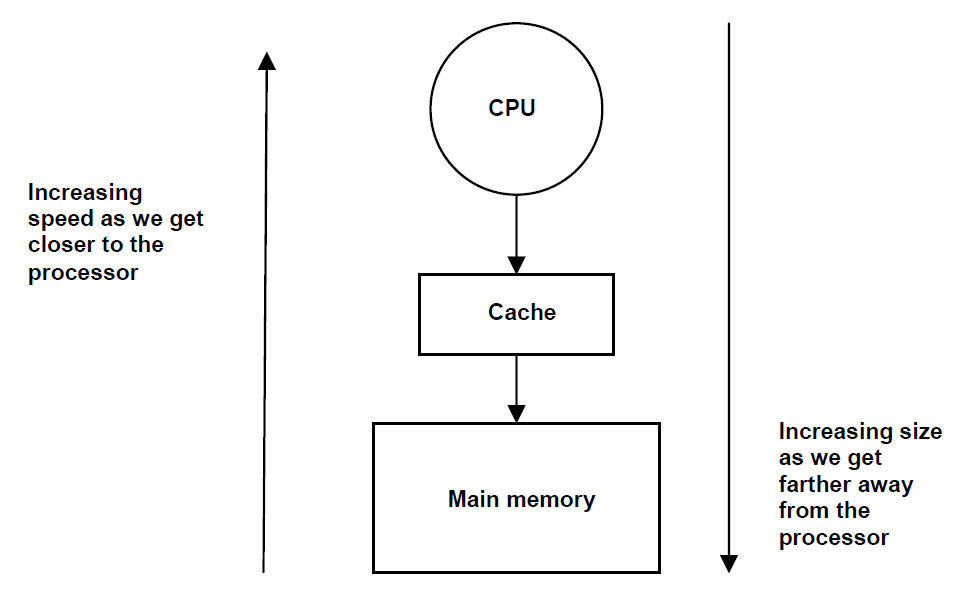
## Principle of Locality
- program typically accesses a small region of memory regardless of how large the program size is
  - region may change over time, but changes are gradual
- 2 dimensions of locality
  - spatial: probability of program accessing adjacent memory locations
    - program instructions are in contiguous memory locations
  - temporal: probability of program accessing same location in the future it accessing currently
    - example: looping code
## Basic Terms
- analogy: toolbox and tool tray
  - look at tool tray first - if not in tool tray, look in toolbox
    - tool tray is much faster to look at
- `Hit` - CPU finding contents of memory address in cache
  - saves trip to deeper levels of memory hierarchy
  - hit rate is probability of successful lookup in cache by CPU
- `miss` - CPU fails to find memory address in cache
  - miss rate = 1 - hit rate
- `miss penalty` - time penalty associated with servicing a miss; analagous to time to go to garage and fetch tool from tool box
- `EMAT(effective memory access time)` - effective access time of CPU, 2 components:
  - time to lookup the cache to see if memory location is there (hit time/cache access time)
  - upon miss in the cache, time to go to deeper levels of memory to fetch missing memory location (miss penalty)
  - CPU will always incur the cache access time, and will add the second if there is a miss in the cache
    - miss penalty depends on organization of cache and main memory design
  - $EMAT = T_c + m * T_m$
    - $T_c$ = cache access time
    - $T_m$ = miss penalty
    - $m$ = miss rate
## Multilevel Memory Hierarchy
- modern processers have multiple levels of caches
  - first level cache is optimized for speed to keep pace with clock cycle times of processor (smaller)
  - speed of second level cache only affects miss penalty of first level cache and doesn't affect clock cycle time of processor
    - focuses on reducing miss rate, so is much larger
  - size of cache becomes larger and access times increase the further away we move from CPU
- EMAT equation for multilevel caches:
  - $EMAT_i = T_i + m_i * EMAT_{i+1}$
- `memory hierarchy`: all storage containing either instructions/data that a processor accesses directly and indirectly
  - indirect = storage is not visible to ISA
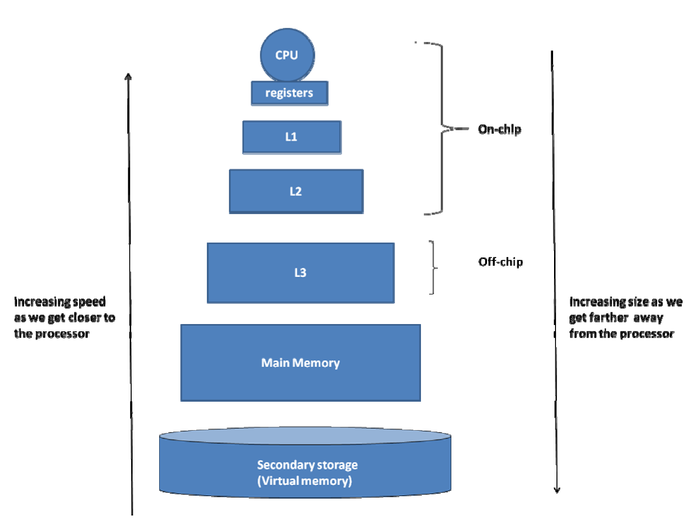
## Cache Organization
- 3 facets to organization: placement, algorithm for lookup, and validity
- placement: where do we place the data in the cache?
  - use mapping function with memory address associated with cache index
- algorithm for lookup: how do we find data in cache?
  - need to add metadata to each entry to identify cache entry contents
- validity: how do we know if data in cache is valid?
  - need valid bit
## Direct-Mapped Cache Organization
- 1 to 1 between memory location and cache location
  - given a memory address, there is exactly one place to put the contents in the cache
- example: 16 entry memory, 8 entry cache
  - obviously, since cache is initially empty, lookups into memory addresses will always miss-`compulsory misses`
  - however, since two memory location map to 1 location on the cache, when storing and looking up, the previous data must be evicted 
  - `conflict miss` - when there are empty spots in the cache and a direct mapping, but still misses
### Cache Lookup
- CPU looks up into cache to see if data is in the cache
  - only looks in physical memory if a miss occurs
- to go from memory address to cache index, simply do
  - memory address % cache size
  - or simply need least significant bits of address for cache index (example cache has 8 entries, look up mem address 8 - 1000 in binary, index is 000)
- since each entry in cache has multiple mappings to memory addresses, need some way of knowing which address the cache entry is for
  - use the most significant bits as the `tag`
  - example: if we are looking up memory address 11, and we look at location 3 in the cache and the tag is 0, then we know that it is a miss because it corresponds to 0011 (3) and not 1011, which is 11.
- also need to add a valid bit for each entry in the cache
### Fields of Cache entry
- valid field, tag field, and data
- memory address generated by CPU has two parts
  - cache tag and cache index
    - LSB are index, MSB as tag
### Hardware for Direct Mapped Cache
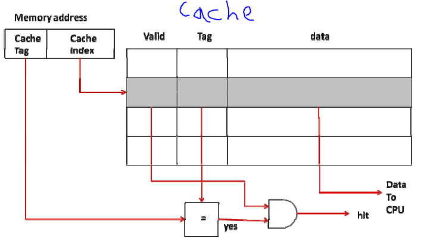
- index part of memory picks out entry in cache, and comparator compares tag field in cache to memory address
  - if this matches and the entry is valid, then it is hit, and supplies data field of selected (`cache line/cache block/cache entry`) to CPU
- tag and valid bit are metadata needed
- if system is byte addressable, LSB of field would be used for the byte offset within the word
- potential for lots of memory overhead needed
## Repercussion on Pipelined Processor Design
- for the pipelined implementation, instead of looking into memory using D-MEM and I-MEM, we have I-cache and D-cache instead
- if there are misses
  - IF stage: must retrieve from memory, and takes a while, so pipeline simply bubbles NOPs until instruction is received
  - MEM stage: same as IF, bubble NOPs until memory reference completes, and freezes preceding stages from advancing past the instructions they are currently working on
- `memory stall`: cycles wasted due to waiting for memory operation to complete
  - read stall and write stall

## Cache read/write algos
### Read access to the cache from CPU
- processor needs to access cache to read memory for eithe instructions or data
- basic actions
  - cpu sends index part of memory address to cache, and if it hits, then it supplies data to CPU. If a miss, then CPU sends address on memory bus to main memory
  - upon sending adress to memory, CPU sends NOPs until it receives data from memory (read stall). Eventually main meory delivers data to CPU and updates the cache block with data. Cache modifies the tag and valid field for this entry
### Write access to cache from CPU
- happens in the MEM stage of pipeline
- two choices: write through/write back
#### Write Through Policy
- update cache and main memory on each CPU write operation
- steps:
  - on every write, CPU simly writes to cache - no need to check valid bit or tag
    - cache updates entry and sets valid bit 
  - simultaneously, CPU sends address and data to main memory
    - process is slow, so use a write buffer in datapath, also happens in the MEM stage
  - write buffer completes write to main memory independent of CPU
    - if write buffer is full, write stall occurs
- write allocate: usual way to handle write misses
  - data being written will be needed by program in the near future, so put it in the cache
  - since block is missing from cache, we need to allocate cache block and bring in missing memory block into it
- no write allocate: not as popular
  - write access can complete quickly since processor doesn't need data
  - simply places write into write buffer, so no write stalls occur
#### Write back Policy
- update only the cache on CPU write
- steps
  - similar to write-through policy - if write hit, CPU writes to cache
  - contents of the cache entry and the memory location are inconsistent with each other doesnt matter as long as it first checks the cache before going to memory on a read
  - when we have to update main mem: must replace entry in cache eventually, and corresponding memory location must be updated as well with the latest data
    - need a way to tell if cache entry data is more current than data in memory
      - introducing dirty bit
        - cache clears bit upon bringining in a memory location into entry
        - set dirty bit upon CPU write
        - cache writes back data in cache to memory location upon replacement
- write buffer: prioritizes servicing read misses over writing to memory
#### Comparison of Write Policies
- write through
  - main memory is always up to date, but slower
  - cache is always clean (never have to write back)
- multilevel cache
  - use write through for L1 cache, and write back for l2 and l3
## Dealing with Cache Misses in Pipeline
- memory accesses disrupt pipeline, so must mitigate effect of isses
- possible to hide misses if the value is not used until a couple of instructions later
### Effect of Memory stalls due to cache misses on pipeline performance
- hazards increase the CPI, as well as misses causing memory stall cycles
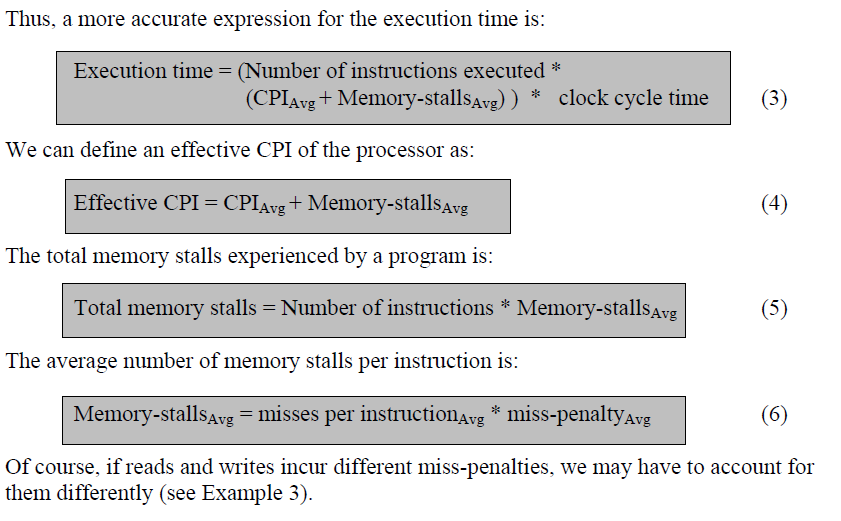
- must reduce miss rate and miss penalty
## Exploiting Spatial Locality to Improve Cache Performance
- idea is to bring adjacent memory locations into cache upon a miss for a memory location `i`
  - we must change the relationship between the unit of memory access (# of bytes instructions manipulates) and unit of memory transfer (how much memory is actually transferred internally)
  - called `block size`
    - upon a miss, cache brings entire block of `block size` bytes that contains missing memory reference
- since cache is organized in terms of blocks of contiguous words now, we need block offset now
  - address generated by cpu has cache tag (MSB), index (middle bits), block offset (LSB)
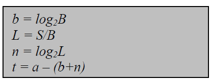
  - a = number of bits in memory address
  - L = number of lines in a direct mapped cache
  - S = cache size
  - B = number of bytes per block
  - b = LSB of memory address
  - t = MSB of memory address
  - n = middle bits
- cache algos in terms of blocks
  - lookup: index for cache lookup comes from middle bits of memory address, and if it is a hit based on the tag and valid bit in the cache, then mux selects specific word/byte from the block by using the LSB bits of address and sends it to CPU
  - read: cache brings out entire block corresponding to cache index, and if hit, then mux selects specific word/byte from CPU
  - write: if hit occurs, CPU writes specific word/byte into cache. Depending on the writing algo, may need additional metadata and actions
### Performance implications of increased blocksize
- increasing block size will reduce miss rate up until a certain inflection point
  - may start happening even before the inflection point because of the miss penalty incurred by the larger block size
    - must strike a balance of block size between speed of 1 instruction, and program as a whole
## Flexible placement
- more efficient spacewise, as can place blocks anywhere and location mappings are not rigid within cache
### Fully associative cache
- cache block can map to any memory block
  - only compulsory and capacity misses occur
- no cache tag needed, since there is no specific mapping
  - simply look through all entries within cache too see if memory address is in cache
    - use comparators in parallel
    - makes it not feasible for a reasonably sized cache
### Set associative cache
- memory block can be associated with a set of cache blocks
- `degree of associativity`-number of homes a given memory block has in cache
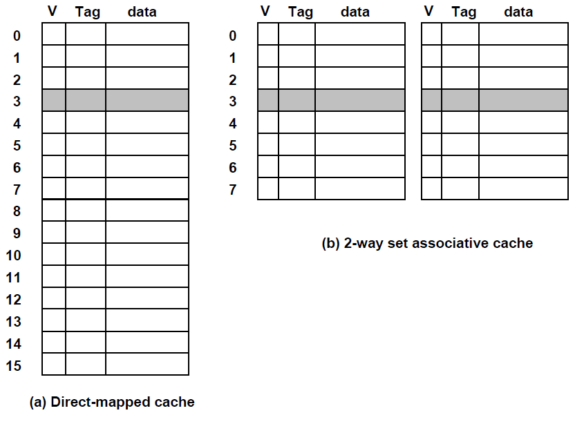
- basically multiple direct mapped caches
  - given a 16 block cache we can have either
    - 16 block direct mapped cache
    - 2 way set associative cache with 8 blocks each
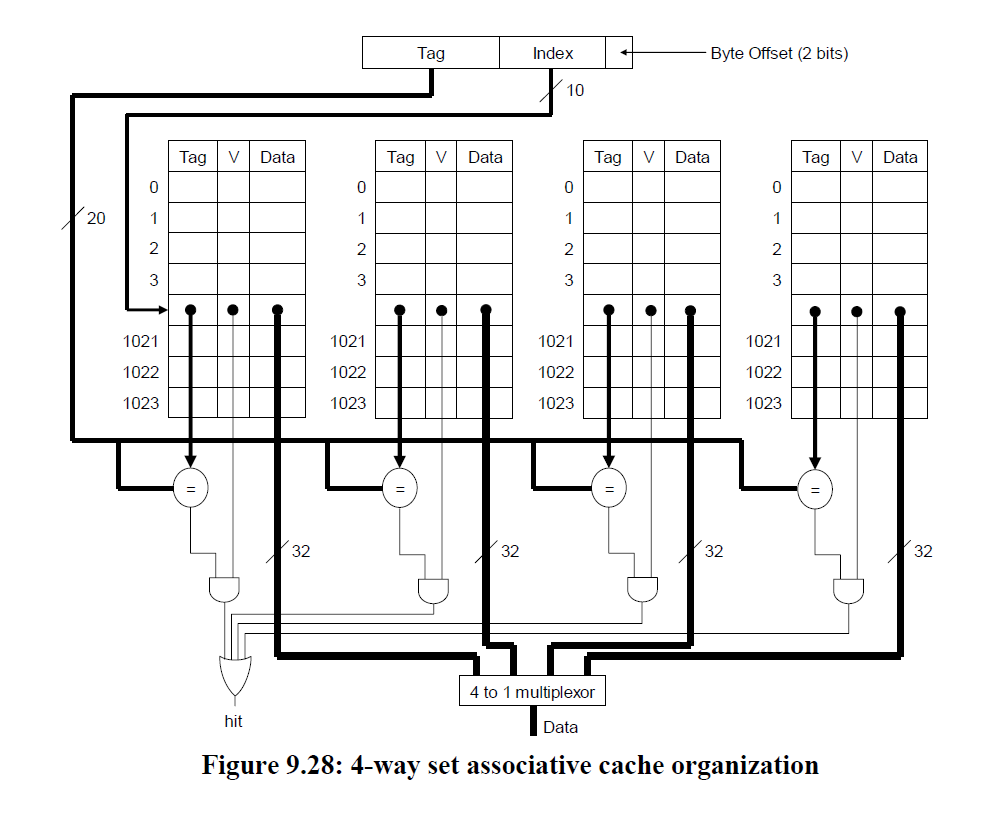
- address contains tag, index, and offset
### Extremes of Set Associativity
- direct mapped and fully associative caches are special cases of set associative cache
  - if degree of associativity = 1, then direct mapped
  - if degree of associativity = n (number of blocks in cache), then fully associative
- fully associative cache mainly used for TLB
## Instruction and Data Caches
- can combine data and instruction cache (reduces miss rate), but problem
  - instruction cache is used every time, but data cache is not, reducing efficiency
- L2 cache is usually unified
## Reducing Miss Penalty
- miss penalty - time to service data transfer from memory to cache on a miss
- memory bus that connects memory to CPU plays big role in penalty
  - `bus cycle time`: time taken for each data transfer between processor and memory
  - `memory bandwith`: amount of data transfer in each cycle between processor and memory
    - depends on number of data wires
- large block size may cause bad effects
  - if miss occurs, need to bring in entire large block containing the address, and it clogs up the bandwith of the memory bus
## Cache Replacement Policy
- choose what block to evict when cache is full
- use LRU policy for set associative/fully associative cache
  - need 1 LRU bit for each set in set associative cache
  - for higher degrees of associativity, need an ordering to see which set is LRU
    - need counter to encode the number of possible states that the LRU bit vector can have - n! states
    - also need a FSM that implements state changes
## Recapping Types of Misses
- compulsory - accessing location for the first time
- capacity - cache is full
- conflict - mapping strategy that causes miss
## Integrating TLB and Caches
- transaction lookaside buffer
  - cache of addresses
  - given a VPN, returns a PFN
  - small size for fast speed
- designed quite similarly to processor caches
- putting all the parts together
  - CPU generates virtual address
  - TLB does virtual address to physical address translation
    - can miss in TLB
  - cache uses physical address to check either I-cache or d-cache
    - can miss as well
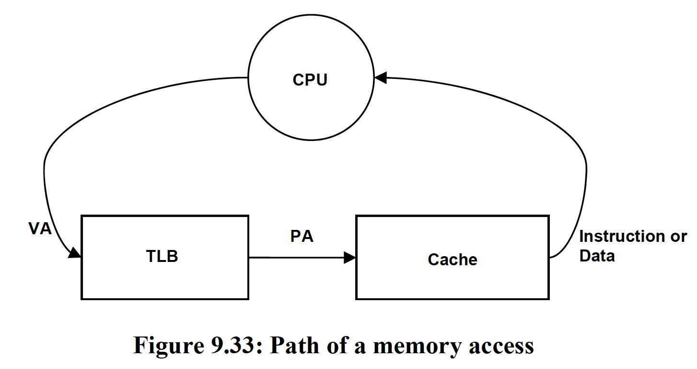
- most implementations have 2 TLBs for data and instruction translation
## Cache Controller
- piece of hardware that interfaces with cache internals and rest of memory system
  - upon request from processor, looks up cache to determine hit/miss, and sends data if hit
    - on miss, initiates bus transaction to look deeper in mem hierarchy
  - once requested data arrives, controller places block within cache 
  - can specify certain parts of mem as uncacheable
## Virtually Indexed Physically Tagged Cache
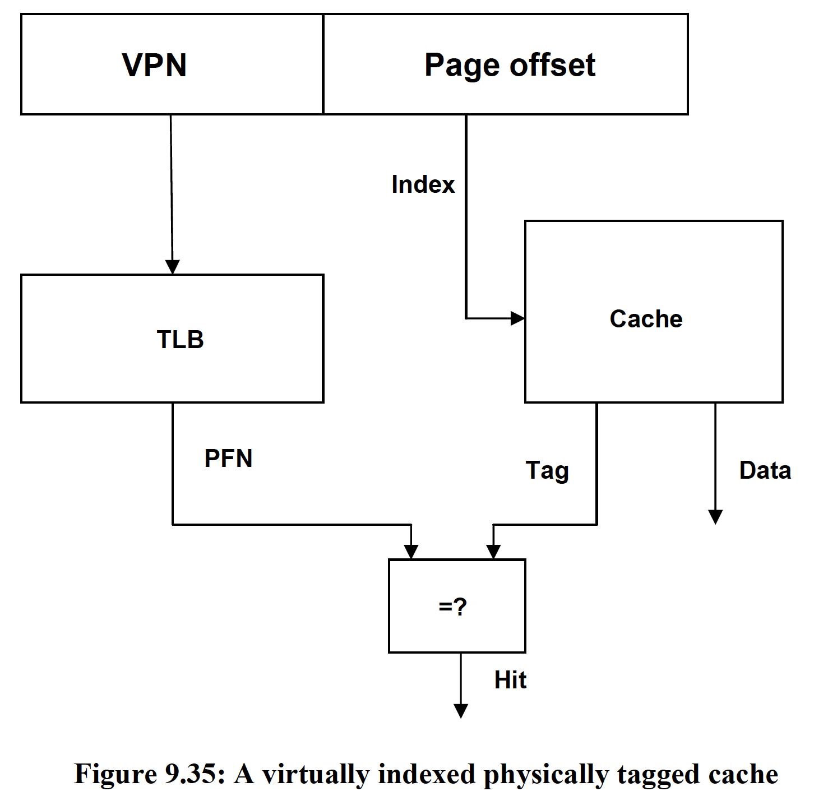
https://www.youtube.com/watch?v=3sX5obQCHNA
- since TLB lookup is required right after CPU sends address, can have significant performance penalty
- ideally, we want to be able to lookup in cache and translate using TLB in parallel
  - use page offset (which remains unchanged in virtual address to physical address translation) as cache index, so we can lookup in parallel
- this looking up in cache in parallel to TLB translation is called `Virtually Indexed Physically Tagged Cache`
  - look up cache using virtual address (page offset)
  - then, verify data is correct using tag (which is physical address) against the TLB translated physical address
- virtual address is unchanging - limits size of cache
  - page coloring - ensures that virtual address bits are as unchanged as possible between VPN to PFN 

## Recap of Cache Design
- processors have TLB, L1, and L2 caches
  - TLB and L1 - reduce hit time 
    - TLB
      - fully associative, only 64-256 entries
    - L1 
      - split into data and instruction caches
      - small degree of associativity (2)
      - smaller size
  - L2 - reduce miss rate
    - combined I and D cache
    - larger associativity (4 or 8)
    - larger block size
## Main Memory Design Considerations
- much slower than CPU 
- will discuss only basic concepts
- 3 different memory bus organizations
### Simple Main Memory
- uses block read requests to service misses
- CPU sends block to main mem, physical mem sends back data from DRAM
  - no bus, so sends data slowly, 1 word at a time
### Main Memory and Bus to Match block size
- organize bus and physical mem to match block size
- only takes a single cycle to transfer data now, but hardware is much more complex
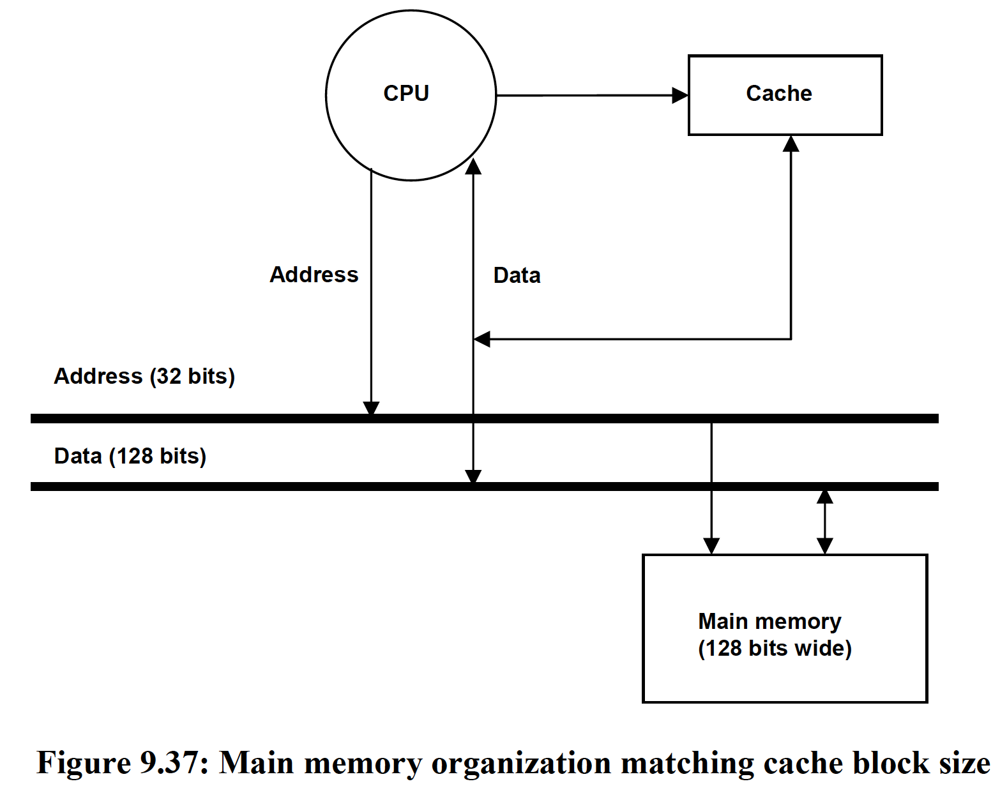
### Interleaved Memory
- use multiple "banks" of memory, each responsible for finding a different word in the cache block
  - work in parallel, and reduces hardware complexity
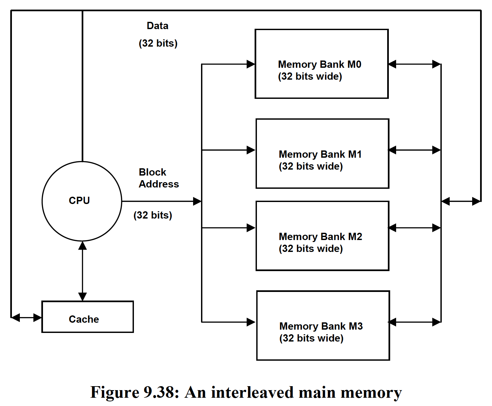

## Modern Main Memory Systems
- DRAM arranged in a rectangular array, and address is split into row and column indices
  - indexed like a 2d array - specify row, then column, and then sends data to CPU
- cycle time of DRAM
  - must read each cell's charge to determine 0 or 1; must recharge after reading
- read more in textbook/research on your own this stuff is confusing lmao

## Performance Implications of Memory Hierarchy
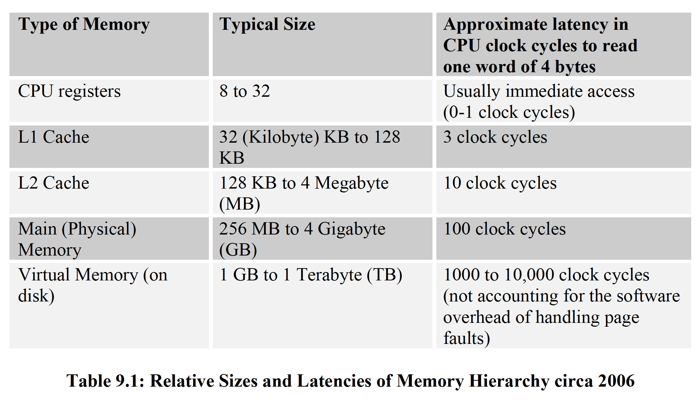

## Summary Graphic
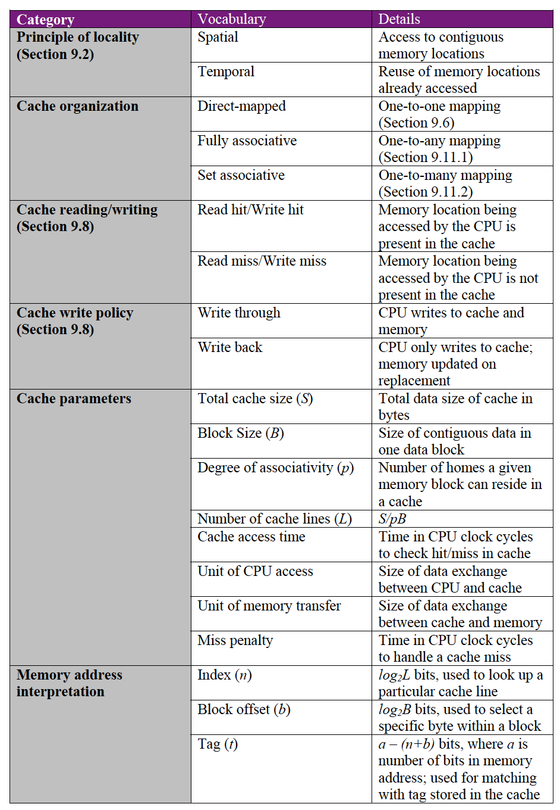
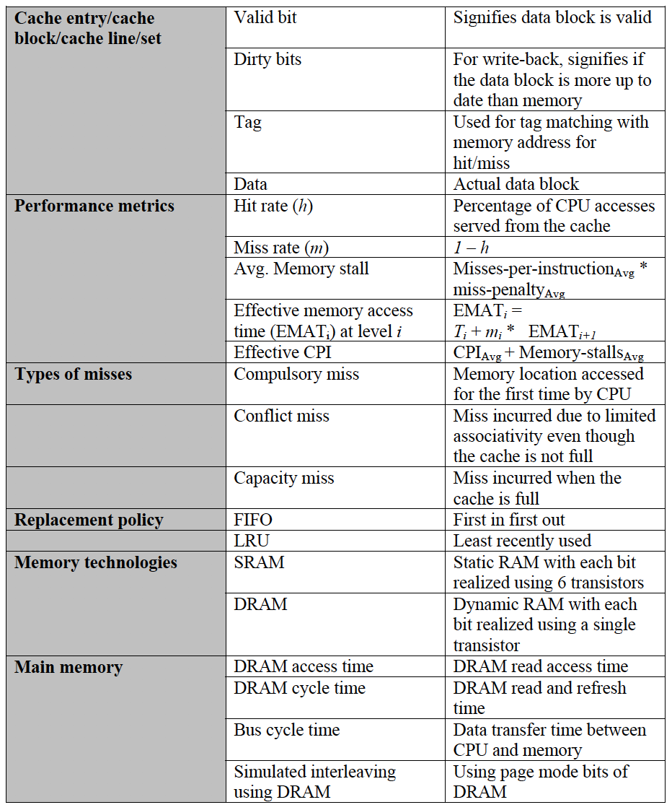